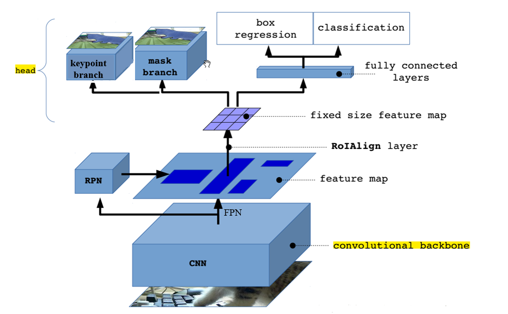

#### 关键点检测：

输入数据：

feature：图片（image）

targets：目标类别（labels），目标边界框（boxes），关键点坐标和可见点数量（keypoints）

评价指标：

目标关键点相似度（object keypoint similarity, OKS），目标关键点相似度系数（OKS coefficients）

##### 1.keypoint R-CNN([Mask R-CNN](paper/maskrcnn.pdf), 2017)

keypoint R-CNN是在Faster R-CNN目标检测的基础上加一个掩码分支，总的结构图如下：

keypoint分支是一个one-hot mask分支，例如人体关键点检测数据集上有17个关键点，那该分支输出一个17个通道的特征矩阵，每个通道代表一种关键点