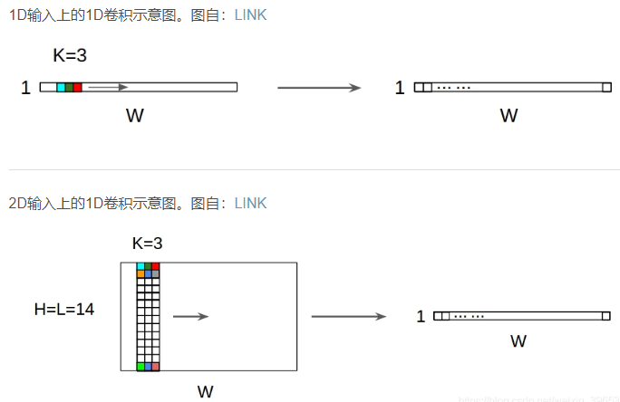
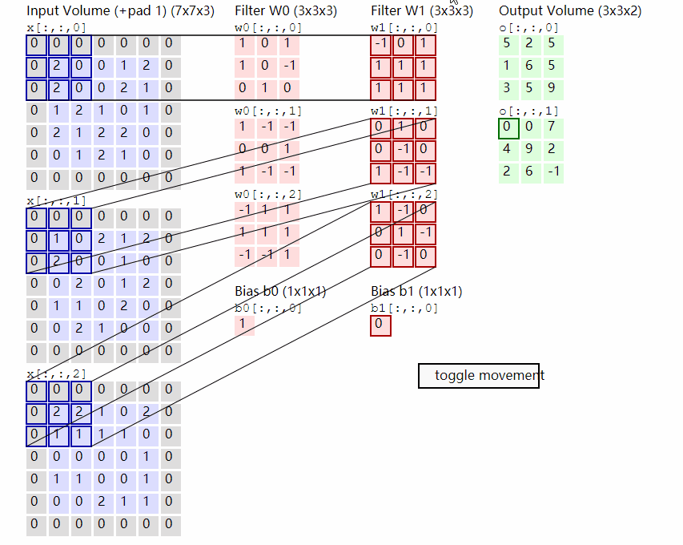
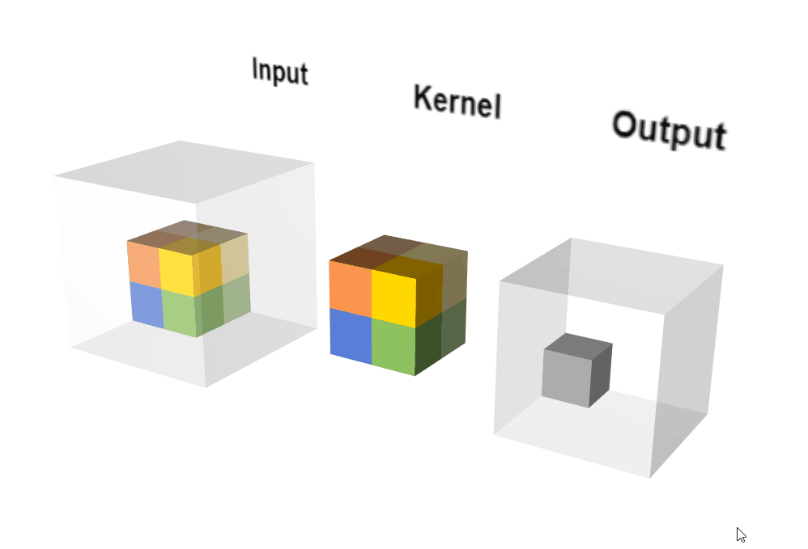
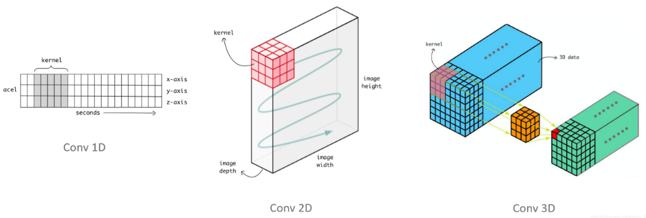
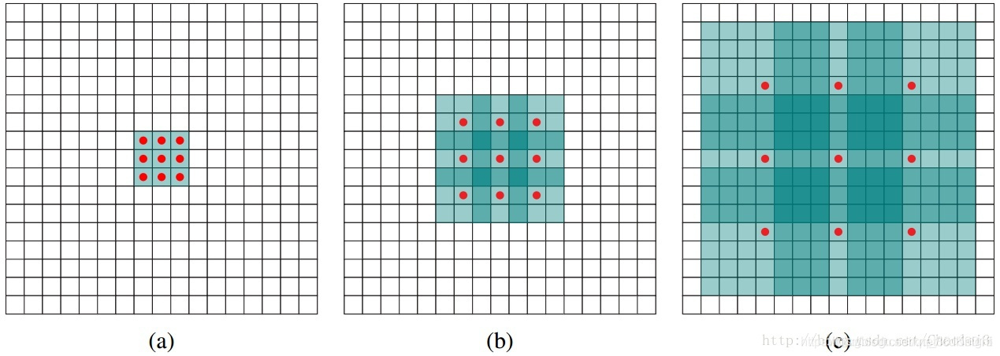
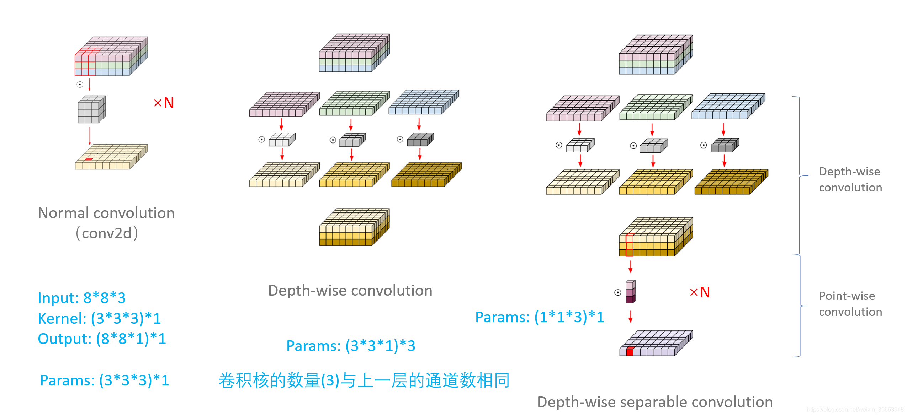
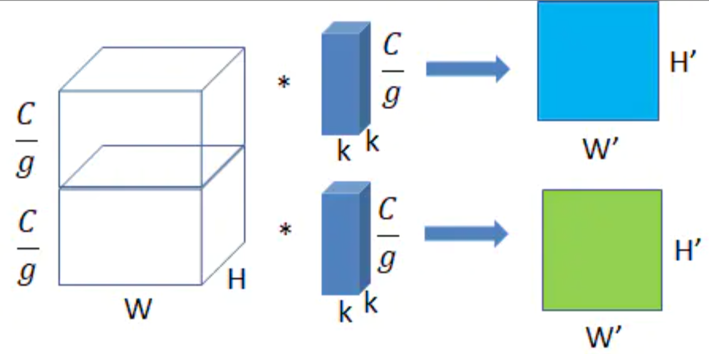

##### 1.Conv1D

1D卷积常用在时间序列数据或文本数据的建模上，卷积核的高度必须与输入特征图的高度相匹配，不管是特征图1D输入还是2D输入，一个卷积核输出都是1D矩阵，对于多个卷积核的情况，其经过Conv1D之后，输出堆叠为2D矩阵，如果卷积核的个数为N，则输出的尺寸为1DxN，卷积过程如下图所示：

##### 2.Conv2D

1D卷积常用在图像数据的建模上，卷积核的channel数必须与输入特征图的channel数相同，一个卷积核输出都是2D矩阵，沿着channel方向的视角，其卷积过程如下：

##### 3.Conv3D

Conv3D可通俗的理解为Conv2D的分组卷积

3D卷积常用于医学影像图像分割以及视频中的动作检测，其卷积核的形状核Conv2D一样，都是三维立体的卷积核，但是Conv3D的卷积结果是一个3D矩阵，卷积过程如下：

##### 4.Conv1D, Conv2D, Conv3D的区别

##### 5.空洞卷积（也叫膨胀卷积）

空洞卷积可通俗的理解为在卷积核的元素间插0，相当于在不进行池化降维损失信息的情况下增大了感受野

空洞卷积诞生于图像分割领域，比如FCN网络，首先像传统的CNN一样，先卷积后池化，经过池化层之后，图像尺寸降低，感受野增大，但是因为图像分割需要实现像素级的输出，所以要将经过池化之后的较小的特征图通过转置卷积（反卷积）上采样到与原始图像相同的尺寸。之前的池化操作使得原特征图中的每个像素都具有较大的感受野，因此FCN中的两个关键：一是通过池化层增大感受野，二是通过转置卷积增大图像尺寸。在先减小后增大的过程中，肯定会丢失信息，那么能否不同池化层也可以使得网络具有较大的感受野呢？空洞卷积应运而生。

空洞卷积的好处是不做pooling损失信息的情况下，加大了感受野，让每个卷积输出都包含较大范围的信息。在图像需要全局信息或者语音文本需要较长的sequence信息依赖的问题中，都能很好的应用dilated conv，比如图像分割、语音合成WaveNet、机器翻译ByteNet中

空洞卷积的膨胀系数（dilated rate）等于卷积核内元素间隔数加1，所以下图种的三种膨胀卷积的膨胀系数分别为1，2，4

##### 6.转置卷积（也叫反卷积）

转置卷积可通俗的理解为在特征矩阵的元素间插0，相当于增大了特征图的尺寸

转置卷积可以进行向上采样以增大输出大小。转置卷积的stride，并不是指反卷积在进行卷积时候卷积核的移动步长，而是被卷积矩阵填充的padding，如下图是一个stride为2的转置卷积：

##### 7.深度可分离卷积

先进行depth-wise卷积，再进行point-wise卷积，主要起到降低参数量，增加非线性，跨通道信息融合的作用，其过程如下图所示：

##### 8.分组卷积

分组卷积是将特征矩阵的channel分成多组，分别用不同的卷积核进行卷积计算，得到一个3维矩阵，矩阵的channel数等于分组的个数。分组卷积的主要优点是减少参数量并且学习到结构性的空间特征表达方式。下图是一个分组数（g）为2的分组卷积：

