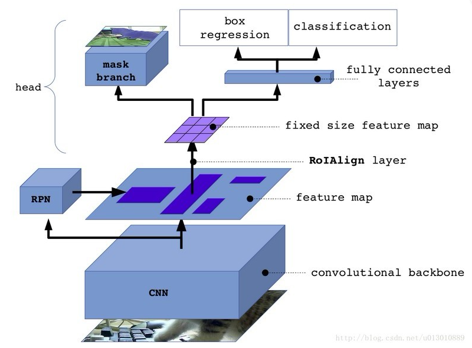
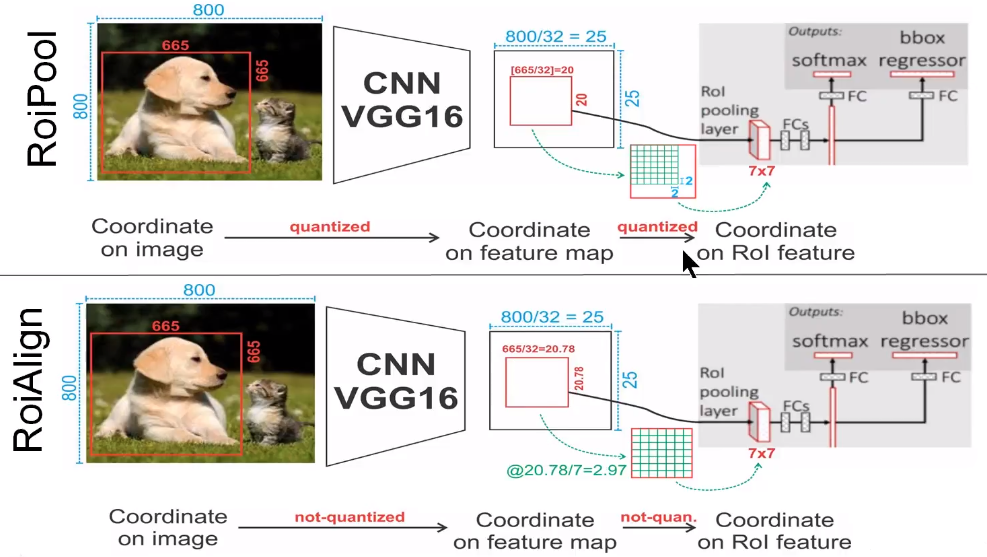
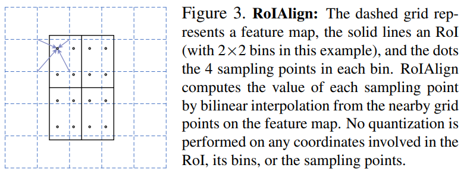
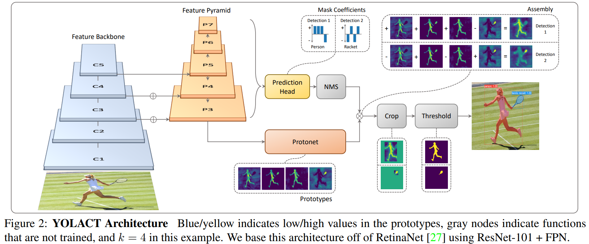
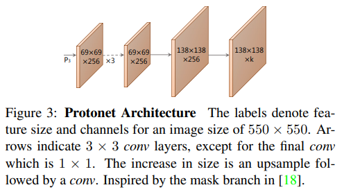
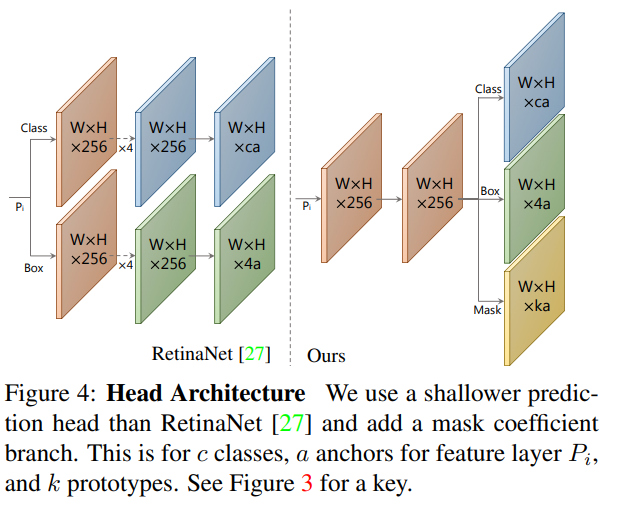
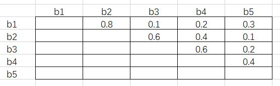

#### 实例分割

训练输入数据：

feature：图片（image）

target：目标类别（labels），目标的边界框（bbox），目标的掩码（mask）

##### 1.Mask R-CNN([Mask R-CNN](paper/maskrcnn.pdf), 2017)

Mask R-CNN模型由目标检测算法faster rcnn和语义分割算法FCN组成，在原始Faster-rcnn算法的基础上面增加了FCN来产生对应的MASK分支。发现了faster rcnn中ROI Pooling存在的像素偏差问题，提出了对应的ROI Align策略，加上FCN精准的像素MASK，使得其可以获得高准确率。Mask R-CNN整体结构如下：

###### ROI Align

ROI Pooling和ROI Align的对比如下：

ROI Pooling存在两次量化取整的操作，导致特征像素出现丢失和偏差，第一次是图像坐标对应特征图坐标时如果出现小数就进行取整，第二次时特征图坐标对应ROI特征坐标时如果出现小数就进行取整

ROI Align未引入量化取整操作，而是使用双线性插值方法来解决像素浮点数的问题。如果ROI池化框对应原图片像素中不是整数，则在池化框的每个网格中采样四个点，每个点的值由该点周围的四个点通过双线性插值方法计算得出，再对每个网格中四个点进行最大池化，得到每个网格的值，如下图所示：

##### 2.Yolact([Real-time Instance Segmentation](paper/yolact.pdf), 2019)

yolact是一种one-stage的anchor-base的实例分割算法，整体结构如下图所示：

1）主干网络默认是ResNet101+FPN，主要用来多尺度特征提取

2）Protonet通过卷积和上采样获得prototypes，prototypes是多张和原图大小相同的模板，相当于热力图，模板中的黄色部分就是目标区域。prototypes是图像全域的，与实例无关；上采样采用的是双线性插值

3）Prediction Head是在RetinaNet目标检测器的基础上添加了一个maks分支，该分支用来输出mask coefficients，利用此系数和prototypes矩阵相乘得到Assembly的结果。RetinaNet检测器输出预测框bbox和类别信息conf，并经过NMS的筛选

4）将NMS筛选剩余的预测框在Assembly的模板上进行截取，再经过阈值处理侯得到最终的mask

###### 1.protonet

protonet的结构如下，输入来自特征金字塔网络的P3层，主要包含了卷积和上采样的操作，k表示模板的数量：

###### 2.Prediction Head

prediction head在retinanet的基础上加了一个mask coefficient分支，输出结果是一个一维张量，和prototypes线性相乘后得到assembly 掩码

###### 3.Fast NMS

传统NMS是按顺序执行的，首先将每个类别的预测框根据置信度大小排序，再将其他预测框与置信度最大的预测框进行IoU阈值筛选。

Fast NMS先对每个类别的置信度最高的前n个预测框计算两两相互的IoU值，排列成一个nxn的对角矩阵。保留每列中的最大值，如果结果大于设定的阈值，则舍去该列对应的预测框。由于每列的网格都是行号小于列号，超出阈值代表着一列对应的预测框与一个比它置信度高的预测框过于重叠了，需要将它舍去。改对角矩阵如下图所示：

##### 3.Yolact++

加入了可变性卷积

