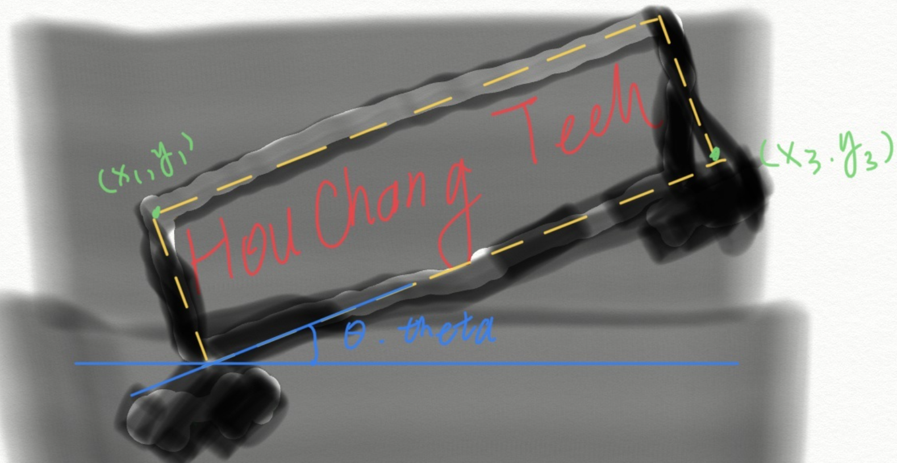
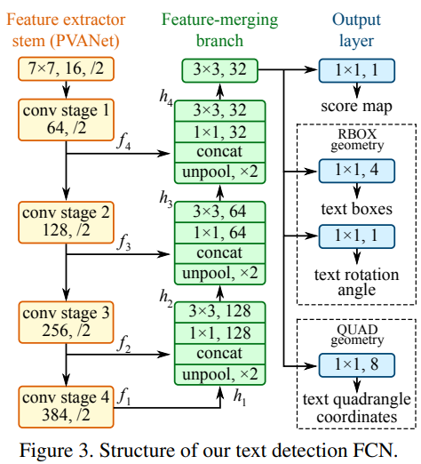
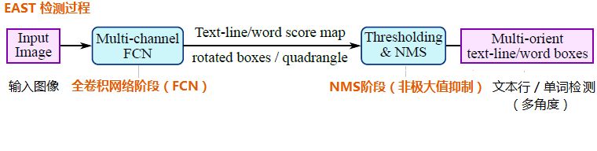
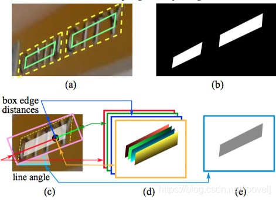
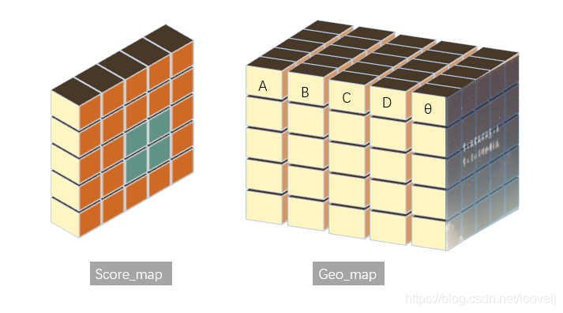
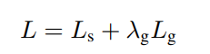

#### 文字检测

检测图像中的是否包含文本内容

输入数据：

训练样本常见的标注方式有RBOX和QUAD两种，以RBOX为例，通常数据集提供的label形式为5个值，分别是Theta(角度），矩阵的两个顶点top_left(x1,y1)，bottom_right(x3,y3)，简化为：Theta,x1,y1,x3,y3

##### 1.East([EAST: An Efficient and Accurate Scene Text Detector](paper/east.pdf), 2017)

East是一个one-stage的anchor-free的文本检测模型，整体的网络结构如下：

1）主干网络是一个PVANet，PVANet是一个目标检测网络，从它的stage1，2，3，4各个尺度提取特征，然后由底至顶进行上采样并进行特征融合，是一种FPN的思想，主要用于提取特征

2）检测器分为3个分支，score map：表示每个像素点属于文本区域的概率；RBOX：4通道输出表示从像素位置到预测框最小外接矩形边界的距离，1通道表示边界框的旋转角度；QUAD：使用8个数字来表示预测框四个顶点到像素位置的坐标偏移，可以预测不规则的四边形文本(如果检测文本区域为规则四边形，一般不用QUAD，只用score map和RBOX即可)

3）然后经过阈值筛选和NMS确定最终的文本预测框

检测过程如下：

###### 1.数据预处理

在训练过程中，要将标签数据处理成特征形式，便于和网络输出对比，计算模型损失，具体做法是：需要首先通过标注的文本矩形（黄色虚线）得到缩小的矩形（绿色实线），一般将标注框缩小0.3比例的大小进行训练（减少标注误差），如图（a）。然后把标注后的图片转化为网络需要的样子，网络需要用旋转的矩阵，生成6个单通道图片。

- 第一个单通道图片是置信度相关的，称作score map，生成步骤为：生成一个大小MxN为全零矩阵A，M,N为原图的长和宽。将标注框矩形Q内的点置为1，得到第一个单通道图片score map，如图（b）
- 第二个单通道图片是角度相关的，称作 angle map，生成步骤为：生成一个大小MxN为全零矩阵A，M,N为原图的长和宽。将标注框矩形Q内的点置为theta，得到第一个单通道图片angle map,如图（e）
- 第三到第六个单通道图片是关于矩形位置的，称为germety map，生成步骤为：生成一个大小MxN为全零矩阵A，M,N为原图的长和宽。开始为标注框矩形Q内的每个点赋值，这个值表示每个点的像素坐标到标注框矩形Q的左右上下四条边的距离，如图（d）

###### 2.损失计算

East模型的损失函数公式为：

其中，Ls和Lg分别表示分数图损失和几何图的损失，λg表示两个损失之间的重要性。

1) Ls使用类平衡交叉熵（用于解决类别不平衡的问题）计算，公式为：

其中，Y^是分数图的预测值，Y*是标注值，参数β是正样本和负样本之间的平衡因子。

2) Lg使用IoU损失计算，公式为：

其中，公式第一项表示文本框的IoU损失，第二项表示文本框旋转角的损失，他们的公式如下：

其中，R^表示预测框几何形状，R*是其相应的标注框。θ^是对旋转角度的预测，并且θ*表示标注值。