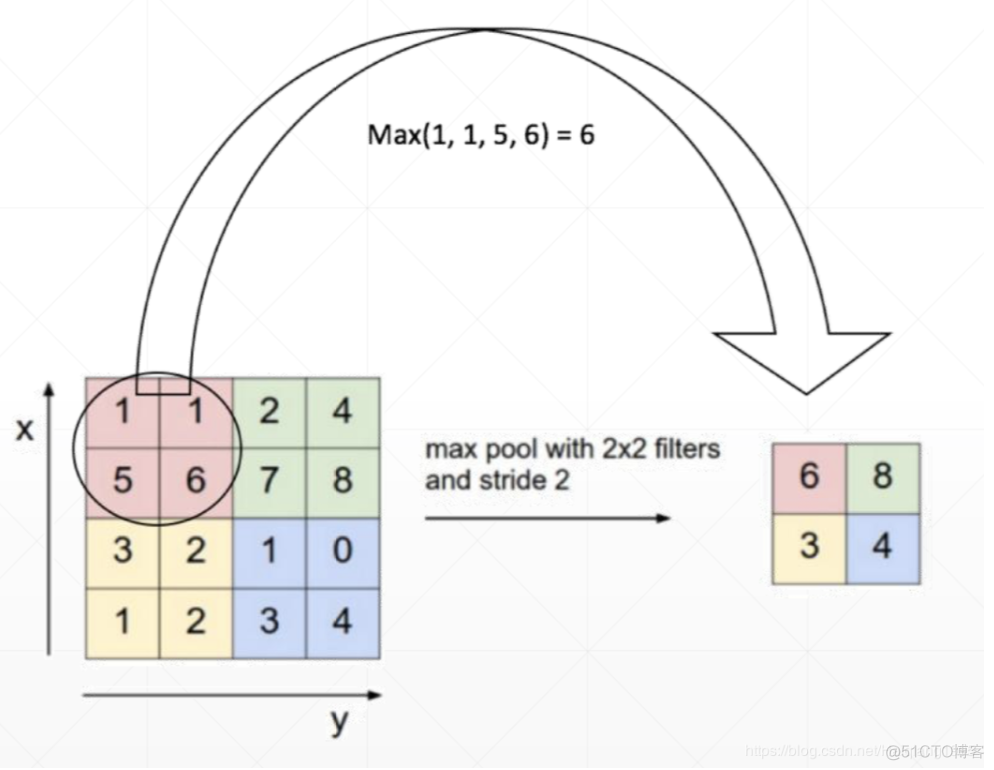
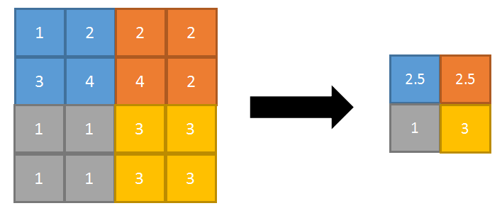
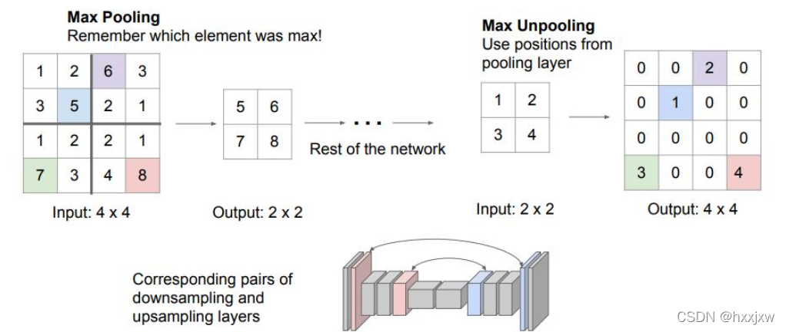

#### 池化(Pooling)

池化的本质是对数据进行降维，通过池化来降低卷积层输出的特征维度，起主要作用有：1）减少网络参数和计算成本，2）降低过拟合现象，3）抑制噪声，降低信息冗余，4）

##### 1.最大池化

最大池化就是选滑动窗口中的最大值当作池化结果，一般kernel_size等于步长，如下图所示

##### 2.平均池化

平均池化就是选滑动窗口中的平均值当作池化结果，一般kernel_size等于步长，下图是一个kernel_size为2x2，特征图为4x4，stride为2的平均池化的过程。

##### 3.上采样池化（也叫反向池化）

上采样池化中常用的是最大上采样池化（Max Unpooling），就是记录下采样池化过过程中最大值所在的位置，上采样的时候把最大值还原到其对应的位置，然后其余的位置补0，如下图所示：

##### 4.自适应池化

自适应池化只需输入参数output_size，表示经过池化后的特征矩阵的尺寸。该池化方式会自动计算所需的kernel_size，stride和padding的大小，自适应池化又分为最大自适应池化和平均自适应池化。

##### 5.全局池化

全局池化的kernel size就是输入特征矩阵的尺寸，所以经过全局池化后的特征矩阵，其形状将变成1x1xchannel。全局池化也分为全局平均池化和全局最大池化