##### 目标检测（object detection）

训练输入数据：

feature：图片（image）

target：目标类别（labels），目标的边界框（bbox）

##### 1.Faster R-CNN([ Faster R-CNN: Towards Real-Time Object Detection with Region Proposal Networks](paper/faster_rcnn.pdf), 2015)

Faster R-CNN是two-stage目标检测模型，第一步先提取出图像特征，在图像特征上生成建议候选框；第二步用第一步的图像特征和建议候选框进行候选框分类与调整，得到最后的检测框。整体结构如下图所示：

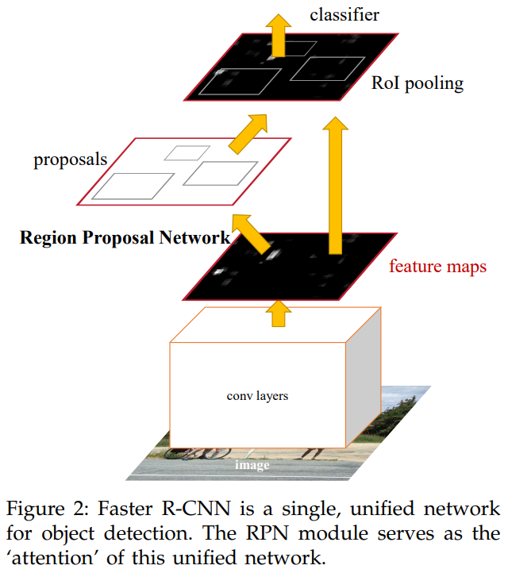

Faster R-CNN模型主要分为四个模块，1）conv layers是主干网络，主要用于提取图像特征，2）RPN用于生成候选框，该模块的第一个任务二分类，判断所有预设候选框中是否存在目标，第二个任务是bounding box regression，修正边界框的位置，通过非极大值抑制（NMS）去掉重复较多的候选框，3）RoI Pooling，用于收集RPN生成的候选框，并从主干网络输出的图像特征中提取出来，将生成的proposals features maps送入后续的全连接层，4）classification and regression，利用proposals features maps判断具体的类别，同时再做一次bounding box regression，得到精确位置

###### 1.conv layers

主干网络一般选取resnet50和fpn（特征金字塔网络，Feature Pyramid Networks）相结合的形式，在多个维度提取图像特征。fpn的具体做法是，记录renet50四个stage的输出结果，记为{c2，c3，c4，c5}，用1x1的卷积得到p5，将p5上采样后与c4逐点相加得到p4，依次向前重复此操作，得到p2, p3, p4, p5四个不同尺度的feature maps，RPN网络将在着四个特征图上生成候选框，这样有利用模型既能检测大目标，也能检测小目标

###### 2.RPN(Region Proposal Network)

RPN网络分为上下两层，上层用于判断候选框中是否存在目标，下层用于边界框修正，网络结构如下：

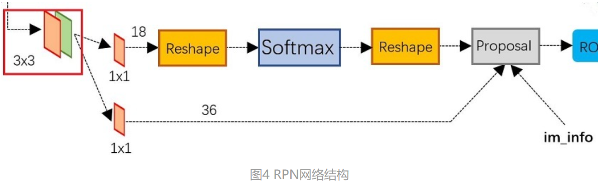

RPN的具体做法是，在主干网络输出的feature maps上的每一个像素上预设9个anchors，anchors的比例是[1:1, 1:2, 2:1]，利用reg层得到的偏移量（四维向量，[x,y,w,h]，是候选框相对于预测框中心点坐标、宽和高的偏移），利用cls层得到的scores(二维向量)，按positive scores（候选框存在目标的概率）大小排列所有的anchors，取前N个，对anchors进行修正，对剩余的positive anchors进行非极大值抑制去重，将剩余的anchors作为proposals（[xmin, ymin, xmax, ymax]对应原图的MxN尺度）输出

###### 3.RoI pooling(Region of Interests pooling)

RPN网络输出的是相对于原图片尺寸的建议框（proposals），RoI pooling网络的作用是将proposals在主干网络输出的feature maps上扣出对应位置来。具体做法是，在features maps上得到具体位置后，用一个固定大小的网格（pooled_w x pooled_h）与proposals位置对应，对网格内每个区域做max pooling，这样处理后，即使大小不同的porposals输出的结果都是pooled_w x pooled_h，实现了固定长度的输出。假定pooled_w x pooled_h是7x7，那RoI pooling的过程如下图所示：

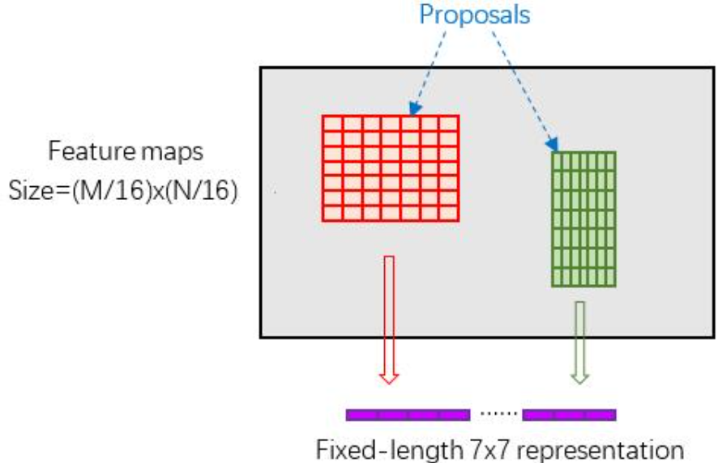

###### 4.classification and regression

最后输出层全连接层和RPN中的全连接层的主要区别在分类部分，RPN中的分类是二分类，只判断候选框中有无目标；最后输出层的分类一般是多分类，判断建议框中的目标类别。两个全连接层的损失函数相同，分类任务用交叉熵损失，回归任务用smooth L1 loss，公式如下：

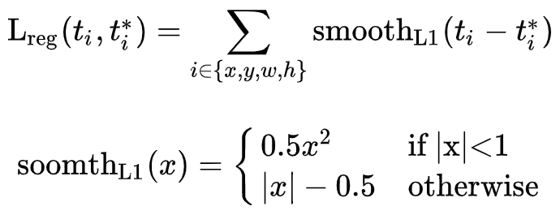

###### 5.Faster RCNN与SSD的anchor区别

前者在特征图上预设了anchor，先进行初步修正与筛选，之后再进行分类与回归（两个阶段）

后者在多个尺度的特征图上预设了anchor，并直接在所有这些anchor上进行分类与回归（一个阶段）

##### 2.SSD([SSD: Single Shot MultiBox Detector](paper/ssd.pdf), 2015)

SSD是一个one-stage的目标检测算法，能够一次就完成目标检测的分类过程。SSD采用VGG16的部分网络作为主干网络，在主干网络的多尺度的特征图上检测目标，大尺度特征图（较靠前的特征图）可以用来检测小物体，而小尺度特征图（较靠后的特征图）用来检测大物体，模型结构如下图所示：

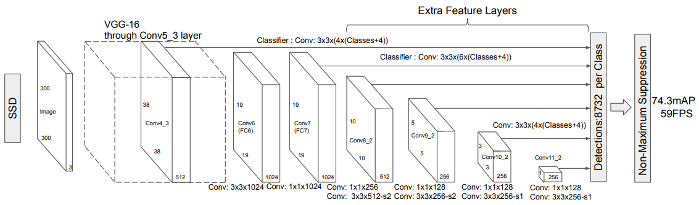

SSD具体的过程是，1）在特征图上预设不同尺寸的候选框，预测的边界框（bounding box）是以这些先验框为基准，预测结果是边界框中心点的偏移和边界框的宽，高（cx,cy,w,h）,以及该边界框的目标类别c+1（1表示背景），综上，对于一个mxn的特征图，每个单元设置候选框的数量记为k，那么每个单元共需要预测（c+1+4）k个预测值，所有单元共需要预测（c+1+4）kmn个预测值，由于ssd是采用卷积做预测，所以就需要（c+1+4）k个卷积核完成这个特征图的检测过程。

训练过程：1)数据增强，对原图片进行水平翻转（horizontal flip），随机裁剪加颜色扭曲（random crop & color distortion），随机采集区域块（randomly sample a pathc）等操作。2）候选框匹配，对于图片中的每个ground truth，找到iou大于某个阈值（一般是0.5）的候选框与之匹配，所以ground truth和候选框是一对多的关系，如果所有候选框与ground truth的iou都小于阈值，则选择iou最大的候选框，总之要确保每个ground truth至少匹配一个候选框，每个候选框只能被一个ground truth匹配。3）损失函数采用位置误差（Lloc）和置信度误差（Lconf）的加权和，公式如下：

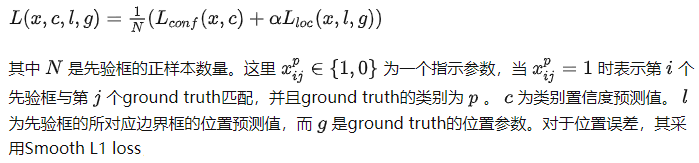

4）根据置信度阈值筛选出预测框，然后对预测框进行解码得到相对于原图的位置参数，最后进行NMS算法，去除重叠度较大的预测框，得到最终结果。

##### 3.RetinaNet([Focal Loss for Dense Object Detection](paper/retina_net.pdf), 2017)

RetinaNet是一个one-stage的目标检测模型，主干网络由ResNet和FPN组成，检测网络由两个分支组成，一个分支用来判断候选框的类别，另一个分支用来对候选框的位置做回归调整。与RPN网络类似，检测网络会在特征金字塔网络输出的特征图上生成建议框，但RPN网络只区分建议框为前景或背景，RetinaNet检测网络会判断的目标的类别。模型结构如下图所示：

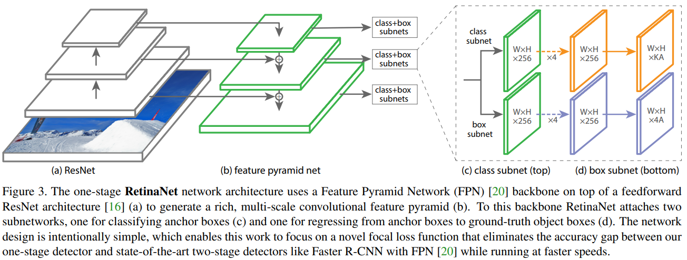

###### Focal Loss

整个网络的损失是所有训练样本经过模型预测后计算损失值的累加，因为难区分的样本（一般来说预测置信度小于0.6的二分类任务）较少，虽然其对应的损失值较大，但最后全部累加后，大部分的损失值还是来自于容易分类的样本，这样模型优化的过程中会将更多的优化放在容易分类的样本中，而忽略难分类的样本。

RetinaNet的一个亮点是在分类子网络上使用了Focal Loss，可以有效减小类别不均衡，挖掘难分的样本。Focal Loss的公式如下：

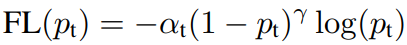

Focal Loss就是在损失函数上加了一个调节因子α和一个权重因子(1-pt)r，r>=0，让损失函数更加关注难分类的样本。对于容易分类的样本，pt的值较大，交叉熵损失前面的项就非常小，对于难分类的样本，pt的值较小，交叉熵损失前面的项就较大，在计算总损失时，难分类的样本贡献的总损失更多，模型优化时就更侧重难分类的样本。下图可以看到，随时r的值不断变大，容易区分的样本贡献的总损失几乎为0，而pt较小的难分类的样本贡献的损失依然很大。

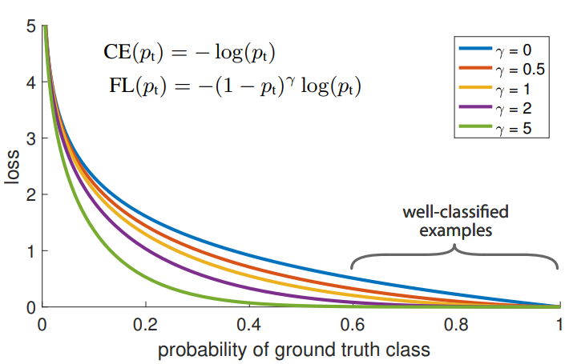

##### 4.FCOS([FCOS: Fully Convolutional One-Stage Object Detection](paper/fcos.pdf), 2019)

FCOS是一个全卷积的one-stage目标检测模型，模型中不预置候选框和建议框，以逐像素预测的方式预测特征图中每个点所属的目标类别和目标框，类似于语义分割。其模型结构如下图所示：

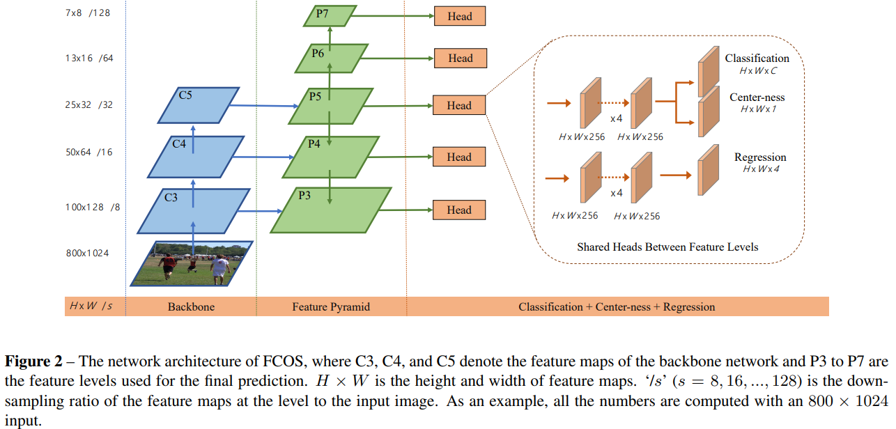

FCOS模型主干网络由ResNet和FPN组成，检测网络分为两个分支，上层分支又分为两个子分支，第一个子分支判断预测框的类别，第二个子分支计算预测点和预测框中心点的距离（center-ness）的分数，区间为[0,1]，分数越大，表示预测点距预测框中心点距离越近，用center-ness分数乘以第一个子分支的类别分数当作NMS排序参考，相当于降低了离预测框较远的位置的权重。如下图所示：

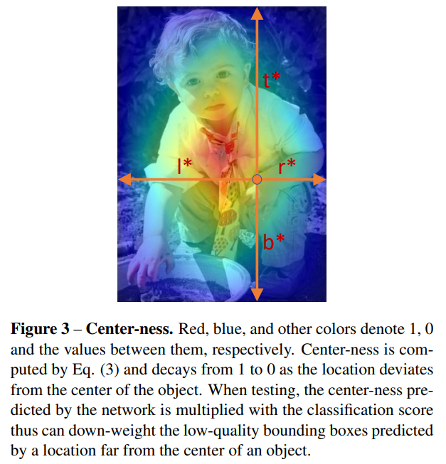

下层分支用来对预测框的位置做回归调整，输出一个四维向量（l,t,r,b），分别表示预测点离目标框的左边、上边、右边、下边的距离。如下图所示：

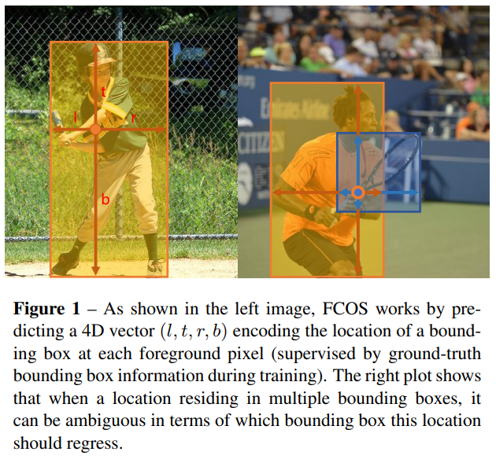

FCOS是在特征图上逐点进行预测的，如果一个点属在标注框内，就是正样本，否则是负样本，所以正负样本是基于每个点的，一般一张图像上目标框的面积和非目标框的面积差距不会特别大，因此基本不会出现正负样本不均衡的问题。

###### anchor的缺点

1）超参数较多，且最终检测结果对超参数对较为敏感，调参较麻烦，2）正负样本不均衡，因为一张图像中的目标数量有限，而anchor通常是要在特征图的每个点上都预置，数量很多，这就导致负样本远远多于正样本，存在样本不均衡的问题

##### 5.YoloV7([Trainable bag-of-freebies sets new state-of-the-art for real-time object detectors](paper/yolov7.pdf), 2022)

当前目标检测的主要优化方向有更快更强的网络架构；更有效的特征集成方法；更准确的检测方法；更精确的损失函数；更有效的标签分配方法；更有效的训练方法等，YoloV7集成了现有的一些trick(技巧)

Mosaic数据增强：采用4张图片，随机缩放、随机裁剪、随机排布的方式进行拼接，主要用来解决小目标检测的问题，如下图：

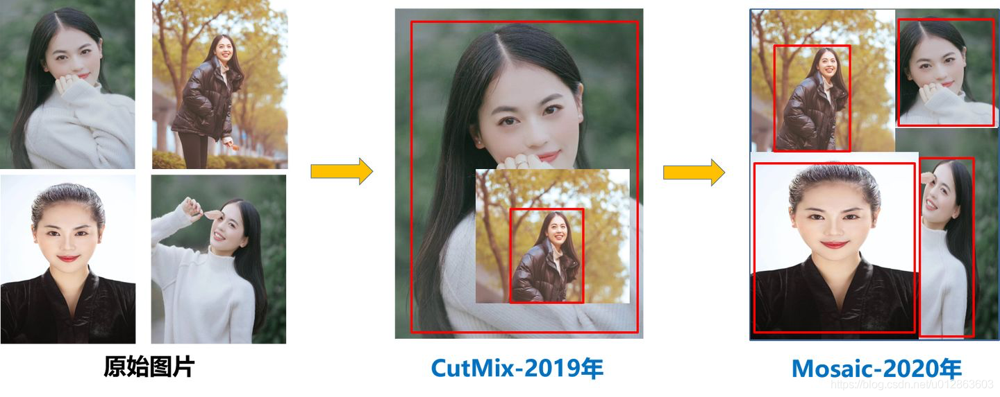

YoloV7的整体结构如下图所示，分为Input，Backbone和Head三个部分，input是640x640x3的图片；Backbone主要采用了MP结构和ELAN结构，激活函数采用Silu；Head相当于是一个FPN+PAN网络结构，并且添加了辅助训练头，主要包含了SPPCSPC，ELAN-W，MP，Rep和CBM结构，如下图所示：

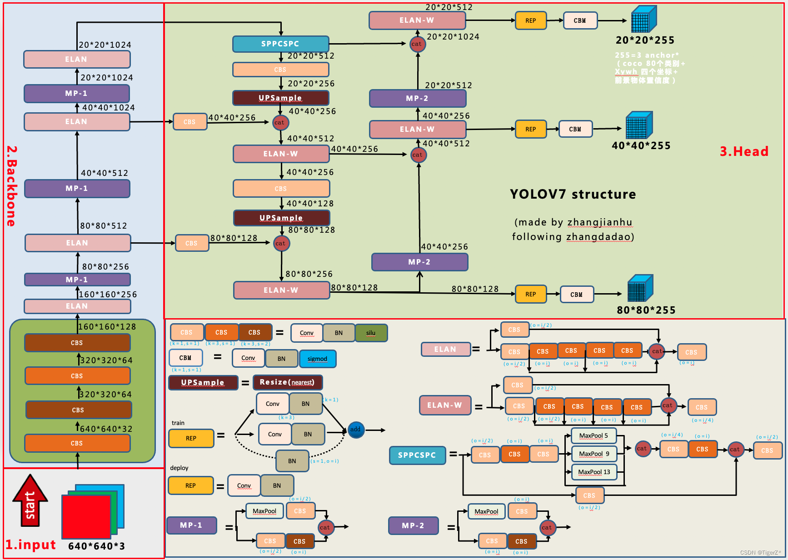

在Backbone部分，CBS结构包含了卷积，批量标准化，激活三个步骤；ELAN是由多个CBS结构组成的，多尺度提取特征后再拼接在一起；MP结构是MaxPooling和下采样卷积（步长为2）的并行，然后再拼接在一起。辅助训练头（Auxiliary head）和主训练头（Lead head）对损失函数的影响系数的比例为0.25：1。

在Head部分，SPPCSPC是一个空间金字塔池化结构，采用不同kernel_size的池化核，然后再将多个支路进行拼接；Rep结构十分灵活，训练时采用多分支提升特征提取性能，推理时采用单分支加快速度。

损失函数包含了边界框坐标损失，目标置信度（框内是否包含目标）损失和分类损失三部分，其中目标置信度损失和分类损失采用了BCEWithLogitsLoss(带log的二值交叉熵损失)，坐标损失采用CIoU损失。

边界框匹配策略采用了simOTA方法，主要过程有：1）根据gt框，利用k-means聚类算法获得9个anchor框（可选，如不选，可用预置的先验框尺寸），2）计算每个gt框和9个anchor框的高与高，宽与宽的比值，取这两个比值中的较大值，若这个较大的比值小于设置的阈值，就把这个anchor框称为正样本，所以可能出现一个gt框匹配多个anchor框的情况，大大增加了正样本的数量，3）扩充正样本，根据gt框的中心位置，将最近的2个邻域的网格也作为预测网格，此时一个gt框最大可以匹配27个anchor框，大大增加了正样本的数量。最近邻域的选定办法如下图，其实是选离gt框中心点最近的两个网格（图中的浅黄色部分），4）获取和当前gt框iou最大的10个预测结果，将iou取sum，最为当前gt框的k，5）计算每个gt框和候选anchor框的损失，并保留损失最小的前k个，6）去掉同一个anchor框被分配到多个gt框的情况

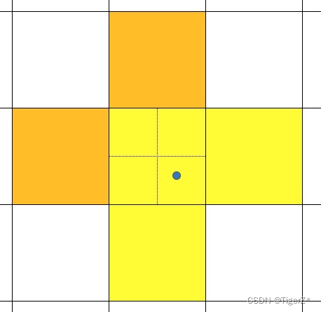

Silu激活函数是Sigmoid激活函数的加权线性组合，公式为：Silu(x)=xSigmoid(x)，曲线如下图：

##### 6.Detr

Paper:https://ai.meta.com/research/publications/end-to-end-object-detection-with-transformers/

GitHub:https://github.com/facebookresearch/detr

##### 7.Dynamic Head

paper：https://arxiv.org/pdf/2106.08322.pdf

github：https://github.com/microsoft/DynamicHead

dynamic head不是某一种具体的目标检测模型，而是一种目标检测头，可以和多种backbone搭配使用，它将注意力机制和目标检测head统一起来。dynamic head的self-attention体现在三个方面：1）在特征层级之间做尺度感知（scale-aware），尺度感知注意力，在level维度上执行，不同level的feature map对应了不同的目标尺度，在level层级增加注意力，可以增强目标检测的尺度感知能力

2）在空间位置之间做空间感知（spatial-aware），空间感知注意力，在spatial维度上执行，不同的空间位置对应了目标的几何变换，在spatial维度上增加注意力，可以增强目标检测器的空间位置感知能力

3）在输出通道之间做任务感知（task-aware），任务感知注意力，在channel维度上执行，不同的通道对应了不同的任务，在channel维度上增加注意力，可以增强目标检测对不同任务的感知能力

整体的示意图如下：

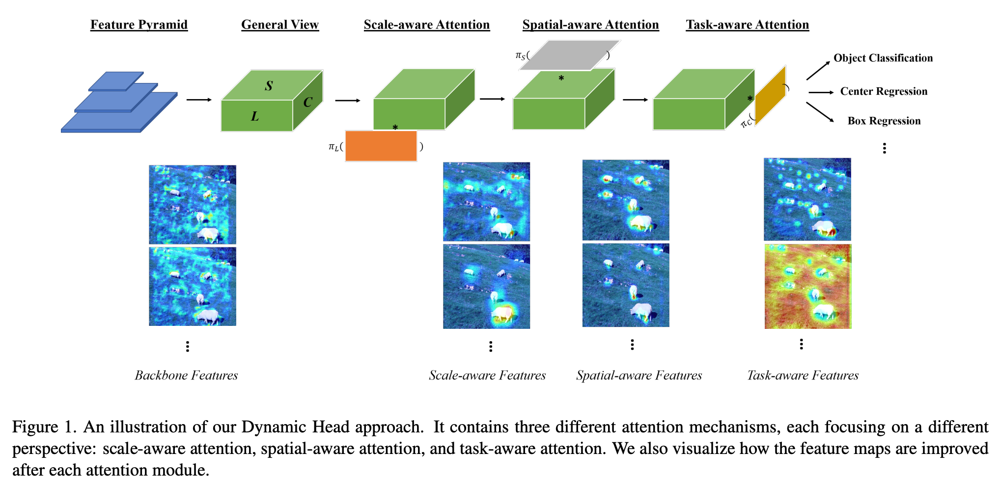

dy head block注意力机制的结构如下，可以分别应用在one-stage和two-stage的目标检测模型上，主要不同点在于，在two-stage的目标检测模型中，任务感知注意力在roi pooling层之后：

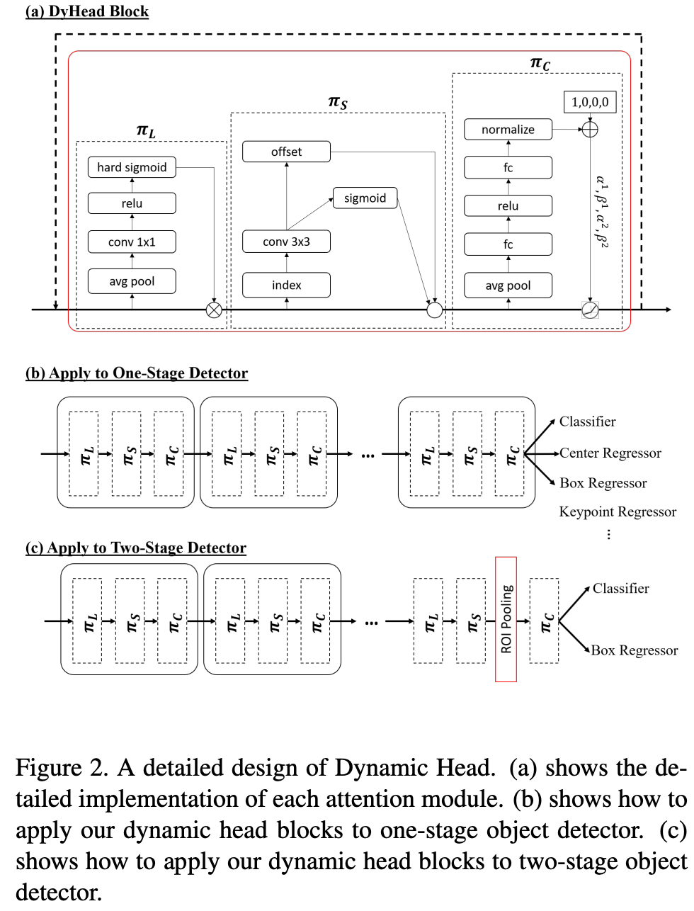