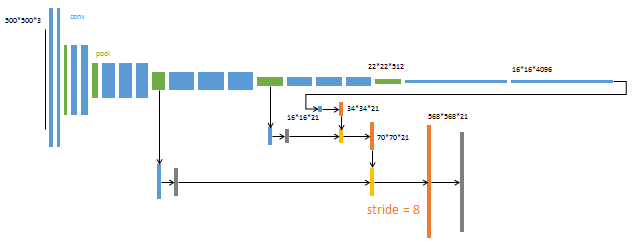
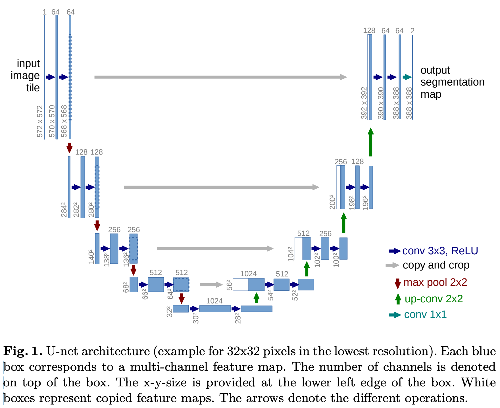

#### 语义分割

语义分割（semantic segmentation）：把每一个像素点都分为一个类别

实例分割（instance segmentation）：只分割前景的像素，并且区分同一类别的不同个体

全景分割（panoptic segmentation）：背景像素用语义分割，前景像素用实例分割

feature：图片（image）

target：目标类别（labels），类别的掩码（mask）

##### 1.FCN([Fully Convolutional Networks for Semantic Segmentation](paper/fcn.pdf), 2014)

FCN是一个全卷积神经网络模型，用于图像语义分割，模型结构如下所示：

论文中一共创建了三个网络结构，分别是FCN-32s，FCN-16s，FCN-8s，s代表步长（stride），如下图所示：

在voc数据集上，FCN-8s的表现最好，具体做法是将不同尺度的特征图进行上采样至原图的大小，再将上采样后的特征图进行融合，得到最终输出的特征图（w，h，c），w，h表示原图的宽和高，c表述语义分割的类别。上采样的过程如下图，图中的灰色特征图对padding进行crop后的结果，橙色特征图和黄色特征图是矩阵相加的操作

###### 上采样的方法

1）双线性插值，原论文采用双线性插值进行上采样

- 线性插值：是指插值函数为一次多项式的插值方式。线性插值的几何意义即为：已知原函数的A点和B点，可以利用过A点和B点的直线来近似表示原函数

- 双线性插值：又称为双线性内插。在数学上，双线性插值是有两个变量的插值函数的线性插值扩展，其核心思想是在两个方向分别进行一次线性插值

2）反卷积（deconvolution），也叫转置卷积，在特征图的网格像素间插值补0，然后再进行卷积，会得到比原特征图尺寸更大的特征图。pytorch官方采用反卷积进行上采样

3）反池化，根据特征图池化前的位置信息，反池化后的位置不变，其他位置填0，如下图所示：

##### 2.DeepLabV3([Rethinking Atrous Convolution for Semantic Image Segmentation](paper/deeplabv3.pdf), 2017)

DeepLabV3是一个语义分割模型，原论文中提出了两种网络搭建方式，如下图所示：

其中第二种模型结构更为常用，其主要创新点是使用了空洞空间金字塔池化（Atrous Spatial Pyramid Pooling, ASPP）结构，DeepLabV3的主干网络一般为ResNet50，将block3中的3x3的卷积核改成了膨胀率为2的空洞卷积，将block4改成了ASPP结构，从不同尺度的提取图像信息，最后将特征图上采样至与原图同样大小，通道数为语义分割类别的数量。

###### 1.空洞卷积（astrous convolution）

空洞卷积也叫膨胀卷积，是在常规卷积核的网格间插入一定数量的0值网格，达到扩大感受野的目的，同时又既不增加参数量，也不下采样损失图像信息。常规卷积核元素间的间隔数加1称为膨胀率(dilated rate)。下图展示了一个膨胀率为2的3x3的卷积：

###### 2.空洞空间金字塔池化（Atrous Spatial Pyramid Pooling）

空洞空间金字塔池化的结构如下图所示：

例如一个feature size为60x60的特征图进入aspp结构中后，会有五个分支，第一个分支是常规的1x1卷积，第二、三、四个分支分别是膨胀率为12、24、36的空洞卷积，第五个分支是全局池化接1x1卷积调整通道数，再接双线性插值上采样至60x60，最后将五个分支的结果按通道方向拼接，其中每个分支都用到了批量标准化

##### 3.LRASPP([Searching for MobileNetV3](paper/lraspp.pdf), 2019)

 LRASPP（ 精简的空洞空间金字塔池化，Lite Reduced Atrous Spatial Pyramid Pooling）是一个轻量级的语义分割网络，采用MobileNetV3为主干网络，后接一个语义分割头，模型整体结构如下图所示：

在主干网络最后的输出层是16倍下采样，后接了两个分支，上分支经过1x1卷积层，下分支经过平均池化、1x1卷积、sigmoid激活、双线性插值后与上分支的结果相乘，然后经过双线性插值、1x1卷积生成相对于原图的8倍下采样特征图。在主干网络8倍下采样的中间层还有一个分支，经过1x1卷积后上层的8bz下采样特征图相加，再经过双线性插值得到和原图大小相同的特征图，通道数为语义分割类别的个数

LRASPP在主干网络MobileNetV3中的卷积都换成了空洞卷积，最后三个bottle neck的空洞系数为2，其他的空洞系数为1.

##### 4.Unet

paper：https://arxiv.org/pdf/1505.04597.pdf

Unet是一个全卷积神经网络，网络的整体结构是先下采样，然后上采样，并在不同阶段采用特征融合的方式，网络结构图如下：

