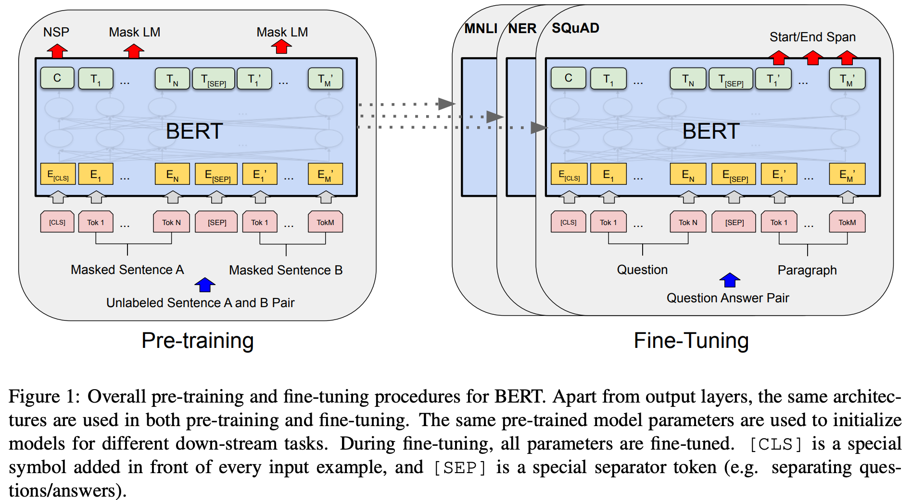
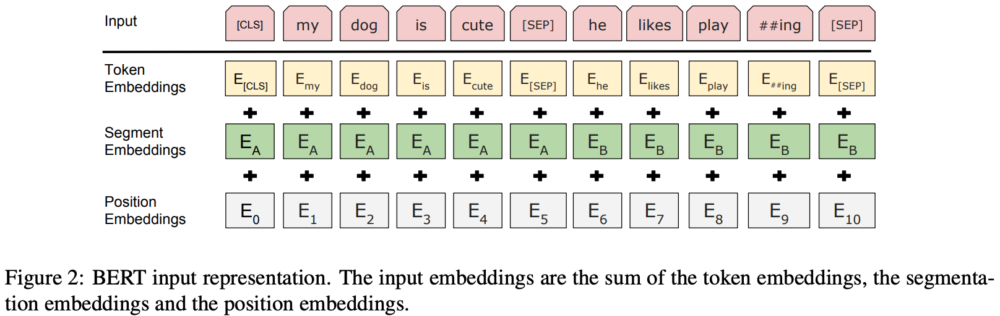

## Bert

Paper: https://arxiv.org/pdf/1810.04805.pdf

GitHub: https://github.com/google-research/bert

#### 1.模型结构

BERTBASE（L= 12，H=768，A=12，总参数=110M）

BERTLARGE（L=24，H=1024，A=16，总参数=340M）

L表示层数（即transformer块的个数），H是隐藏层的大小，A是注意力机制的头数

#### 2.训练

在训练和微调过程中，除了输出层不同，其他的网络层结构都相同：

bert模型的输入是token、segment、position的编码加和的结果，如下图所示，token embedding是词向量，segment embedding表示是哪个句子，position embedding是位置编码

预训练任务：

1.完形填空，随机将句子中15%的token用mask表示，在训练的过程中预测这些被标记的token，

2.下一个句子预测（NSP），预测输入中的第二个句子是否是第一个句子的下一个句子

两个任务的损失函数都为交叉熵损失