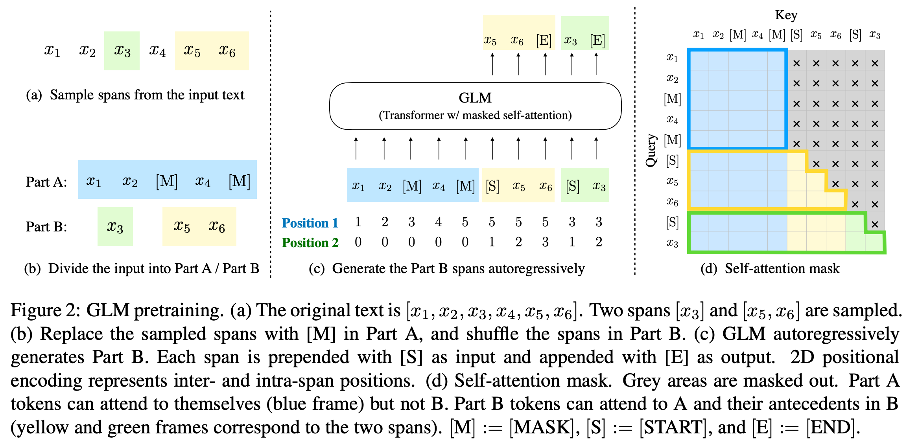

#### 模型介绍

encoder-only（autoencoding）：bert

decoder-only（autoregressive）：gpt

encoder-decoder：T5

GLM的模型结构基于autoregressive，训练方式借鉴了bert和gpt，既有随机空白填充（blanking filling），也有文本片段生成（sequentially reconstruct the spans）

#### 创新点

文本片段洗牌（span shuffling）：随机从PartA中抽取span，并将span随机排列作为PartB

2d位置编码（2D positional encoding）：第一个位置编码表示输入文本中的位置。第二个位置编码是span内的位置，对于PartA，编码为0，对于PartB，编码的范围是从1到span的长度

GLM在训练时将文本随机抽样并分成两部分PartA和PartB，PartA随机mask掉token，训练完形填空任务，PartB部分的Token可以关注PartA部分的文本语义，训练生成任务。glm的与训练过程如图所示：

