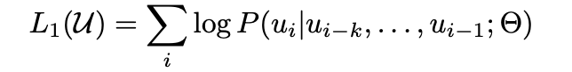
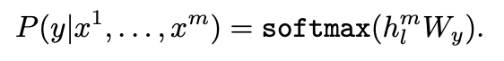
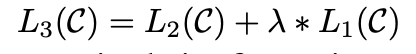
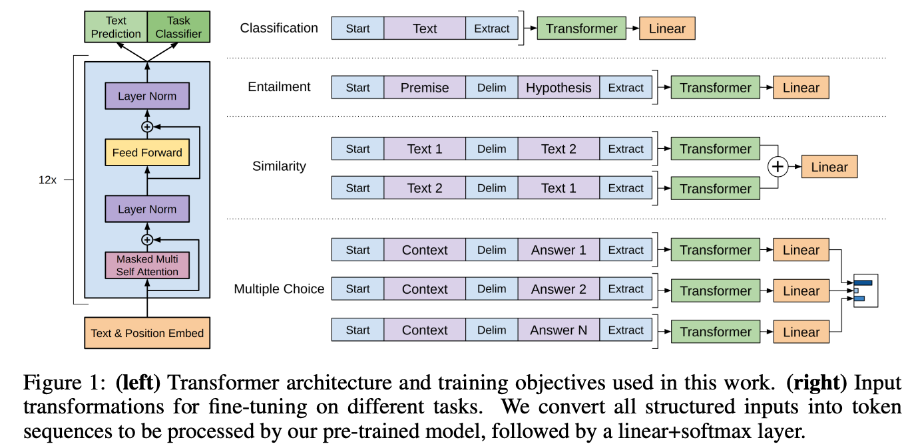
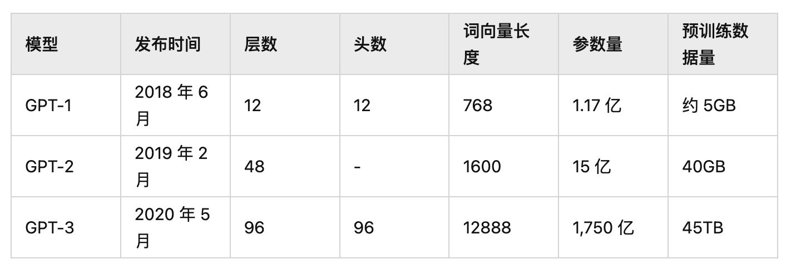

### 1.GPT([GPT](paper/gpt.pdf))

#### 1.简介

GPT通过在各种未标记文本的语料库上对语言模型进行生成式预训练，然后对每个特定任务进行区分性微调，在这些任务上实现了巨大收益

GPT的训练分为无监督学习和有监督学习两个阶段：

无监督学习阶段的损失函数为：

其中，k是上下文窗口，条件概率 P 使用参数为 θ 的神经网络进行建模，在已知i-k到i-1的tokens的情况下，让ui出现的概率最大化，就是优化函数的目标

有监督学习阶段的损失函数为：

其中(x1,...,xm)是输入tokens，y是本文的label，在已知输入tokens的情况下，让y的概率最大化就是优化函数的目标

两个阶段的损失函数按一定权重(λ=0.5)加起来，就是GPT完整训练任务的损失函数：

#### 2.模型结构

下图左边是decoder结构和训练目标，右边是不同任务在微调过程中的输入预处理方式

#### 3.训练参数

GPT模型结构很大程度上遵循了transformer中decoder，包含12层decoder，每个decoder层包含12个masked self attention头，embedding dimensional为768，sequence length为512，前馈神经网络的维度为3072

## 2.GPT2([GPT2](paper/gpt2.pdf))

GPT2认为所有的有监督学习都是无监督语言模型的一个子集

GPT2模型在GPT的基础上做了以下几个方面的调整：

1.层归一化(LAYER NORMALIZATION)，被放到了每一个解码器的前端，并且在最后的一层隐层输出做了一个层归一化

2.参数的初始化方式，把每一个残差链接层的参数按照残差层的个数进行了缩放，缩放比例是1/(根号n)

3.语句的分词，用了BYTE-LEVEL VERSION OF BYTE PAIR ENCODING，对字节级别的信息进行编码作为输入

GPT2最主要的贡献是探索了更大规模的模型在ZERO-SHOT的情况下的表现，没有使用任何微调，仅靠预训练+提示+预测就在8/9个任务里达到了SOTA.

## 3.GPT3([GPT3](paper/gpt3.pdf))

GPT-3的主要目标是用更少的领域数据、且不经过精调步骤去解决问题。对于所有任务，应用GPT-3无需进行任何梯度更新或微调，而仅通过与模型的文本交互指定任务和少量演示即可

GPT-3主要聚焦于更通用的NLP模型，解决当前BERT类模型的两个缺点：

- **对领域内有标签数据的过分依赖**：虽然有了预训练+精调的两段式框架，但还是少不了一定量的领域标注数据，否则很难取得不错的效果，而标注数据的成本又是很高的
- **对于领域数据分布的过拟合**：在精调阶段，因为领域数据有限，模型只能拟合训练数据分布，如果数据较少的话就可能造成过拟合，致使模型的泛化能力下降，更加无法应用到其他领域

#### 模型结构

GPT-3依旧延续自己的单向语言模型训练方式，只不过这次把模型尺寸增大到了1750亿，并且使用45TB数据进行训练。同时设置了各种size的模型进行对比

#### 训练集

CommonCrawl数据集，采取了3个步骤来提高数据集的平均质量：（1）基于与一系列高质量参考语料库的相似性，下载并筛选了CommonCrawl的一个版本（2）在文档级别、数据集内部和数据集之间执行了模糊重复数据消除，以防止冗余，并保留完整验证集作为一种精确的过拟合度量（3）将已知的高质量参考语料库添加到训练组合中，以增强CommonCrawl并增加其多样性

