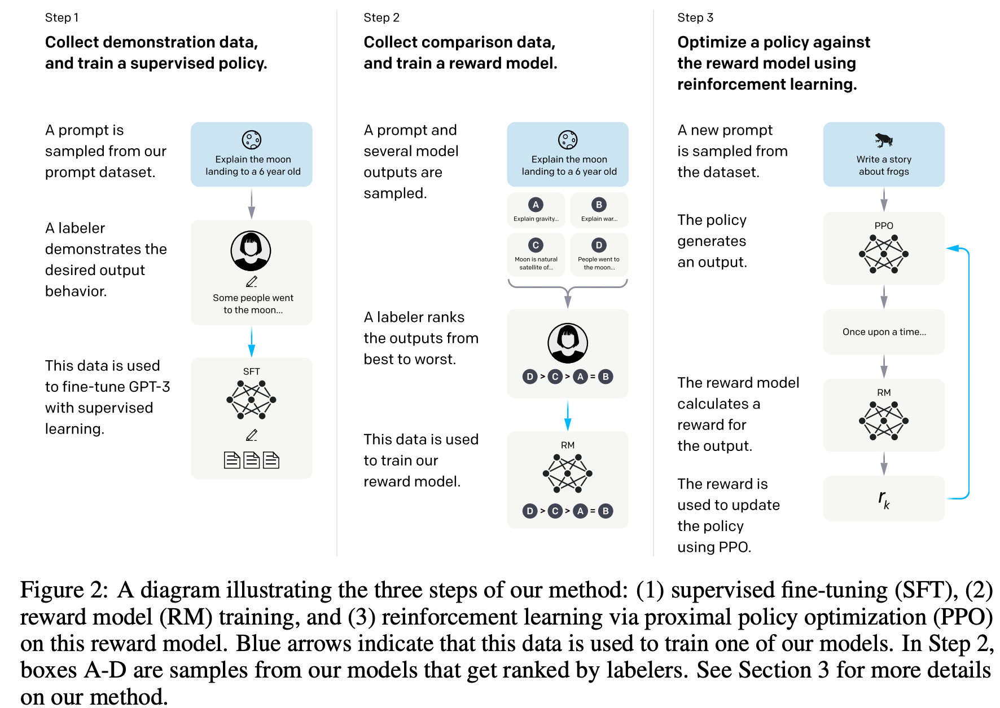
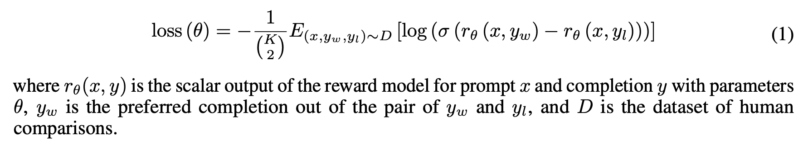
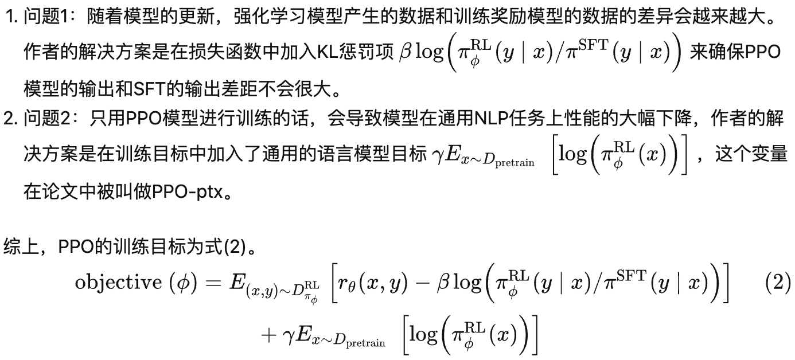

## Instruct GPT([instructgpt](paper/instructgpt.pdf))

Instruct gpt的训练方式和chatgpt相同，训练步骤如下图所示：

#### 1.数据集

+ SFT数据集是用来训练第1步有监督的模型，即使用采集的新数据，按照GPT-3的训练方式对GPT-3进行微调。因为GPT-3是一个基于提示学习的生成模型，因此SFT数据集也是由提示-答复对组成的样本
+ RM数据集用来训练第2步的奖励模型，我们也需要为InstructGPT/ChatGPT的训练设置一个奖励目标，要尽可能全面且真实的对齐我们需要模型生成的内容。很自然的，我们可以通过人工标注的方式来提供这个奖励，通过人工对可以给那些涉及偏见的生成内容更低的分从而鼓励模型不去生成这些人类不喜欢的内容。InstructGPT/ChatGPT的做法是先让模型生成一批候选文本，让后通过labeler根据生成数据的质量对这些生成内容进行排序
+ InstructGPT的PPO数据没有进行标注，它均来自GPT-3的API的用户。既又不同用户提供的不同种类的生成任务，其中占比最高的包括生成任务（45.6%），QA（12.4%），头脑风暴（11.2%），对话（8.4%）等

#### 2.训练

- SFT：这一步的训练和GPT-3一致，而且作者发现让模型适当过拟合有助于后面两步的训练

- RM：因为训练RM的数据是一个labeler根据生成结果排序的形式，所以它可以看做一个回归模型。RM结构是将SFT训练后的模型的最后的嵌入层去掉后的模型。它的输入是prompt和Reponse，输出是奖励值。具体的讲，对弈每个prompt，InstructGPT/ChatGPT会随机生成k个输出（ 4≤k≤9 ），然后它们向每个labeler成对的展示输出结果，也就是每个prompt共展示k(k-1)个结果，然后用户从中选择效果更好的输出。在训练时，InstructGPT/ChatGPT将每个prompt的k(k-1)个响应对作为一个batch，这种按prompt为batch的训练方式要比传统的按样本为batch的方式更不容易过拟合，因为这种方式每个prompt会且仅会输入到模型中一次。奖励模型的损失函数如下，这个损失函数的目标是最大化labeler更喜欢的响应和不喜欢的响应之间的差值:

  

- ppo阶段的问题和损失函数如下：

  