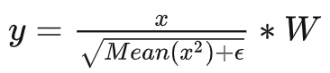

## LLAMA

#### 1.简介

Paper:https://arxiv.org/pdf/2302.13971.pdf

github:https://github.com/facebookresearch/llama

语言模型是单词、标记或字符序列的概率分布，生成式语言模型的任务通常被定义为下一个标记预测，长期以来一直被认为是自然语言处理的核心问题

#### 2.LLAMA创新点

##### 1.预标准化（pre-normalization）

使用前置的RMSNorm，在transformer的输入层进行归一化，而不是对输出进行归一化

- LayerNorm和RMSNorm的不同：

LayerNorm：

RMSNorm:

RMSNorm发现LayerNorm的中心偏移（减去均值的操作）作用不大，改成RMSNorm后，可以大大提高计算速率

##### 2.使用SwiGLU激活函数（也称为SiLU）

公式为：sigmoid(x)*x，效果类似平滑版的relu：

##### 3.旋转位置编码（rotary embeddings）

一般来说，绝对位置编码的特点是实现简单、计算速度快，相对位置编码能体现相对位置信息，更有利于注意力机制的学习。旋转位置编码的设计思路是以绝对位置编码的方式实现相对位置编码，编码形式为：

从上面这个公式可以看出，q和k的attention依赖相对距离m-n。因此RoPE为q、k注入的绝对位置编码，计算得到的attention，却变成了相对位置编码

