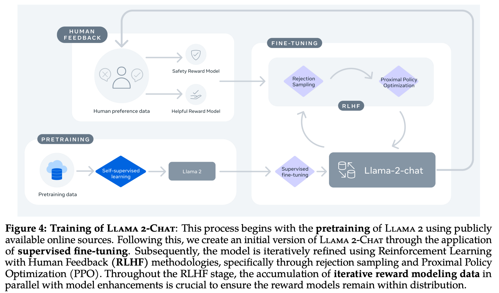
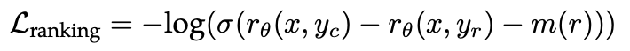
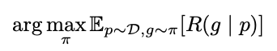
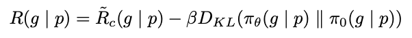
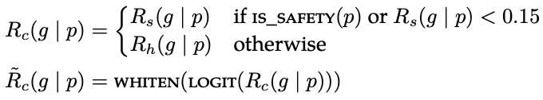
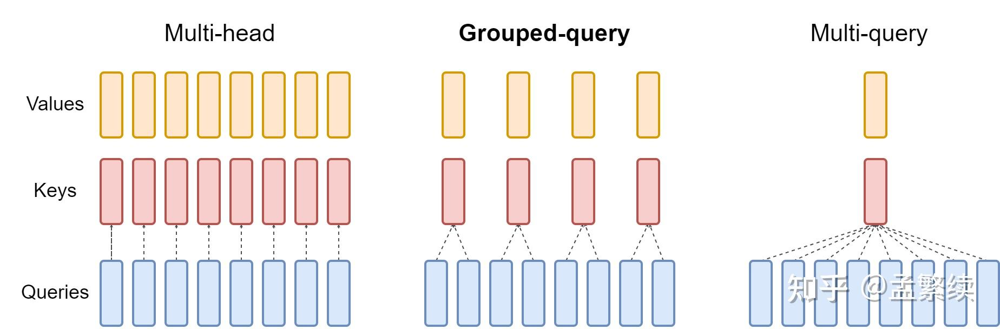

## llama2

paper：https://scontent-lax3-2.xx.fbcdn.net/v/t39.2365-6/10000000_663429262362723_1696968207443577320_n.pdf?_nc_cat=101&ccb=1-7&_nc_sid=3c67a6&_nc_ohc=5ol-jUSglG4AX9uTu-j&_nc_ht=scontent-lax3-2.xx&oh=00_AfDVmJr77y3bv5GCbJ26w-stMJNXsZPTwVDlWhoIkkb8Lg&oe=64BDB0D1

llama2-chat的训练过程如下：

#### 1.预训练

编码方法：BPE（byte pair encoding）算法，The total vocabulary size is 32k tokens

预归一化：RMSNorm

激活函数：SwiGLU

优化器：AdamW，β1 = 0.9，β2 = 0.95，eps = 10−5，cosine lr scheduler with warmup of 2000 steps， weight decay 0.1, gradient clip 1.0 

#### 2.微调

- SFT：cosine lr scheduler ，lr=2*10^-5，weight decay 0.1, batch size 64， sequence length 4096，epoch 2，每个训练样本中都包含prompt和answer，训练时用特殊标记将prompt和answer链接起来，以便于将句子填充到sequence length的长度

- RLHF数据收集：收集代表根据经验采样的人类偏好的数据，人类注释者可以选择他们更喜欢的两个模型输出中的哪一个，数据的标注过程是：标注员输入一个prompt，不同的模型总共产生2个answer，标注员选择自己更新的一个answer和喜欢的程度。标注员在选择时将考虑answer的有用性和安全性。

- RM：分别训练了一个有用性奖励模型和安全性奖励模型，奖励模型的架构、超参数和预训练模型相同，只是将预测下一个词的分类头改成了输出标量奖励分数的回归头，奖励模型的损失函数如下：

  

​		r是奖励，x是prompt，yc是choosen answer，yr是rejected answer，m是奖励的评级

​		奖励的计算公式如下：

​	

​		其中，p是数据集D 中的prompt，g是策略π下的生成，R(g|p)模型奖励。π0是初始策略，πθ是当前策略，D是当前策略的生成相对于初始策略的KL散度，作为奖励函数的惩罚项。Rs是安全奖励，Rh是有用性奖励，Rc是组合奖励。最终的奖励通过使用 logit 函数反转 sigmoid 来表示

#### 3.对llama1的改进

context length：上下文窗口从 2048 个标记扩展到 4096 个token

grouped query attention：分组查询注意力(GQA)机制来提高推理可扩展性，节省kv缓存，llama2采用的是具有8kv投影的分组查询注意力机制

Ghost attention(GAtt)：多轮对话一致性，基于上下文蒸馏的多回合一致性新方法，该方法通常是用来提高模型性能的，直到我们更好地理解如何训练模型来满足我们的需要

相比llama，llama2的语料库增加40%，模型的上下文长度加倍，在70B参数量的模型上还采用分组查询注意力(GQA)机制来提高推理可扩展性

#### 4.Group Query Attention

自回归模型生成回答时，需要前面生成的KV缓存起来，来加速计算。多头注意力机制(MHA)需要的缓存量很大，Multi-Query Attention指出多个头之间可以共享KV对。Group Query Attention没有像MQA一样极端，将query分组，组内共享KV，效果接近MQA，速度上与MQA可比较。p.s. 这个技术falcon已经用上了，当时falcon说自己用的是multi query attention，因为当group=1时，GQA和MQA是等价的

