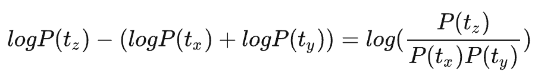
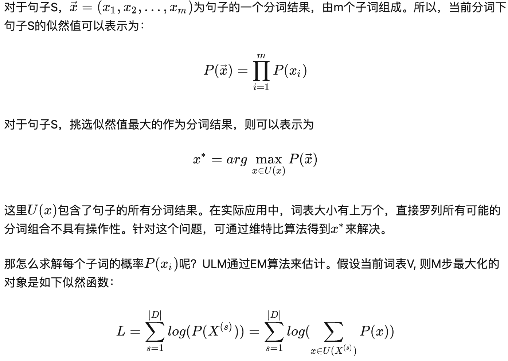

## token编码方法

tokenizer是token编码器，可以把一段文本编码为一个列表，列表中的每个元素就代表一个token；同时也可以将含有token的列表解码成一段文本

vocab_size是词汇表的长度，是在训练tokenizer时人工规定的超参数，词汇表里的元素就是token和与之对应的索引，token可以是一个单词，一个子词片段，一个标点符号等，这取决于token编码的方法。常见的token编码方法有wordpiece、BPE、unigram等

最基本的tokenization, 就是把每一个单词看成一个token，然后对其进行编号，这种编码方式十分符合人类语言习惯，因为人类语言也经常以单词为单位进行交流。一门语言中，通常有几万到几十万量级的单词数。若使用这种编码方式，在语言模型预测的时候需要在这个拥有几万个单词的列表上计算一个概率分布，那样的计算量是非常恐怖的，而且过大的token列表十分影响模型的预测准确度。随着模型集成的不同国家的语言越来越多，模型的词汇列表势必会增长到一个非常可怕的数量级

### 1.wordpiece编码

wordpiece的编码思想是将常见的单词用一个token索引表示，将罕见且复杂的单词拆分成多个子词片段，每个子词片段用一个token索引表示，这样就可以将token的数量控制在人为规定的范围内，同时也可以由多个子词片段组合成任何单词。被拆分成的子词片段会有特殊标记（比如bert中的##），解码时可根据特殊标记将多个子词片段拼接成一个完整单词。具体的步骤如下：

1. 使用文本中的所有字符初始化单词单元清单

2. 使用 1 中的清单在训练数据上构建语言模型

3. 通过组合当前单词库存中的两个单元来生成新的单词单元，以使单词单元清单增加 1。 从所有可能的单词单元中选择新的单词单元，当添加到模型中时，该新单词单元可以最大程度地增加训练数据的可能性

4. 转到步骤 2，直到达到单词单元的预定义限制或可能性增加低于某个阈值。

  假设把相邻位置的x和y两个子词进行合并，合并后产生的子词记为z，此时句子S似然值的变化可表示为：
  
  很容易发现，似然值的变化就是两个子词之间的互信息。简而言之，WordPiece每次选择合并的两个子词，他们具有最大的互信息值，也就是两子词在语言模型上具有较强的关联性，它们经常在语料中以相邻方式同时出现

### 2.BPE编码（Byte Pair Encoding）

BPE 是一种简单的数据压缩算法，BPE的核心思想是：每一步都将最常见的一对相邻数据单位替换为该数据中没有出现过的一个新单位，反复迭代直到满足停止条件，停止条件就是总的token数量符合人为规定的vocab_size

假设我们有需要编码（压缩）的数据 aaabdaaabac。相邻字节对（相邻数据单位在BPE中看作相邻字节对） aa 最常出现，因此我们将用一个新字节 Z 替换它。我们现在有了 ZabdZabac，其中 Z = aa。下一个常见的字节对是 ab，让我们用 Y 替换它。我们现在有 ZYdZYac，其中 Z = aa ，Y = ab。剩下的唯一字节对是 ac，它只有一个，所以我们不对它进行编码。我们可以递归地使用字节对编码将 ZY 编码为 X。我们的数据现在已转换为 XdXac，其中 X = ZY，Y = ab，Z = aa。它不能被进一步压缩，因为没有出现多次的字节对。那如何把压缩的编码复原呢？反向执行以上过程就行了。

### 3.Unigram编码

与WordPiece一样，Unigram Language Model(ULM)同样使用语言模型来挑选子词。不同之处在于，BPE和WordPiece算法的词表大小都是从小到大变化，属于增量法。而Unigram Language Model则是减量法,即先初始化一个大词表，根据评估准则不断丢弃词表，直到满足限定条件。ULM算法考虑了句子的不同分词可能，因而能够输出带概率的多个子词分段

其中，D是语料库，s是语料库中的句子，x是句子中的子词，X是1个句子所有可能的分词结果。上述公式的一个直观理解是，将语料库中所有句子的所有分词组合形成的概率相加

Unigram的编码步骤如下：

1. 初始时，建立一个足够大的词表。一般，可用语料中的所有字符加上常见的子字符串初始化词表，也可以通过BPE算法初始化
2. 针对当前词表，用EM算法求解每个子词在语料上的概率
3. 对于每个子词，计算当该子词被从词表中移除时，总的loss降低了多少，记为该子词的loss
4. 将子词按照loss大小进行排序，丢弃一定比例loss最小的子词(比如20%)，保留下来的子词生成新的词表。这里需要注意的是，单字符不能被丢弃，这是为了避免OOV（out of vocabulary）情况
5. 重复步骤2到4，直到词表大小减少到设定范围