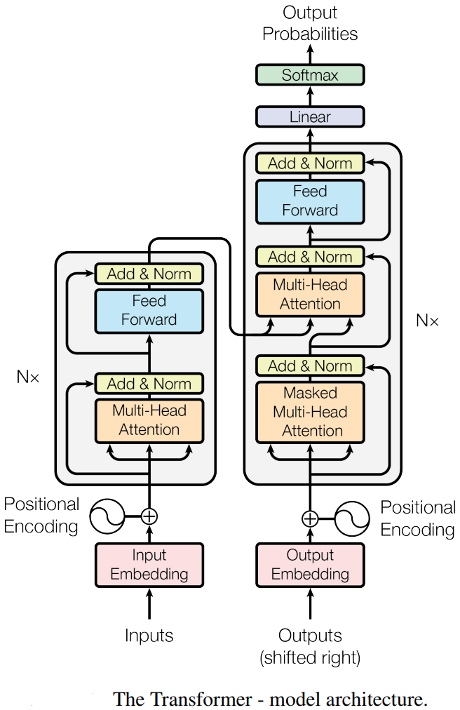
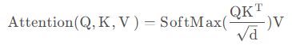
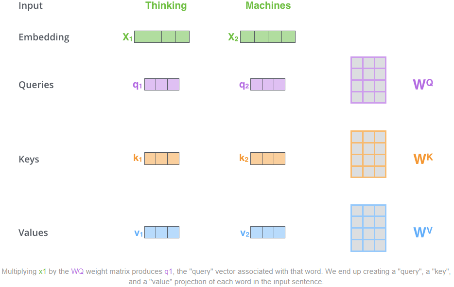
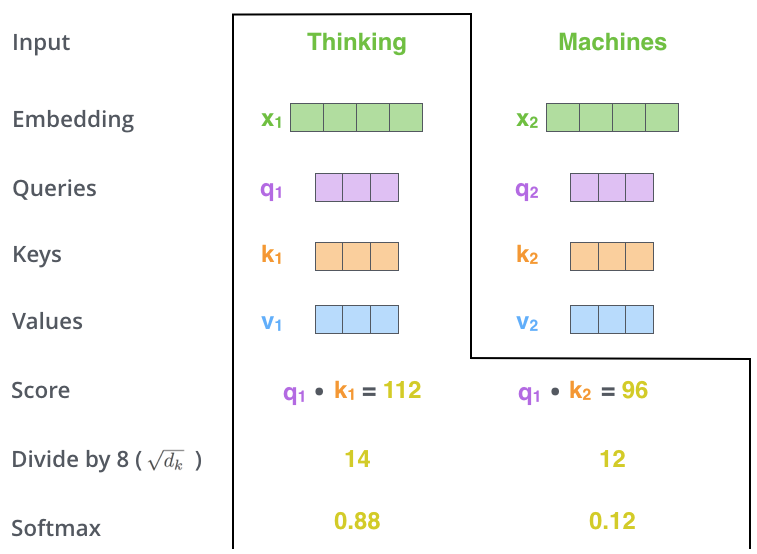
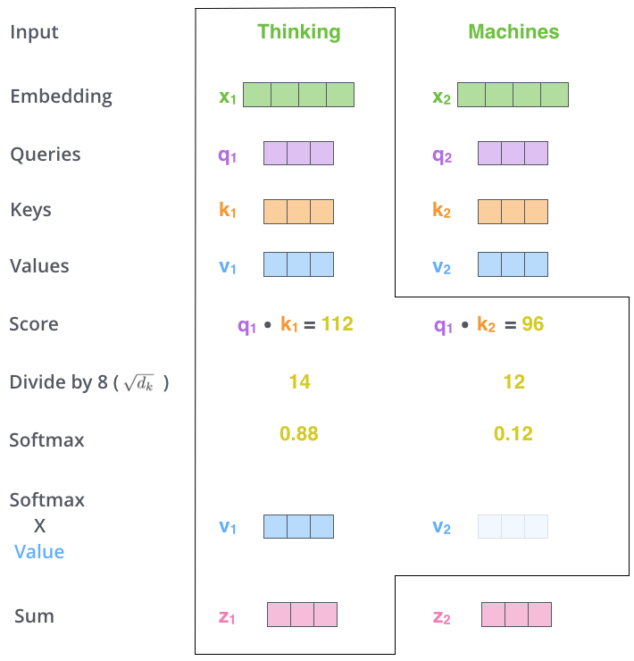
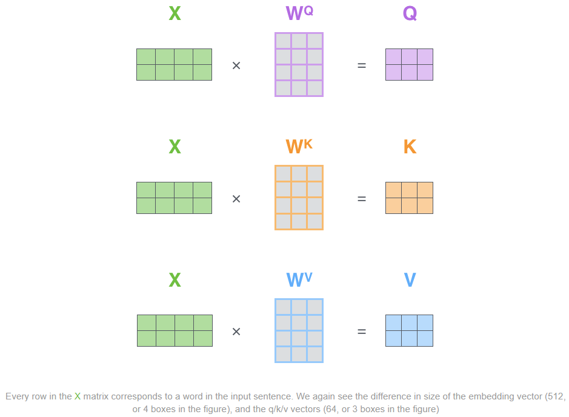
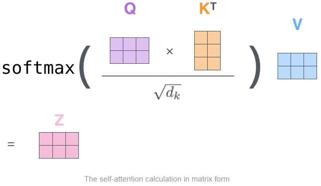
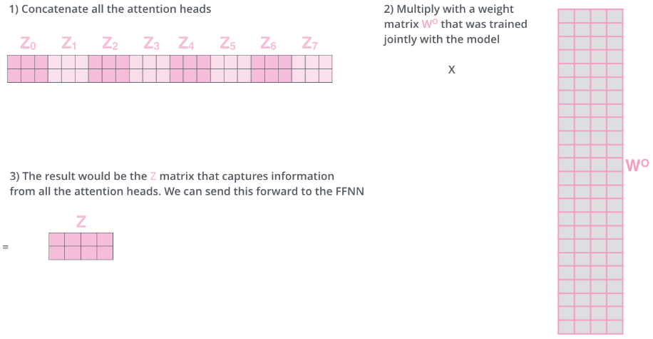
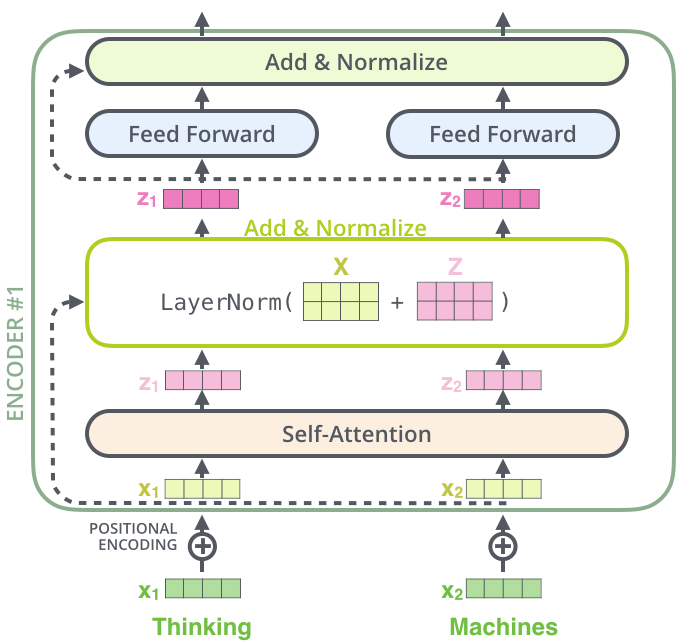

##### [attention is all you need](paper/attention-is-all-you-need.pdf)

##### 1.transformer的结构

transformer的模型结构如下所示：

transformer分为输入部分，输出部分，编码器和解码器四个部分

输入部分：源文本嵌入层和位置编码器；目标文本嵌入层和位置编码器

输出部分：线性层；softmax层

编码器：由N个编码器层堆叠而成，每个编码器层分为两个子层，第一个子层包括多头注意力机制，标准化层和残差连接；第二个子层包括前馈神经网络，标准化层和残差连接。同时每个编码器层由两个子层连接结构组成

解码器：由N个解码器层堆叠而成，每个解码器层分为三个子层，第一个子层包括掩码多头注意力机制，标准化层和残差连接；第二个子层包括多头注意力机制，标准化层和残差连接；第三个子层包括前馈神经网络，标准化层和残差连接。同时每个解器层由三个子层连接结构组成。值得说明的是第二个多头自注意力机制的输入是将第一层的输出当作Q，将编码器的输出当作K和V

##### 2.位置编码([Transformer Architecture: The Positional Encoding]([Transformer Architecture: The Positional Encoding - Amirhossein Kazemnejad's Blog](https://kazemnejad.com/blog/transformer_architecture_positional_encoding/)))

transformer中的位置编码是一个和词嵌入向量维度相同的向量，位置编码和词嵌入向量相加后得到最终输入编码器层的数据

transformer中采用相对位置编码，编码的步骤如下，pt是位置编码向量：

##### 3.多头自注意力机制

###### 1.自注意力机制

自注意力机制是想让模型注意到整个输入中不同部分之间的相关性，公式为:

注意力机制的计算过程：

1）将输入单词转换成嵌入向量，根据嵌入向量得到q，k，v三个向量（具体的做法是是用词嵌入向量乘以q，k，v各自的权重矩阵），下面的图示是将单词Thinking，Machines的词嵌入向量X1，X2乘以Q，K，V的权重WQ，WK，WV，得到每个词的q，v，v三个向量

2）用当前词的q向量分别乘以所有词的k向量的转置，除以一个常数（防止梯度消失），再经过softmax处理后就得到每个词相对于这个词的相关度

3）然后再用每个词的v向量乘以每个词对当前词的相关性度，将得到的向量相加，就得出了当前词的注意力向量z

以上过程的矩阵计算形式为：

###### 2.多头自注意力机制

多头自注意力机制拓展了模型关注不同位置的能力，为注意力机制提供了多个子空间。具体计算方法是用为每个词向量生成多组q向量，k向量，v向量，然后计算出多个注意力向量z，再将所有的向量z拼接在一起，乘以权重WO，得到最终的Z向量，这么做是为了融合多个头之间的语义信息

Transformer中的Encoder层可以用下图来详细表述：

