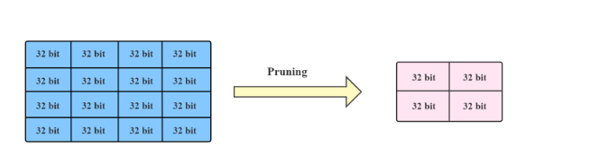
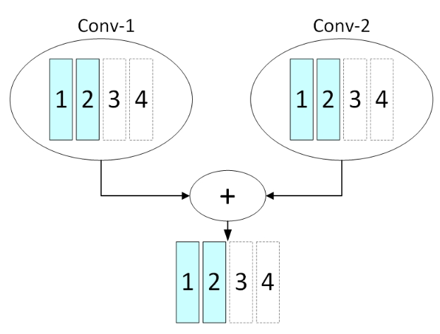
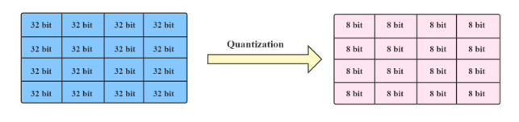

#### NNI模型压缩

模型压缩可以减小模型大小并加速模型训练/推理，而不会显着降低性能

##### 1.模型剪枝

###### 1.1 模型剪枝简介

剪枝方法探索模型权重（参数）中的冗余，并尝试删除/修剪冗余和不重要的权重。 从模型中删除冗余元素，将它们的值归零，确保它们不参与反向传播过程。



在依赖感知模式下（dependency_aware 设置为 True），剪枝器不仅基于每个输出通道的度量，还基于整个网络架构的拓扑对模型进行剪枝。剪枝器会尝试对相互具有通道依赖的层剪枝相同的输出通道，如下图所示。



NNI支持的剪枝器类型有：[Pruner in NNI — Neural Network Intelligence](https://nni.readthedocs.io/en/stable/compression/pruner.html)

###### 1.2 模型剪枝步骤

1）准备模型

```python
import torch
from torchvision.models import alexnet


device = torch.device('cuda' if torch.cuda.is_available() else 'cpu')
model = alexnet().to(device)
print(model)
```

2）剪枝模型

```python
from nni.compression.pytorch.pruning import L1NormPruner
from nni.compression.pytorch.speedup import ModelSpeedup

config_list = [
    {'sparsity_per_layer': 0.5, 'op_types': ['Linear', 'Conv2d']},
    # {'exclude': True, 'op_names': ['fc3']}
] # 剪枝比例为0.5，作用在Linear和Conv2d层

pruner = L1NormPruner(model, config_list)
_, masks = pruner.compress()

pruner._unwrap_model() # 模型加速前需要展开模型

ModelSpeedup(model, torch.rand(3, 3, 512, 512).to(device), masks).speedup_model()

print(model)
```

3）训练模型

```python
from torch.optim import SGD
optimizer = SGD(model.parameters(), 1e-2)
for epoch in range(3):
    trainer(model, optimizer, criterion)
```

##### 2.模型量化

###### 2.1 模型量化简介

量化是指通过减少代表权重或激活函数所需的位数来压缩模型，这可以减少计算和推理时间。模型量化和混合精度训练的主要区别在于，前者同时加速训练和推理，而后者只加速训练，不能加速推理。



NNI支持的量化器有：[Quantizer in NNI — Neural Network Intelligence](https://nni.readthedocs.io/en/stable/compression/quantizer.html)

###### 2.2 模型量化步骤

1）准备模型

```python
import torch
from torchvision.models import alexnet


device = torch.device('cuda' if torch.cuda.is_available() else 'cpu')
model = alexnet().to(device)
print(model)
```

2）量化

```python
from nni.algorithms.compression.pytorch.quantization import QAT_Quantizer
from nni.compression.pytorch.quantization_speedup import ModelSpeedupTensorRT
# QAT 是一种训练感知量化器，它会在训练期间更新比例和零点。
config_list = [
    {'quant_types': ['input', 'weight'], 'quant_bits': {'input': 8, 'weight': 8}, 'op_types': ['Conv2d']},
    {'quant_types': ['output'], 'quant_bits': {'output': 8}, 'op_types': ['ReLU']}
] # 配置列表，将Conv2d层和ReLU层的参数设置为8bit位大小

dummy_input = torch.rand(3, 3, 512, 512).to(device)
quantizer = QAT_Quantizer(model, config_list, optimizer, dummy_input)
quantizer.compress()
print(model)

model_path = "./log/mnist_model.pth"
calibration_path = "./log/mnist_calibration.pth"
calibration_config = quantizer.export_model(model_path, calibration_path)

print("calibration_config: ", calibration_config)

engine = ModelSpeedupTensorRT(model, (3, 3, 512, 512), config=calibration_config, batchsize=32)
engine.compress()
```

