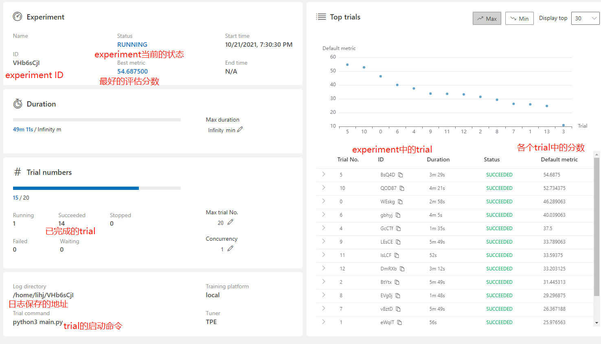
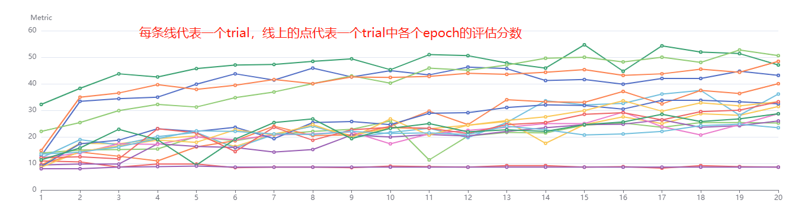
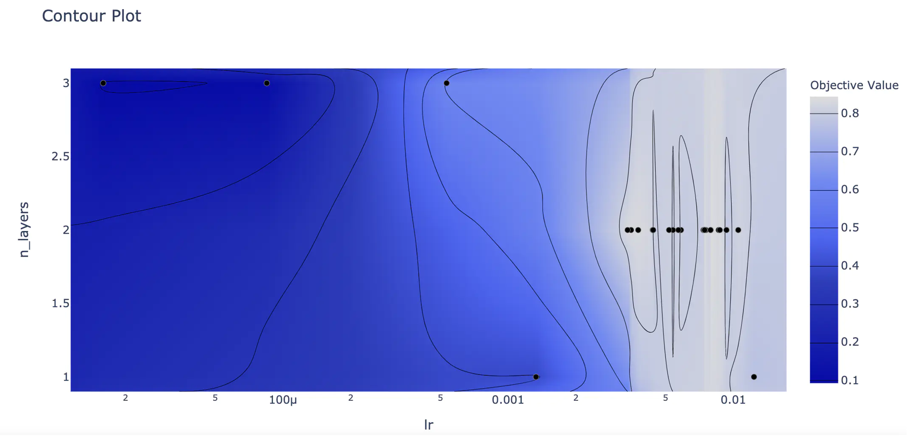
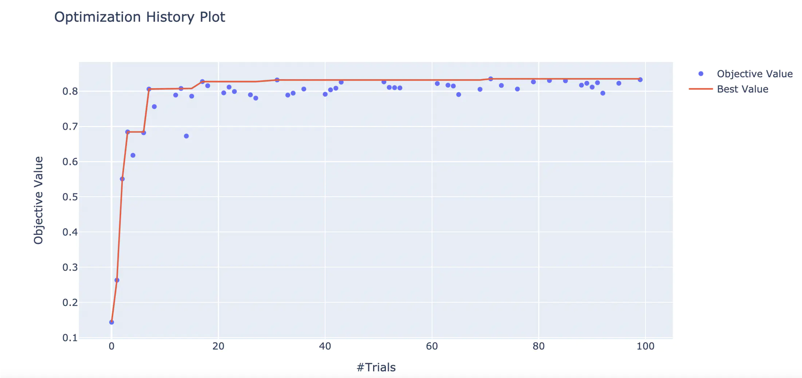
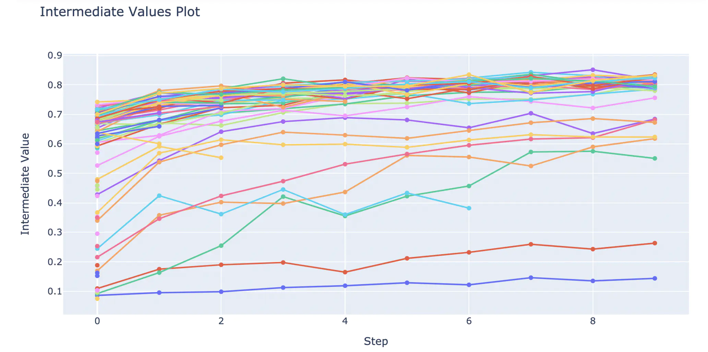
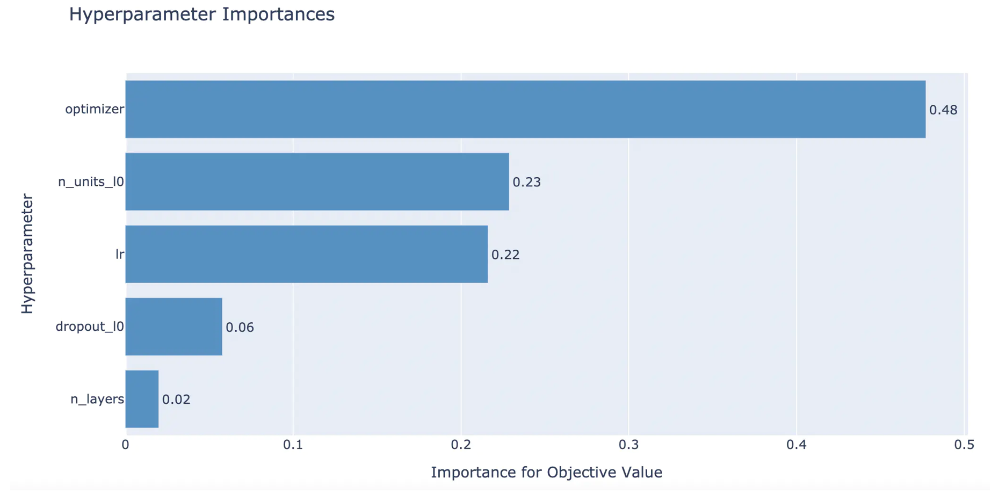
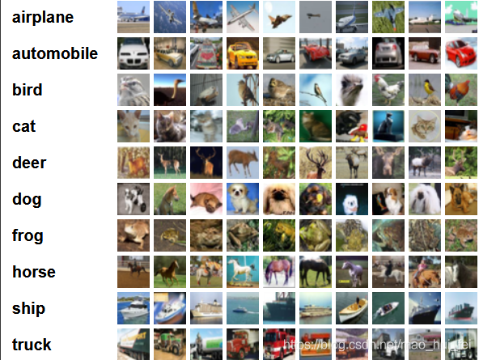
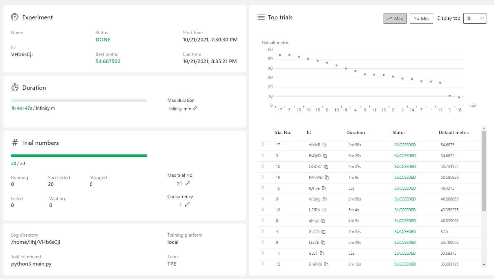
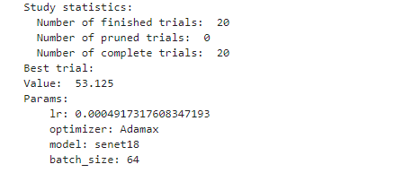

### 一、NNI

#### 1.简介

NNI (Neural Network Intelligence) 是一个轻量但强大的工具包，主要功能自动超参调优、神经网络架构搜索、特征工程和模型压缩。本次调研主要学习其中的自动超参调优功能。

#### 2.包含的调参算法

- [Random Search（随机搜索）](https://nni.readthedocs.io/zh/stable/Tuner/BuiltinTuner.html#Random)：在超参优化时，随机搜索算法展示了其惊人的简单和效果。 建议当不清楚超参的先验分布时，采用随机搜索作为基准
- [TPE](https://nni.readthedocs.io/zh/stable/Tuner/BuiltinTuner.html#TPE)：是一种 sequential model-based optimization（SMBO，即基于序列模型优化）的方法。 SMBO 方法根据历史指标数据来按顺序构造模型，来估算超参的性能，随后基于此模型来选择新的超参
- [Anneal（退火）](https://nni.readthedocs.io/zh/stable/Tuner/BuiltinTuner.html#Anneal)：这种简单的退火算法从先前的采样开始，会越来越靠近发现的最佳点取样。 此算法是随机搜索的简单变体，利用了反应曲面的平滑性。 退火率不是自适应的。
- [Naïve Evolution（朴素进化）](https://nni.readthedocs.io/zh/stable/Tuner/BuiltinTuner.html#Evolution)： 它会基于搜索空间随机生成一个种群。 在每一代中，会选择较好的结果，并对其下一代进行一些变异（例如，改动一个超参，增加或减少一层）。 朴素进化算法需要很多次的 Trial 才能有效，但它也非常简单，也很容易扩展新功能。
- [SMAC](https://nni.readthedocs.io/zh/stable/Tuner/BuiltinTuner.html#SMAC)：SMAC 基于 Sequential Model-Based Optimization (SMBO，即序列的基于模型优化方法)。 它会利用使用过的突出的模型（高斯随机过程模型），并将随机森林引入到SMBO中，来处理分类参数。
- [Batch tuner（批处理）](https://nni.readthedocs.io/zh/stable/Tuner/BuiltinTuner.html#Batch)：Batch Tuner 能让用户简单的提供几组配置（如，超参选项的组合）。 当所有配置都完成后，Experiment 即结束。 Batch Tuner 仅支持 choice 类型。
- [Grid Search（遍历）](https://nni.readthedocs.io/zh/stable/Tuner/BuiltinTuner.html#GridSearch)：网格搜索会穷举定义在搜索空间文件中的所有超参组合。 遍历搜索可以使用的类型有 choice, quniform, randint。
- [Hyperband](https://nni.readthedocs.io/zh/stable/Tuner/BuiltinTuner.html#Hyperband)：Hyperband 试图用有限的资源来探索尽可能多的组合，并发现最好的结果。 基本思想是生成许多配置，并通过少量的 Trial 来运行一部分。 一半性能不好的配置会被抛弃，剩下的部分与新选择出的配置会进行下一步的训练。 数量的多少对资源约束非常敏感（例如，分配的搜索时间）。
- [Network Morphism](https://nni.readthedocs.io/zh/stable/Tuner/BuiltinTuner.html#NetworkMorphism)：网络模态（Network Morphism）提供自动搜索深度学习体系结构的功能。 它会继承父网络的知识，来生成变形的子网络。 包括深度、宽度、跳连接等变化。 然后使用历史的架构和指标，来估计子网络的值。 然后会选择最有希望的模型进行训练。
- [Metis Tuner](https://nni.readthedocs.io/zh/stable/Tuner/BuiltinTuner.html#MetisTuner)：大多数调参工具仅仅预测最优配置，而 Metis 的优势在于有两个输出：(a) 最优配置的当前预测结果， 以及 (b) 下一次 Trial 的建议。 它不进行随机取样。 大多数工具假设训练集没有噪声数据，但 Metis 会知道是否需要对某个超参重新采样。
- [BOHB](https://nni.readthedocs.io/zh/stable/Tuner/BuiltinTuner.html#BOHB)：BOHB 是 Hyperband 算法的后续工作。 Hyperband 在生成新的配置时，没有利用已有的 Trial 结果，而本算法利用了 Trial 结果。 BOHB 中，HB 表示 Hyperband，BO 表示贝叶斯优化（Byesian Optimization）。 BOHB 会建立多个 TPE 模型，从而利用已完成的 Trial 生成新的配置。
- [GP Tuner](https://nni.readthedocs.io/zh/stable/Tuner/BuiltinTuner.html#GPTuner)：Gaussian Process（高斯过程） Tuner 是序列化的基于模型优化（SMBO）的方法，并使用了高斯过程来替代。
- [PBT Tuner](https://nni.readthedocs.io/zh/stable/Tuner/BuiltinTuner.html#PBTTuner)：PBT Tuner 是一种简单的异步优化算法，在固定的计算资源下，它能有效的联合优化一组模型及其超参来最大化性能。
- [DNGO Tuner](https://nni.readthedocs.io/zh/stable/Tuner/BuiltinTuner.html#DNGOTuner)： 使用神经网络作为 GP 的替代方法，对贝叶斯优化中的函数分布进行建模。

其中最为常用的是TPE超参数调优算法，它是一种 sequential model-based optimization（SMBO，即基于序列模型优化）的方法。 SMBO 方法根据历史指标数据来按顺序构造模型，来估算超参的性能，随后基于此模型来选择新的超参。[参考论文](https://papers.nips.cc/paper/4443-algorithms-for-hyper-parameter-optimization.pdf)

#### 3.提前停止方法

1.Median Stop: Medianstop 是一种简单的提前终止策略，可参考[论文](https://static.googleusercontent.com/media/research.google.com/en//pubs/archive/46180.pdf)。 如果 Trial X 在步骤 S 的最好目标值低于所有已完成 Trial 前 S 个步骤目标平均值的中位数，这个 Trial 就会被提前停止。

2.Curve Fitting Assessor: 是一个 LPA (learning, predicting, assessing，即学习、预测、评估) 的算法。 如果预测的 Trial X 在 step S 比性能最好的 Trial 要差，就会提前终止它。 [参考论文](http://aad.informatik.uni-freiburg.de/papers/15-IJCAI-Extrapolation_of_Learning_Curves.pdf)

#### 4.使用方法

##### 1.创建超参数搜索空间

超参数搜索空间定义在search_space.json文件里，json文件的内容示例如下：

```json
{
    "lr": {
        "_type": "uniform",
        "_value": [0.00001, 0.1]
    },
    "optimizer": {
        "_type": "choice",
        "_value": ["SGD", "Adadelta", "Adagrad", "Adam", "Adamax"]
    }, 
    "model": {
        "_type": "choice",
        "_value": ["vgg", "resnet18", "googlenet", "densenet121", "mobilenet", "dpn92", "senet18"]
    },
    "batch_size": {
        "_type": "choice",
        "_value": [64, 32, 16]
    }
}
```


##### 2.创建配置文件

配置文件定义在config.yml文件里，yml文件的内容示例如下：

```yml
searchSpaceFile: search_space.json # 超参数搜索空间
trialCommand: python3 main.py # 代码启动的命令
trialGpuNumber: 1 # GPU的数量
trialConcurrency: 1 # trial任务并行数
maxTrialNumber: 20 # 最大trial数
experimentWorkingDirectory: /opt/aps/workdir # 日志的保存位置
tuner:
  name: TPE # 选择的超参数优化算法
  classArgs:
    optimize_mode: maximize # 最大化监控指标
trainingService:  
  platform: local # 训练平台
```

##### 3.源代码改动

nni对源代码的改动非常小，只需

```python
import nni

RCV_CONFIG = nni.get_next_parameter() # 从超参数搜索空间里获取超参数
prepare(RCV_CONFIG) # 利用nni生成的超参数，生成优化器，损失函数，DataLoader等
acc = 0.0
best_acc = 0.0
for epoch in range(start_epoch, start_epoch+args.epochs):
    train(epoch, args.batches)
    acc, best_acc = test(epoch)
    nni.report_intermediate_result(acc) # 汇报每次epoch的中间结果给nni，决定是否提前终止当前trial
    
nni.report_final_result(best_acc) # 汇报每个trail的最终结果给nni，为获取下一次的超参数组合提供借鉴
```

##### 4.启动方式

nni只支持nnictl命令行启动。例如：

nnictl create --config config.yml --port 880

表示创建一个nni的experiment，并指定了配置文件和web服务的端口。可以从日志或者web页面观察模型的训练情况。

不利于在aps算子中开发！

#### 5.可视化

nnictl创建一个experiment后，也会启动一个web服务，从web页面可以观察各个trial的运行情况：





#### 6.附件

源代码，config.yml和search_space.json等文件见附件目录NNI。

### 二、OPTUNA

#### 1.简介

optuna是一个开源的超参数优化框架，用于自动化超参数搜索。

#### 2.包含的调参算法

BaseSampler：相对采样同时确定多个参数的值，以便采样算法可以使用参数之间的关系（例如，相关性）。独立采样确定单个参数的值，而不考虑参数之间的任何关系。独立采样的目标参数是相对搜索空间中没有描述的参数

GridSampler：试验会在研究期间建议给定搜索空间中的所有参数组合

RandomSampler：该采样器基于独立采样，随机地在给定搜索空间寻找超参数组合

TPESampler：在每次试验中，对于每个参数，TPE 将一个高斯混合模型 (GMM) l(x) 拟合到与最佳目标值相关的一组参数值，并将另一个 GMM g(x) 拟合到其余参数值。 它选择使比率 l(x)/g(x) 最大化的参数值 x

CmaEsSampler：推断目标试验中的相对采样将使用的搜索空间

PartialFixedSampler：具有部分固定参数的采样器

NSGAIISampler：使用 NSGA-II 算法的多目标采样器。它是一种众所周知的、快速的、精英主义的多目标遗传算法

MOTPESampler使用 MOTPE 算法的多目标采样器，该采样器是 TPESampler 的多目标版本

IntersectionSearchSpace：返回 BaseStudy 的交集搜索空间。交集搜索空间包含迄今为止已完成的研究试验中建议的参数分布的交集。 如果存在多个具有相同名称但分布不同的参数，则它们都不包含在结果搜索空间中（即排除具有动态值范围的参数）。

参考链接：[optuna.samplers — Optuna 2.7.0 文档](https://optuna.readthedocs.io/zh_CN/latest/reference/samplers.html#)

#### 3.提前停止方法

BasePruner：根据报告的值判断是否应提前停止

MedianPruner：使用中值停止规则的修剪器。如果试验的最佳中间结果比同一步骤中先前试验的中间结果中位数差，则提前停止

NopPruner：从不提前停止

PercentilePruner：修剪器以保持试验的指定百分比。如果最佳中间值位于同一步骤试验的底部百分位，则提前停止

SuccessiveHalvingPruner：剪枝器采用异步逐次减半算法。连续减半是一种基于bandit的算法，用于在多个配置中确定最佳配置

HyperbandPruner：使用双曲线的修剪器。要求将配置数作为其超参数。对于给定的有限预算，所有配置的资源平均为。其中有一个权衡，并且通过尝试固定预算的不同值来攻击这个权衡

ThresholdPruner：剪枝机用于检测试验的外围指标。如果度量超过上限阈值、低于下限阈值或达到nan，则进行提前停止

参考链接：[optuna.pruners — Optuna 2.7.0 文档](https://optuna.readthedocs.io/zh_CN/latest/reference/pruners.html)

#### 4.使用方法

##### 1.创建超参数搜索空间

optuna的的支持float、int和categorical类型的超参数调优，每次trial开始时会生成建议的超参数组合，需要在源代码中少量的改动，示例如下：

```python
lr = trial.suggest_float("lr", 0.00001, 0.1, log=True) # 表示从0.00001到0.1之间取一个float类型的数
optimizer_name = trial.suggest_categorical("optimizer", ["SGD", "Adadelta", "Adagrad", "Adam", "Adamax"]) # 表示从给定列表中取一个值
batch_size = trial.suggest_int(1, 10)  # 表示从1到10之间取一个int类型的数
```

##### 2.源代码改动

nni对源代码的改动非常小，只需

```python
import optuna

def objective(trial): # 在该函数中创建超参数搜索空间, 每次trial都会产生一组超参数。该参数的返回值是需要评估的模型指标
	lr = trial.suggest_float("lr", 0.00001, 0.1, log=True) # 浮点型的超参数，取值为[0.00001, 0.1]区间上的任意实数
    optimizer_name = trial.suggest_categorical("optimizer", ["SGD", "Adadelta", "Adagrad", "Adam", "Adamax"])
    batch_size = trial.suggest_categorical("batch_size", [64, 128, 256])# 类别型的超参数，取值为[64，128，256]中的某一个值
    
    for epoch in range(start_epoch, start_epoch + args['epochs']):
        train(epoch,  -1)
        acc, best_acc = test(epoch)
    
    return best_acc

study = optuna.create_study(direction="maximize") # 创建一个study，最大化评估指标
study.optimize(objective, n_trials=100, timeout=100000) # 开始优化，目标函数为object， trial次数为100， 最大训练时间为100000秒
```

##### 3.启动方式

optuna不改变源代码原来的启动方式

有利于APS算子的开发和扩展！

#### 5.可视化

1.选择可视化的参数

```python
optuna.visualization.plot_contour(study, params=['n_layers', 'lr'])
```



2.可视化优化历史

```python
from optuna.visualization import plot_optimization_history
plot_optimization_history(study)
```



3.可视化trial学习曲线



4.可视化超参数重要性

```python
from optuna.visualization import plot_param_importances
plot_param_importances(study)
```



#### 6.附件

见附件目录OPTUNA

### 三、NNI和OPTUNA对比测试

#### 1.数据集

CIFAR-10: 是由 Hinton 的学生 Alex Krizhevsky 和 Ilya Sutskever 整理的一个用于识别普适物体的小型数据集。一共包含 10 个类别的 RGB 彩色图 片：飞机（ a叩lane ）、汽车（ automobile ）、鸟类（ bird ）、猫（ cat ）、鹿（ deer ）、狗（ dog ）、蛙类（ frog ）、马（ horse ）、船（ ship ）和卡车（ truck ）。图片的尺寸为 32×32 ，数据集中一共有 50000 张训练圄片和 10000 张测试图片。 CIFAR-10 的图片样例如图所示。由于受训练资源所限，本次调研采用训练集中的前2000个样本，测试集中的前500个样本。



#### 2.超参数搜索空间和训练配置参数

```python
"lr":  [0.00001, 0.1]
"optimizer":  ["SGD", "Adadelta", "Adagrad", "Adam", "Adamax"]
"model": ["vgg", "resnet18", "googlenet", "densenet121", "mobilenet", "dpn92", "senet18"]
 "batch_size":  [64, 32, 16]
```

两种超参调优框架采用相同的配置，在同一台机器上运行。最大的trail设置为20，每个最大的epoch设置为20

#### 3.结果对比

#### 1.NNI



NNI训练花费1小时5分钟，

最好的分数为 54.688

最好的超参数为：

lr:0.042345131639681656
optimizer:"Adadelta"
model:"googlenet"
batch_size:32

#### 2.OPTUNA



NNI训练花费1小时1分钟

### 四、结论

OPTUNA训练速度略快于NNI

NNI的最佳评估分数略高于OPTUNA

OPTUNA的可视化内容更加丰富

OPTUNA的开发难度远低于NNI

NNI除了超参数调优外，还有神经网络架构搜索、特征工程和模型压缩；OPTUNA只专注于超参数调优
