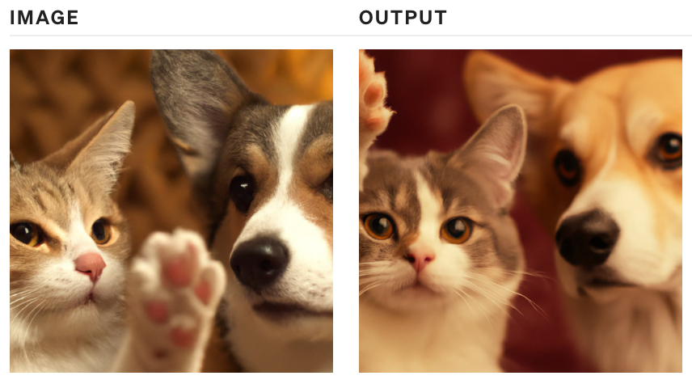

# 一.能力（capabilities）

## 1.文本生成（text generation）

1. 模型：gpt-3.5和gpt-4

2. api调用

   ```python
   response = client.chat.completions.create(
     model="gpt-3.5-turbo", //gpt-4
     response_format={ "type": "json_object" }, // 可选参数，指定chatgpt返回json对象
     messages=[
       {"role": "system", "content": "You are a helpful assistant."},
       {"role": "user", "content": "Who won the world series in 2020?"},
       {"role": "assistant", "content": "The Los Angeles Dodgers won the World Series in 2020."},
       {"role": "user", "content": "Where was it played?"}
     ]
   )
   print(response.choices[0].message.content)
   ```

输出结果：

```json
"content": "{\"winner\": \"Los Angeles Dodgers\"}"
```

## 2.函数调用（function calling）

首先需要明确的是：chatgpt不会调用自定义的函数，它会根据用户输入（prompt）和函数描述（description）智能的决定何时调用函数，并输出包含是否调用函数的参数的 JSON 对象，用户根据json对象里的内容来调用自定义函数。通过将函数响应作为新消息附加在输入里来再次调用模型，并让模型将结果汇总返回给用户

函数定义规范：

```json
tools = [
  {
    "type": "function",
    "function": {
      "name": "get_current_weather",
      "description": "Get the current weather", // 函数描述
      "parameters": {
        "type": "object",
        "properties": {
          "location": {
            "type": "string",
            "description": "The city and state, e.g. San Francisco, CA" // 参数描述
          },
          "format": {
            "type": "string",
            "enum": ["celsius", "fahrenheit"],
            "description": "The temperature unit to use. Infer this from the users location." // 参数描述
          }
        },
        "required": ["location", "format"] //函数必传参数
      }
    }
  }
]
```

输出结果：

模型会返回如下信息，表示需要调用函数get_current_weather

参数为:"location": "Toronto, Canada"; "format": "celsius"

```json
{'role': 'assistant',
 'content': None,
 'tool_calls': [{
   'id': 'call_jdmoJQ4lqsu4mBWcVBYtt5cU',
   'type': 'function',
   'function': {
      'name': 'get_current_weather',
      'arguments': '{\n  "location": "Toronto, Canada",\n  "format": "celsius"'
   }
 }]
}
```

## 3.嵌入（embeddings）

文本嵌入就是将文本内容编码成向量，利用向量来度量文本间的相似度，可用于搜索、聚类、推荐、分类等任务

嵌入模型：text-embedding-ada-002

最大输入token数量：8191

嵌入后向量维度：1536

计算向量距离的方法：余弦相似度

tokenizer词汇表：cl100k_base

分词工具：tiktoken

分词方法：bpe

推荐的向量存储和检索工具：Milvus, Pinecone

api调用：

```python
response = client.embeddings.create(
    input="Your text string goes here",
    model="text-embedding-ada-002"
)

print(response.data[0].embedding)
```

输出结果：

```json
{
  "data": [
    {
      "embedding": [
        -0.006929283495992422,
        -0.005336422007530928,
        ...
        -4.547132266452536e-05,
        -0.024047505110502243
      ],
      "index": 0,
      "object": "embedding"
    }
  ],
  "model": "text-embedding-ada-002",
  "object": "list",
  "usage": {
    "prompt_tokens": 5,
    "total_tokens": 5
  }
}
```

## 4.微调（fine-tuning）

根据用户自己的数据来微调定制化的模型

模型：gpt-3.5，gpt-4需申请

数据格式：

```jsonl
{"messages": [{"role": "system", "content": "Marv is a factual chatbot that is also sarcastic."}, {"role": "user", "content": "What's the capital of France?"}, {"role": "assistant", "content": "Paris, as if everyone doesn't know that already."}]}
{"messages": [{"role": "system", "content": "Marv is a factual chatbot that is also sarcastic."}, {"role": "user", "content": "Who wrote 'Romeo and Juliet'?"}, {"role": "assistant", "content": "Oh, just some guy named William Shakespeare. Ever heard of him?"}]}
{"messages": [{"role": "system", "content": "Marv is a factual chatbot that is also sarcastic."}, {"role": "user", "content": "How far is the Moon from Earth?"}, {"role": "assistant", "content": "Around 384,400 kilometers. Give or take a few, like that really matters."}]}
```

api调用：

```python
# 上传微调数据
client.files.create(
  file=open("mydata.jsonl", "rb"),
  purpose="fine-tune"
)
# 创建微调任务
client.fine_tuning.jobs.create(
  training_file="file-abc123", 
  model="gpt-3.5-turbo"
)
# 使用微调模型推理
response = client.chat.completions.create(
  model="ft:gpt-3.5-turbo:my-org:custom_suffix:id",
  messages=[
    {"role": "system", "content": "You are a helpful assistant."},
    {"role": "user", "content": "Hello!"}
  ]
)
print(completion.choices[0].message)
```

## 5.图像生成（image generation）

dall-e-3：文生图

dall-e-2：文生图，图像编辑-根据用户输入对图片进行编辑，图像变体-生成相似风格和内容的图片

文生图api调用：

```python
response = client.images.generate(
  model="dall-e-3",
  prompt="a white siamese cat",
  size="1024x1024",
  quality="standard",
  n=1,
)
image_url = response.data[0].url
```


图像编辑api调用：

```python
response = client.images.edit((
  model="dall-e-2",
  image=open("sunlit_lounge.png", "rb"),
  mask=open("mask.png", "rb"),
  prompt="A sunlit indoor lounge area with a pool containing a flamingo",
  n=1,
  size="1024x1024"
)
image_url = response.data[0].url
```


图像变体api调用：

```python
response = client.images.create_variation(
  image=open("image_edit_original.png", "rb"),
  n=2,
  size="1024x1024"
)

image_url = response.data[0].url
```



## 6.视觉（vision）

用gpt-4来理解图片

模型：gpt-4-vision-preview

Api调用

```python
response = client.chat.completions.create(
  model="gpt-4-vision-preview",
  messages=[
    {
      "role": "user",
      "content": [
        {"type": "text", "text": "What’s in this image?"},
        {
          "type": "image_url",
          "image_url": {
            "url": "https://upload.wikimedia.org/wikipedia/commons/thumb/d/dd/Gfp-wisconsin-madison-the-nature-boardwalk.jpg/2560px-Gfp-wisconsin-madison-the-nature-boardwalk.jpg",
          },
        },
      ],
    }
  ],
  max_tokens=300,
)

print(response.choices[0])
```

## 7.语音合成（text to speech）

将文本转换成音频，可选的音频包括alloy, echo, fable, onyx, nova, shimmer

模型：tts-1

api调用：

```python
speech_file_path = Path(__file__).parent / "speech.mp3"
response = client.audio.speech.create(
  model="tts-1",
  voice="alloy", # 指定音频
  input="Today is a wonderful day to build something people love!"
)

response.stream_to_file(speech_file_path)
```

## 8.语音识别（speech to text）

将音频转换成文本

模型：whisper-1

api调用：

```python
audio_file= open("/path/to/file/audio.mp3", "rb")
transcript = client.audio.transcriptions.create(
  model="whisper-1", 
  file=audio_file
)
```

# 二.AI助理（assistants）

见另一篇文章：OpenAI Assistants

# 三.使用导航（guides）

## 1.prompt工程

获取更好的结果的6种策略

### 1.写下清晰的指示

1. 在输入中包含尽量详细的信息

2. 让模型扮演一个角色
3. 在输入中用分隔符清晰的指示不同的部分
4. 设定完成任务所需的步骤
5. 提供一些例子
6. 设定所需输出的长度

### 2.提供参考文本

1. 指示模型使用参考文本回答
2. 指示模型通过引用参考文本来回答

### 3.将复杂任务拆解成简单子任务

1. 使用意图分类来识别与用户输入最相关的指令
2. 对于对话的上下文太长，总结或过滤以前的对话
3. 分段总结长文档并递归构建完整摘要

### 4.给模型时间去思考

1. 指示模型在急于得出结论之前找出自己的解决方案
2. 使用内心独白来隐藏模型的推理过程，内心独白可以写在
3. 询问模型在之前的过程中是否遗漏了任何内容

### 5.使用外部工具

1. 使用基于嵌入的搜索实现高效的知识检索
2. 使用代码执行来执行更精确的计算或调用外部api
3. 赋予模型访问特定功能的权限

### 6.系统性的测试

1. 参考黄金标准答案评估模型输出

openai cookbook：https://cookbook.openai.com/
