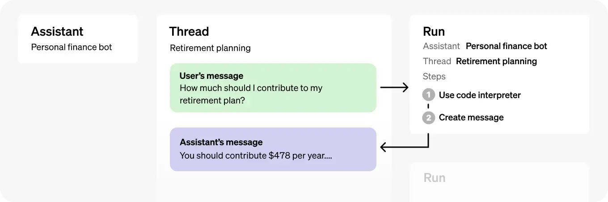

# OpenAI Assistants

## 一.简介

Assistants可以指示和利用模型，工具和知识库去响应用户的问题，目前Assistants支持三种工具：代码解释器，检索和函数调用

### 1.Assistants API 的工作流程

1. 通过自定义指令并选择模型来在 API 中创建Assistants，创建时可以启用代码解释器、检索和函数调用等工具

2. 当用户开始对话时，Assistants会创建一个Thread

3. 当用户提问时，Assistants将消息添加到Thread中

4. 在Thread上运行Assistants以触发响应，会自动调用相关Tools

### 2.Assistants的能力

1. Assistants可以使用特定指令调用 OpenAI 的模型

2. Assistants可以并行访问多个工具。 这些可以是 OpenAI 托管的工具（例如代码解释器和知识检索），也可以是用户自己构建/托管的工具（通过函数调用）。 

3. Assistants可以访问持久线程。线程只用创建一次，然后就可以不断的将消息添加到其中即可，线程通过存储消息历史记录

4. Assistants可以访问多种格式的文件 ，在使用工具时，Assistants还可以创建文件（例如图像、电子表格等）

### 3.Assistants相关的对象

1. assistant：定义了assistant的名称，角色，可调用的openai模型和可使用的工具

2. thread：assistant和user之间的会话环境，可以存储消息列表

3. message：由assistant和user创建的消息，可以包括文本、图像和其他文件，消息以列表的形式存储在线程上

4. run：run就是在线程上调用assistant，assistant使用它的配置和线程的thread通过调用模型和工具来执行任务

5. run step：assistant在运行过程中所采取步骤的详细信息

Assistants的各个对象之间的关系：



## 二.Assistants的创建和运行流程

我们先看一下简单的例子：

### 1.创建Assistants

一个Assistants就是一个实体，可以通过一下参数进行配置，来响应用户的消息：

1. Instructions：定义了Assistant和model应该如何响应
2. Model：可以指定任何 GPT-3.5 或 GPT-4 模型，包括微调后的模型。检索工具需要 gpt-3.5-turbo-1106 和 gpt-4-1106-preview 
3. Tools：API 支持由 OpenAI 构建和托管的代码解释器和检索
4. Functions：API 允许自定义函数签名，其功能与函数调用功能类似

下面的例子中，将创建一个做为个人数学老师的Assistants，这个Assistants可以利用代码解释器：

如果你的open api key能使用gpt-4，建议使用gpt-4-1106-preview，更智能一些

```bash
# 创建python虚拟环境，安装openai库
conda create -n openai python=3.10
conda activate openai

pip install openai
```

```python
from openai import OpenAI

# 创建openai客户端
client = OpenAI(api_key='your openai api key') # 输入你的openai api key
print(client.model.list()) # 查看你能使用的openai模型

# 创建assistant对象, 定义创建assistant的身份为一个数学导师，可以写代码并运行代码来解决数学问题
assistant = client.beta.assistants.create(
    name='Math Tutor',
    instructions="You are a personal math tutor. Write and run code to answer math questions.",
    tools=[{"type": "code_interpreter"}],
    model="gpt-3.5-turbo-1106"  # gpt-4-1106-preview
)
```

### 2.创建Thread

一个线程代表一个对话

```python
# 创建一个线程
thread = client.beta.threads.create()
```

### 3.在Thread里添加Message

一条消息可以包含用户的文本和上传的文件，目前还不支持上传图片，据说即将支持。这个例子中，我们让Assistants求解数学一个方程式

```python
# 创建一条消息
message = client.beta.threads.messages.create(
    thread_id=thread.id,
    role="user",
    content="I need to solve the equation `3x + 11 = 14`. Can you help me?" # 提出一个数学问题
)
print(message)
```

### 4.运行Assistants

当运行Assistants时，它会决定是否调用工具。在运行时还可以通过instructions参数添加额外的命令

```python
# 运行assistant
run = client.beta.threads.runs.create(
    assistant_id=assistant.id,
    thread_id=thread.id,
    instructions="Please address the user as Jane Doe. The user has a premium account."
)
```

### 5.展示Assistants的响应

当Assistants运行之后，run会被添加到一个队列里，如果run的状态是queued，表示正在排队；如果run的状态是completed，表示运行完毕，可以定时通过ru ns.retrieve动态查看run的状态

```python
run = client.beta.threads.runs.retrieve( # 通过thread.id和run.id来查看run的状态
  thread_id=thread.id,
  run_id=run.id
)
print(run)
```

同时可以看到，Assistants决定使用code_interpreter工具：


当run运行完毕后，可以通过message.list查看assistant的响应结果

```python
messages = client.beta.threads.messages.list( # 查看thread.id中的message
  thread_id=thread.id
)
print(messages)
```


## 三.Assistants的高阶配置

### 1.创建Assistants时的更多配置

client.beta.assistants.create()这个函数可以传入的参数还有很多，各参数的功能和具体用法如下：

name: Assistants的名字
model: Assistants可以调用的openai模型
description: Assistants的功能描述
instructions: 定义Assistants的个性和目标，
tools: Assistants可以调用的工具
file_ids: Assistants可以读取的文件，该文件会添加到thread的上下文中

上传文件到openai客户端：

注意：assistant中指定的文件可以被同一个assistant下的所有thread获得，thread中指定的文件只能被这一thread获得。支持多种文件类型，具体的包括这些类型：[assistant支持的文件类型](https://platform.openai.com/docs/assistants/tools/supported-files)

```python
file = client.files.create( # 上传本地的speech.py，用于assistants
  file=open("speech.py", "rb"),
  purpose='assistants'
)
```

在定义assistant时指定可以获取的文件：

```python
assistant = client.beta.assistants.create( # 定义assistant，
  name="Data visualizer",
  instructions="write code to solve this problem" # 明确告诉assistant编码和运行代码
  description="You are great at creating beautiful data visualizations. You analyze data present in .csv files, understand trends, and come up with data visualizations relevant to those trends. You also share a brief text summary of the trends observed.",
  model="gpt-4-1106-preview",
  tools=[{"type": "code_interpreter"}],
  file_ids=[file.id] # 在assistant中指定可以获取的文件
)
```

### 2.创建线程时的更多配置

在创建线程时，可以往线程里添加一条或多条消息，消息中可以指定获取的文件

```python
thread = client.beta.threads.create(
  messages=[
    {
      "role": "user",
      "content": "Create 3 data visualizations based on the trends in this file.",
      "file_ids": [file.id] # 在thread中指定可以获取的文件
    }
  ]
)
```

### 3.运行过程中的更多配置

在创建run时，也可以再设置model、tools和instructions，增加灵活性

```python
run = client.beta.threads.runs.create(
  thread_id=thread.id,
  assistant_id=assistant.id,
  model="gpt-4-1106-preview",
  instructions="additional instructions",
  tools=[{"type": "code_interpreter"}, {"type": "retrieval"}]
)
```

## 四.Assistants支持的工具

### 1.Code Interpreter

Assistants可以使用Code Interpreter工具来编写和运行python代码

#### 1).定义可调用的code_interpreter

```python
assistant = client.beta.assistants.create(
  instructions="You are a personal math tutor. When asked a math question, write and run code to answer the question.",
  model="gpt-4-1106-preview",
  tools=[{"type": "code_interpreter"}] # 定义可调用的code_interpreter
)
```

#### 2).获取Assistants返回的文件

如果Assistants在调用code_interpreter时的回值中有文件，如下所示。可以通过retrieve_content获取文件内容

```json
{
    "id": "msg_OHGpsFRGFYmz69MM1u8KYCwf",
    "object": "thread.message",
    "created_at": 1698964262,
    "thread_id": "thread_uqorHcTs46BZhYMyPn6Mg5gW",
    "role": "assistant",
    "content": [
    {
      "type": "image_file",
      "image_file": {
        "file_id": "file-WsgZPYWAauPuW4uvcgNUGcb"
      }
    }
  ]
}
```

```python
content = client.files.retrieve_content(file.id) # 获取返回值中的文件内容
```

### 2.Knowledge Retrieval

检索功能可以利用模型外部的知识来增强Assistants，例如专有产品信息或用户提供的文档。 文件上传并传递给Assistants后，OpenAI 将自动对文档进行分块、索引和存储嵌入，并实施矢量搜索功能以检索相关内容来回答用户的输入

#### 1).定义可调用的retrieval

```python
assistant = client.beta.assistants.create(
  instructions="You are a customer support chatbot. Use your knowledge base to best respond to customer queries.",
  model="gpt-4-1106-preview",
  tools=[{"type": "retrieval"}] # 定义可调用的retrieval
)
```

#### 2).上传可供检索的文件

```python
# Upload a file with an "assistants" purpose
file = client.files.create(
  file=open("knowledge.pdf", "rb"),
  purpose='assistants'
)

# Add the file to the assistant
assistant = client.beta.assistants.create(
  instructions="You are a customer support chatbot. Use your knowledge base to best respond to customer queries.",
  model="gpt-4-1106-preview",
  tools=[{"type": "retrieval"}],
  file_ids=[file.id]
)
```

#### 3).删除文件

这里的删除指定的是让Assistants不可用这个文件，文件本身并没有被删除

```python
file_deletion_status = client.beta.assistants.files.delete(
  assistant_id=assistant.id,
  file_id=file.id
)
```

### 3.Function calling

函数调用功能可以让Assistants在运行过程中调用函数并返回结果

在用户输入信息中，如果出发了函数的功能，Assistants就会智能的调用该函数

函数定义：

```python
assistant = client.beta.assistants.create(
  instructions="You are a weather bot. Use the provided functions to answer questions.",
  model="gpt-4-1106-preview",
  tools=[{
      "type": "function", # 声明工具的类型是function
    "function": {
      "name": "getCurrentWeather",
      "description": "Get the weather in location", # 查询天气的函数
      "parameters": {
        "type": "object",
        "properties": {
          "location": {"type": "string", "description": "The city and state e.g. San Francisco, CA"},
          "unit": {"type": "string", "enum": ["c", "f"]}
        },
        "required": ["location"]
      }
    }
  }, {
    "type": "function",
    "function": {
      "name": "getNickname",
      "description": "Get the nickname of a city", # 获取城市名昵称的函数
      "parameters": {
        "type": "object",
        "properties": {
          "location": {"type": "string", "description": "The city and state e.g. San Francisco, CA"},
        },
        "required": ["location"]
      }
    } 
  }]
)
```

## 五.网页版操作流程

### 1.创建assistants

具体步骤如下：

1. 打开openai assistant网站：[Assistants - OpenAI API](https://platform.openai.com/assistants)

2. 点击右上角的create按钮来创建一个assistant

3. 输入name, instructions, 选择可调用的model

4. 添加可调用的函数，这个例子里添加了查询天气的函数

5. 启用code interpreter和retrieval等工具功能

6. 上传文件，这个例子里上传了一些日期，想让assistant查询这些日期的某个城市的天气，做一个趋势分析

7. 点击save按钮，保存assistant


上传文件time.txt的内容如下：


### 2.在playground里运行assistant

打开openai layground网站[Playground - OpenAI API](https://platform.openai.com/playground)，在左上角选择assistants对象，选择刚刚创建的DataAnalyst助理，在下方填写prompt，点击add and run按钮，运行assistant，具体步骤如下图：


运行结果如下，可以看到assistant读取了知识库中的相关数据，画出了2022.07.01-2022.07.02期间北京市的天气趋势图：

（时间上和上传的文件有些出入，感觉知识库只是assistant运行中的参考，如果想准确画出某段时期内的天气趋势，可以在prompt中明确指定）


## 六.结论：

目前AI Agent是大模型应用场景中非常火的方向，github中的[AutoGPT](https://github.com/Significant-Gravitas/AutoGPT)和[MetaGPT](https://github.com/geekan/MetaGPT)项目就是基于chatgpt的大模型能力开发的AI Agent应用，star数量至今分别超过了150k和30k。现在OpenAI亲自下场开发，更加坚定了AI Agent未来可期

OpenAI的assistants除了本文介绍的功能以外，还有更多功能和可调用的工具，期待你发挥想象，创造更多的应用场景和更强大的Assistant