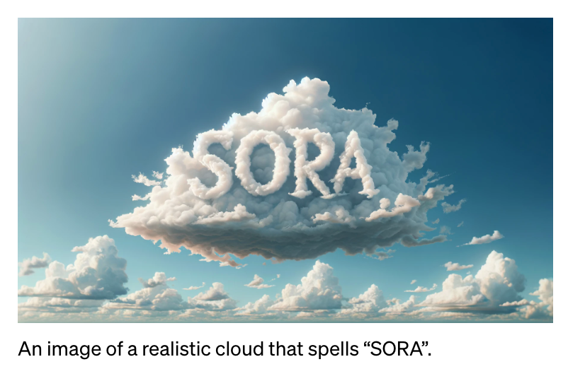

# SORA技术报告

视频生成模型的先前工作：循环网络、生成对抗网络、自回归transformer、扩散模型；这些模型只能生成一小类视觉数据、较短的视频或固定大小的视频

sora：是视觉数据的通用模型，是基于transformer架构的扩散模型。可以生成不同时长、长宽比和分辨率的视频和图像，最多可达一分钟的高清视频

## 1.将视觉数据转换为patches

现将视频压缩至低纬度潜在空间，然后分解成时空补丁（spacetime patches）

## 2.视频压缩网络

训练一个降低视觉数据维度的网络。 该网络将原始视频作为输入并输出在时间和空间上压缩的潜在表示。 Sora 在这个压缩的潜在空间中接受训练并随后生成视频。 还训练了相应的解码器模型，将生成的潜伏映射回像素空间。

## 3.时空潜在补丁

给定一个压缩的输入视频，提取一系列时空补丁（图像块），充当transformer tokens。 该方案也适用于图像，因为图像是具有单帧的视频。 基于补丁的表示使 Sora 能够对不同分辨率、持续时间和长宽比的视频和图像进行训练。 在推理时，可以通过在适当大小的网格中排列随机初始化的补丁来控制生成视频的大小。

## 4.用于视频生成的缩放变压器

Sora是一个扩散变压器（diffusion transformer），可以有效地缩放为视频模型。给定输入噪声补丁（以及文本提示等调节信息），它被训练来预测原始的“干净”补丁。下面的图片展示了训练过程中具有固定种子和输入的视频样本的比较。 随着训练计算的增加，样本质量显着提高。

## 5.可变的持续时间、分辨率、宽高比

### 1.采用灵活性

sora可以采样宽屏1920x1080p的视频、竖屏1080x1920p的视频以及介于两者之间的所有视频。这使得 Sora 可以直接以其原生宽高比为不同设备创建内容。 它还能够在以全分辨率生成之前快速以较低尺寸制作原型内容 - 所有这些都使用相同的模型。

### 2.改进的框架和构图

根据经验发现，以原始长宽比对视频进行训练可以改善构图和取景

## 6.语言理解

训练文本到视频生成系统需要大量带有相应文本字幕的视频。 将 DALL·E 3 中引入的重新字幕技术应用于视频。 首先训练一个高度描述性的字幕生成器模型，然后使用它为训练集中的所有视频生成文本字幕。 对高度描述性视频字幕进行训练可以提高文本保真度以及视频的整体质量。 与 DALL·E 3 类似，还利用 GPT 将简短的用户提示转换为较长的详细字幕，然后发送到视频模型。 这使得 Sora 能够生成准确遵循用户提示的高质量视频。

## 7.通过图像和视频进行提示

sora不仅可以通过文本生成视频，还可以根据图像或视频来生成视频，这使sora能够执行各种图像和视频编辑任务--创建完美的循环视频、动画静态图像、及时向前或向后扩展视频等

### 1.DALL·E 图像动画

例如下面的示例，sora能够根据图像和文本提示来生成视频

### 2.扩展生成的视频

Sora 还能够在时间上向前或向后扩展视频。 可以使用此方法向前和向后扩展视频以产生无缝的无限循环。

### 3.视频到视频的编辑

扩散模型有多种根据文本提示编辑图像和视频的方法，Sora使用的是SDEdit，这项技术使 Sora 能够零镜头地改变输入视频的风格和环境

### 4.连接视频

还可以使用 Sora 在两个输入视频之间逐渐进行插值，从而在具有完全不同主题和场景构成的视频之间创建无缝过渡

## 8.图像生成能力

Sora 还能够生成图像，通过在时间范围为一帧的空间网格中排列高斯噪声块来实现。 该模型可以生成各种尺寸的图像，分辨率高达 2048x2048

## 9.新兴的模拟功能

视频模型在大规模训练时表现出许多有趣的新兴功能。 这些功能使 Sora 能够模拟现实世界中人、动物和环境的某些方面。 这些属性的出现对 3D、物体等没有任何明确的归纳偏差——它们纯粹是尺度现象。 

3D 一致性： Sora 可以生成带有动态摄像机运动的视频。 随着摄像机的移动和旋转，人和场景元素在三维空间中一致移动。

长距离连贯性和物体持久性：视频生成系统面临的一个重大挑战是在采样长视频时保持时间一致性。 Sora 通常能够有效地对短期和长期依赖关系进行建模。 例如，我们的模型可以保留人、动物和物体，即使它们被遮挡或离开框架。 同样，它可以在单个样本中生成同一角色的多个镜头，并在整个视频中保持其外观。

与世界互动：Sora有时可以用简单的方式模拟影响世界状况的动作。 例如，画家可以在画布上留下新的笔触，并随着时间的推移而持续存在，或者一个人可以吃汉堡并留下咬痕。

模拟数字世界：Sora 还能够模拟人工过程——一个例子是视频游戏。 Sora 可以同时通过基本策略控制《我的世界》中的玩家，同时以高保真度渲染世界及其动态。 这些能力可以通过用提及“我的世界”的标题提示 Sora 来零样本生成。

## 10.讨论

Sora 目前作为模拟器表现出许多局限性。 例如，它不能准确地模拟许多基本相互作用的物理过程，例如玻璃破碎。 其他交互（例如吃食物）并不总是会产生对象状态的正确变化。

我们相信，视频模型的持续扩展是开发物理和数字世界以及生活在其中的物体、动物和人的高性能模拟器的一条有前途的道路。