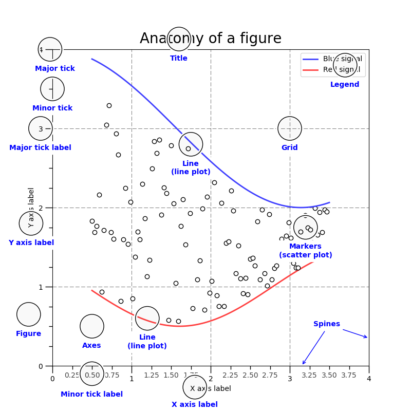
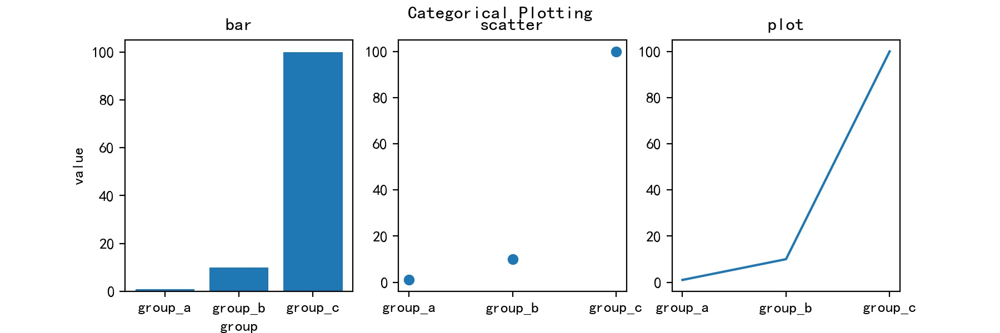

## matplotlib画图

### 1.图的组成

在matplotlib中，首先需要创建一个figure（图），figure可以包含一个或多个axes（子图），axes是真正绘图区。matplotlib有两种代码风格，一种是面向对象，明确的创建figrure和axes，并通过调用他们的方法进行绘图；另一种是依靠pyplot自动创建和管理figure和axes，并使用pyplot函数进行绘图，每一个pyplot函数都会对figure进行改变，例如：创建figure，在figure中创建axes，在axes中绘制一些线条，用标签装饰figure等。本文的代码主要采用第二种风格。fugure组成的示意图如下图所示：



### 2.绘图步骤

#### 2.1 子图

```python
from matplotlib import pyplot as plt
import matplotlib

matplotlib.rcParams['font.sans-serif']=['SimHei'] # 正常显示中文 windows
# matplotlib.rcParams['font.sans-serif']= ['Heiti TC']  # 正常显示中文 mac
matplotlib.rcParams['axes.unicode_minus']=False # 正常显示负号

names = ['group_a', 'group_b', 'group_c']
values = [1, 10, 100]

plt.figure(figsize=(9,3), dpi=200) # 创建一个figure，figsize是figure的尺寸（宽，高），dpi是以每英寸点数为单位的图形分辨率
plt.suptitle('Categorical Plotting') # figure的titile

plt.subplot(1, 3, 1) # 在figure中创建1x3个子图，现在开始在第一个子图中绘图
plt.bar(names, values) # 在第一个子图中画一个bar
plt.title('bar') # 第一个子图的title
plt.xlabel('group') # 第一个子图的xlabel
plt.ylabel('value') # 第一个子图的ylabel

plt.subplot(1, 3, 2) # 在figure中创建1x3个子图，现在开始在第二个子图中绘图
plt.scatter(names, values) # 在第二个子图中画一个scatter
plt.title('scatter') # 第二个子图的title

plt.subplot(1, 3, 3) # 在figure中创建1x3个子图，现在开始在第三个子图中绘图
plt.plot(names, values) # 在第三个子图中画一个plot
plt.title('plot') # 第三个子图的title


plt.savefig('test.jpg') # 保存figure为test.jpg文件
plt.show() # 将figure渲染到canvas上，显示图形。

# 注意：
# figsize的尺寸应与其中子图的数量和排列方式相适应，比如一共有6个子图，排列方式为3x2，那figsize的宽高比应为2：3
# plt.show()应该放在代码的最后
# plt.subplot(1, 1, 1) 表示创建1x1个子图，现在开始在第一个子图中绘图。一般可以省略不写改行代码
```



```python
plt.legend() # 显示图例
plt.grid() # 显示网格
```

