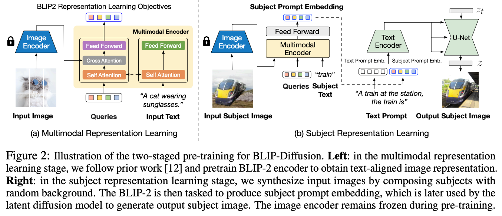
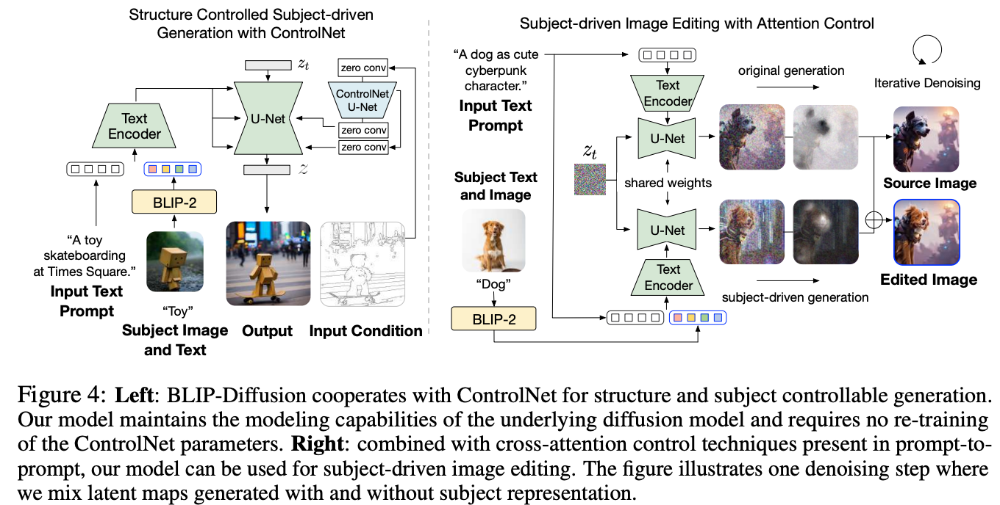

## BLIP-Diffusion

Paper:https://arxiv.org/pdf/2305.14720.pdf

GitHub:https://github.com/salesforce/LAVIS/tree/main/projects/blip-diffusion

Blog:https://dxli94.github.io/BLIP-Diffusion-website/

blip-diffusion是第一个主题驱动的文本到图像生成模型，它具有预训练的通用主题表示，它使主题驱动的生成在zero-shot或几步的fine-tune就能完成。模型建立在一个视觉语言编码器（BLIP-2 ）和一个潜在的扩散模型（Stable Diffusion）之上。BLIP-2编码器将主题图像及其类别文本作为输入，它生成主题表示作为输出。然后，我们将主题表示固定在提示嵌入中，以指导潜在扩散模型的主题驱动的图像生成和编辑

数据集制作：给定包含主题的图像和类别文本，用CLIPSeg对图像进行分割，将置信度较高的分割图作为前景，将置信度较低的区域作为不确定区域，其余部分作为背景，构建一个 trimap，然后抠图提取前景，再通过 alpha 混合将提取的主题合成到随机背景图像上，获得更多同一主题、不同背景的图片

#### 1.训练过程

模型的训练过程分为两个阶段，第一阶段是多模态表示学习，这将强制BLIP-2基于输入的图像生成文本对齐的视觉特征。第二阶段是主题表示学习，其中扩散模型根据输入的视觉特征学习生成新的主题再现。具体来说，通过随机背景来合成输入图像，在预训练过程中，给BLIP-2输入合成的输入图像和主题类标签，以获得作为主题表示的多模态嵌入。然后，将主题表示与文本提示相结合，以指导目标图像的生成。两个阶段的训练过程如下：

#### 2.可控推理

##### 1.结合ControlNet进行结构控制生成

BLIP-Diffusion可以与ControlNet进行结合，同时实现主题驱动和结构控制，结构条件包括等边缘图和深度图。如上左图所示，通过残差将预训练 ControlNet 的 U-Net 附加到 BLIP-Diffusion 的 U-Net。由于BLIP-Diffusion继承了原始LDM的架构，无需进一步微调，使用预训练 ControlNet，就能到了满意的生成结果

##### 2.结合prompt-to-prompt注意力控制的主题驱动图像编辑

BLIP-Diffusion将主题嵌入与文本提示嵌入相结合，作为多模态条件引导扩散模型生成。受prompt-to-prompt的启发，通过操纵prompt token的交叉注意力图可以实现基于主题驱动的图像编辑。上右图展示了BLIP-Diffusion使用特定主题编辑原始图像的能力，假设原始图像的生成过程是已知的，或者可以通过真实图像的反演出来，目的是获得原始图像的交叉注意力图。

要编辑图像，首先要指定要编辑的文本token（例如dog），然后使用指定token的交叉注意力图提取要编辑的区域掩码。为了保留未编辑区域的布局和语义，需要保留原始的注意力图，同时为插入的主题嵌入生成新的注意力图。未编辑区域的掩码来自原始图像生成，而编辑区域的掩码则来自主题驱动的生成，通过这种方式，BLIP-Diffusion获得了具有特定主题视觉效果的编辑图像，同时还最大限度保留了未编辑的区域