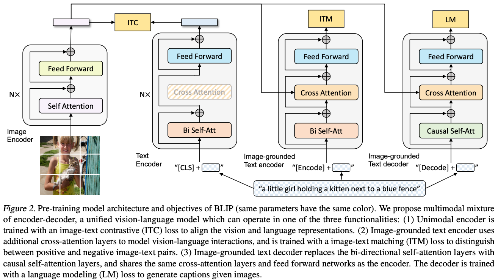
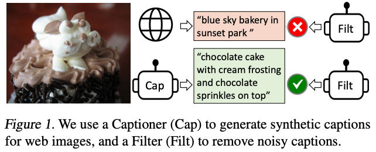
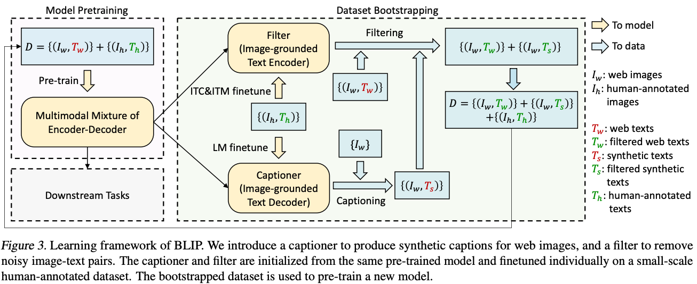
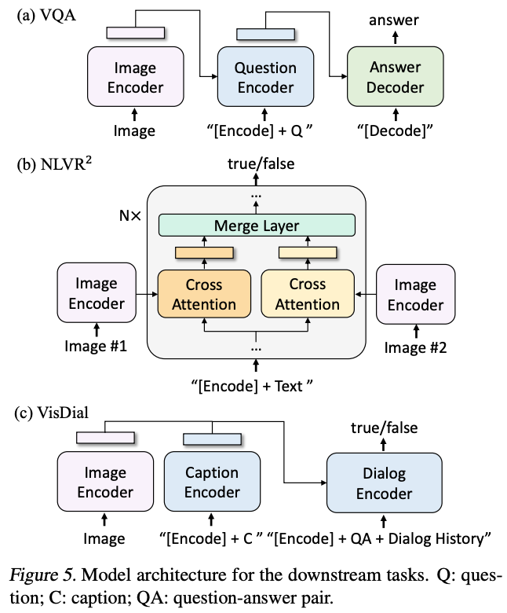

## BLIP

paper：https://arxiv.org/pdf/2201.12086.pdf

github：https://github.com/salesforce/BLIP

#### 1.主要贡献

1.提出了一种新模型架构，多模态混合的编码器-解码器（Multimodal mixture of Encoder-Decoder，MED），MED 可以作为单模态编码器、基于图像的文本编码器或基于图像的文本解码器运行。 该模型与三个视觉语言目标联合预训练：图像文本对比学习、图像文本匹配和图像条件语言建模，预训练的过程如下：

2.提出了一种新的数据方法，字幕和过滤，用于从噪声图像文本对中学习，将预训练的 MED 微调为两个模块：一个用于根据给定网络图像生成合成字幕的字幕生成器，以及一个用于从原始网络文本和合成文本中删除噪声字幕的过滤器，增强过程如下：

#### 2.模型结构

1.单模态编码器，image encoder，使用VIT作为图像编码器，它将输入图像划分为补丁并将它们编码为嵌入序列（sequence of embeddings），使用附加的[CLS]token来表示全局图像特征；text encoder，使用BERT作为文本编码器

2.基于图像的文本编码器，通过在文本编码器的每个encoder块的自注意（SA）层和前馈网络（FFN）之间插入一个额外的交叉注意（CA）层来注入视觉信息。 特定于任务的 [Encode] 标记被附加到文本中，并且 [Encode] 的输出嵌入用作图像-文本对的多模态表示

3.基于图像的文本解码器，用因果自注意力层替换基于图像的文本编码器中的双向自注意力层。 [Decode] 标记用于表示序列的开始，序列结束标记用于表示序列的结束

#### 3.预训练目标函数

预训练阶段联合优化三个目标，其中两个基于理解的目标和一个基于生成的目标：

1.图像文本对比损失（Image-Text Contrastive Loss）：它的目的是通过鼓励正图像-文本对与负图像-文本对相比具有相似的表示来对齐视觉变换器和文本变换器的特征空间

2.图像文本匹配损失（Image-Text Matching Loss）：它的目的是学习图像文本多模态表示，捕获视觉和语言之间的细粒度对齐。 ITM 是二分类任务，其中模型使用 ITM 头（线性层）来预测图像文本对在给定多模态特征的情况下是正（匹配）还是负（不匹配）

3.语言建模损失（Language Modeling Loss）：其目的是根据给定的图像生成文本描述。 它优化了交叉熵损失，训练模型以自回归方式最大化文本的可能性。

为了在利用多任务学习的同时执行高效的预训练，文本编码器和文本解码器共享除 SA 层之外的所有参数。 原因是 SA 层最好地捕获编码和解码任务之间的差异。 特别是，编码器采用双向自注意力来构建当前输入token的表示，而解码器则采用因果自注意力来预测下一个token。 另一方面，嵌入层、CA层和FFN在编码和解码任务之间的功能相似，因此共享这些层可以提高训练效率，同时受益于多任务学习

#### 4.CapFilt

CapFilt引入了两个模块：一个用于在给定网络图像的情况下生成字幕的字幕生成器（captioner），以及一个用于消除噪声图像文本对的过滤器（filter）。captioner和filter都是从相同的预训练MED模型初始化，从coco数据集上单独进行微调，captioner是一个基于图像的文本解码器，filter是一个基于图像的文本编码器。最后，将过滤后的图像文本对与人工注释对结合起来形成一个新的数据集，用它来预训练新模型。CapFilt的图示如下：

#### 5.下游任务的模型结构

