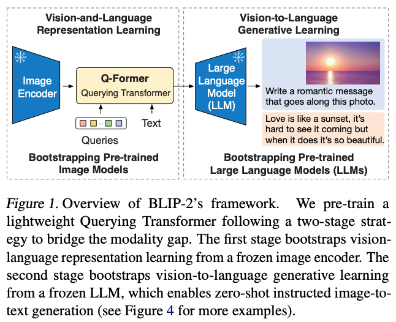
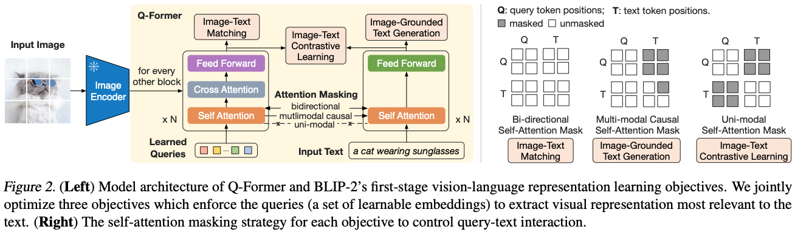
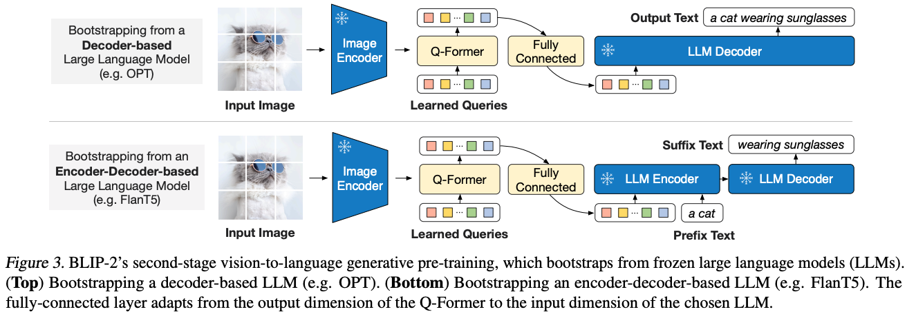

## BLIP2

paper：https://arxiv.org/pdf/2301.12597.pdf

github：https://github.com/salesforce/LAVIS/tree/main/projects/blip2

BLIP2提出了一种高效的预训练策略，可从现成的冻结预训练图像编码器和冻结大型语言模型引导视觉语言预训练。通过轻量级查询转换器（query transformer）弥补了模态差距，该转换器分两个阶段进行预训练，第一阶段从冻结图像编码器引导视觉语言表示学习； 第二阶段从冻结的语言模型引导视觉到语言的生成学习。BLIP2的框架概述如下：

#### 1.模型结构

blip2第一阶段的训练过程图示：

blip2第二阶段的训练过程图示：

其中，image encoder是VIT模型，llm decoder是opt模型，llm encoder-decoder是FlanT5模型