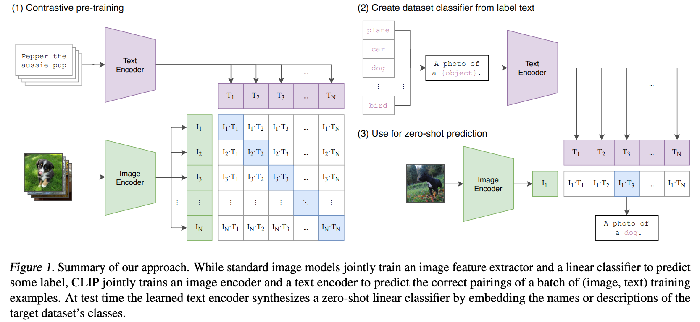
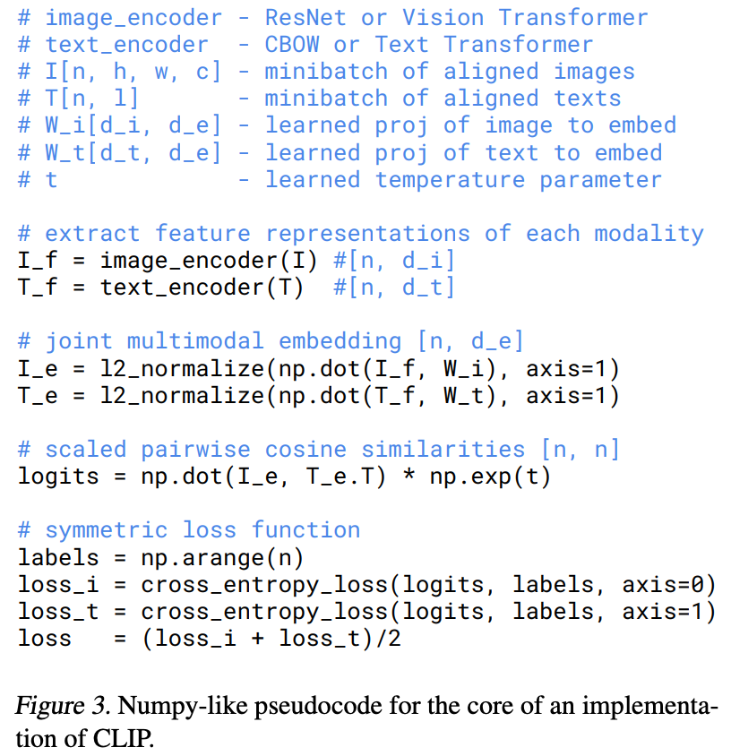
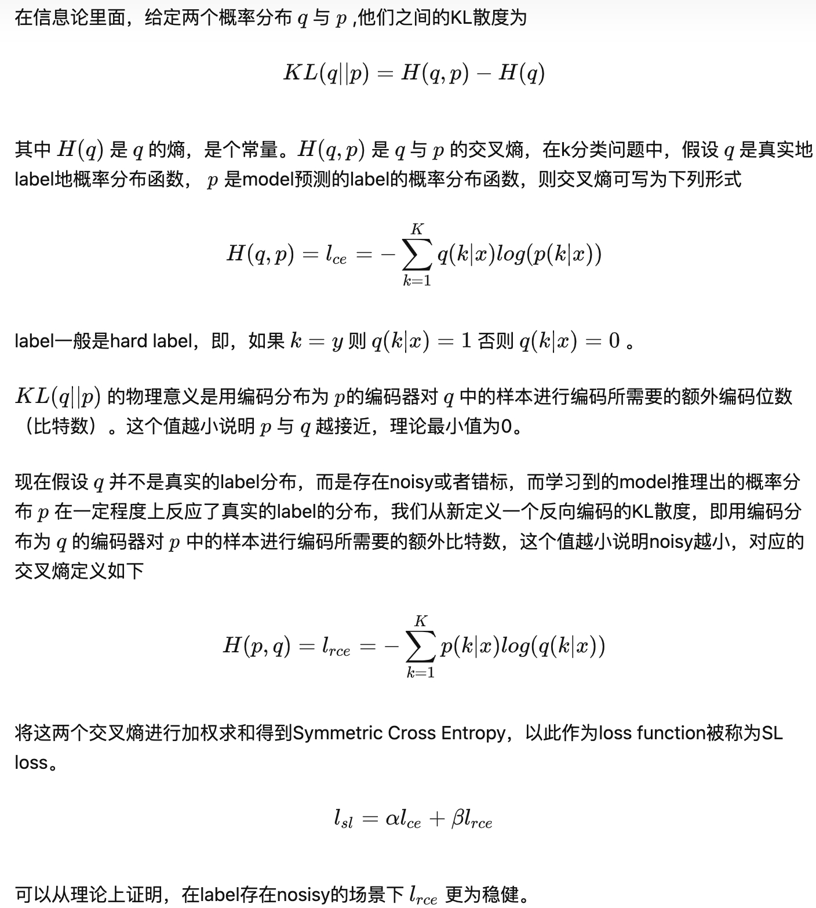

## CLIP

Learning Transferable Visual Models From Natural Language Supervision

GitHub: https://github.com/openai/CLIP

Paper: https://arxiv.org/pdf/2103.00020.pdf

#### 1.模型结构

Image encoder：ResNet 或 VIT

text encoder：CBOW 或 Text Transformer

## 2.训练过程

直接利用从互联网爬取的4亿个（图像、文本）对，进行图文匹配任务的训练，计算相似度。并将其成功迁移应用于30个现存的计算机视觉——OCR、动作识别、细粒度分类

训练和零样本推理的过程如下图所示，给定batch=N的image-text pairs，CLIP预测NxN的概率（利用线性变换得到multi-modal embedding space的向量，点乘计算得到相似度），对角线即为正样本，其它都是负样本。损失函数为对称交叉熵

训练过程的伪代码：

symmetric loss function的计算：计算了2个维度的交叉熵，分别代表image投射到text空间和text投射到image空间后预测的概率分布，希望这两个分布都能够与预期分布相近

symmetric loss function的定义：

