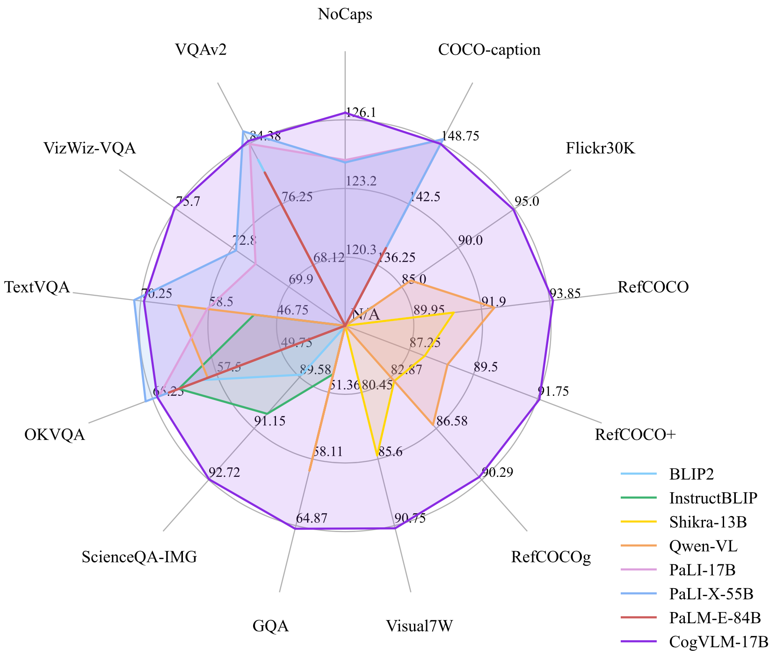
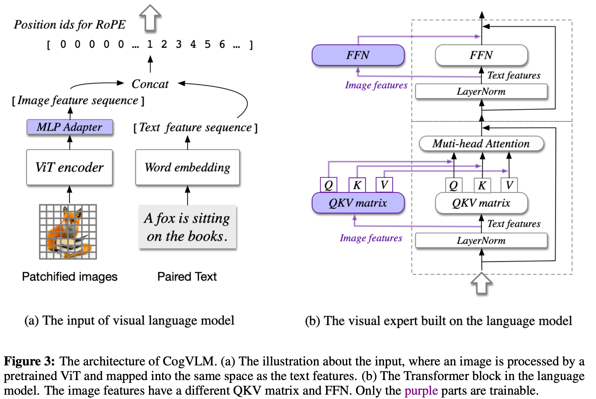

# CogVLM论文总结

论文地址：https://arxiv.org/pdf/2311.03079.pdf

代码仓库：https://github.com/THUDM/CogVLM

# 前言

CogVLM是一个开源的视觉语言基础模型，与流行的将图像特征映射到语言模型输入空间的浅层对齐方法不同，CogVLM 通过注意力层和 FFN 层中的可训练视觉专家模块弥合了冻结的预训练语言模型和图像编码器之间的差距。下图是CogVLM和其他模型在各种多模态任务上的表现对比，可以看出，CogVLM的标签几乎都在前两名，十分具有竞争力。

# 1.简介

许多视觉和多模态任务可以被表述为下一个token预测，例如图像字幕（image captioning）、视觉问答（visual question answering）、视觉基础（visual grounding，感觉可以翻译成视觉定位）和图像分割（image segmentation）

目前比较流行的浅层对齐的方法是通过可训练的Q-Former或线性层连接冻结的预训练视觉编码器和语言模型，将图像特征映射到语言模型的输入嵌入空间（input embedding space），比如BLIP-2。 这种方法训练收敛快，但是视觉理解能力弱，容易表现为幻觉，性能不如联合训练视觉语言模型

CogVLM在保留大语言模型的NLP能力的同时，加入顶尖的视觉理解能力。论文认为，浅层对齐方法性能较差的根本原因在于视觉和语言信息之间缺乏深度融合。这个灵感来源于 p-tuning 和 LoRA 在高效微调方面的比较，其中 p-tuning 学习任务中的输入嵌入（input embedding）中的前缀，而 LoRA 通过一个低秩矩阵调整模型的每一层权重。 因此，LoRA 性能更好、更稳定。类似的现象也可能存在于VLM中，因为在浅层对齐方法中，图像特征的作用类似于p-tuning中的前缀嵌入。 p-tuning 和浅对齐性能下降的更详细原因包括：

1. 语言模型中冻结的权重是针对文本标记进行的训练，视觉特征在输入文本空间中没有完美的对应物。 因此，在多层转换之后，视觉特征可能不再与深层权重的输入分布相匹配
2. 在预训练期间，图像字幕任务的先验信息只能在浅对齐方法中编码为视觉特征， 削弱了视觉特征与内容的一致性

CogVLM 在语言模型中添加了可训练的视觉专家。 这个视觉专家会在语言模型的每一层中将序列中的图像特征使用一个新的不同的QKV矩阵和新的带有文本特征的MLP层。由于原语言模型中的所有参数都是固定的，所以当输入序列不包含图像时，其行为与原语言模型相同。

# 2.方法

## 2.1 结构

CogVLM由以下4个基础组件构成：

1. ViT编码器，具体用的是EVA2-CLIP-E，参数量在5B左右
2. MLP适配器，具体用的是SwiGLU，由两层的MLP组成，用于将 ViT 的输出映射到与词嵌入的文本特征相同的空间。 所有图像特征在语言模型中共享相同的位置 ID
3. 预训练的大型语言模型， CogVLM 的模型设计与任何现成的 GPT 式预训练大型语言模型都兼容。 具体用的是 Vicuna-7B-v1.5，因果掩模（cause mask）应用于所有注意力操作，包括图像特征之间的注意力，参数量在7B左右
4. 视觉专家模块，大语言模型的每一层都添加一个视觉专家模块，以实现深度视觉语言特征对齐。 具体来说，每层的视觉专家模块由每层的QKV矩阵和MLP（FFN）组成。 QKV 矩阵和 MLP 的形状与预训练语言模型中的形状相同并从它们初始化。 其动机是语言模型中的每个注意力头捕获语义信息的某个方面，而可训练的视觉专家可以转换图像特征以与不同的头对齐，从而实现深度融合。参数量在6B左右

正式的说，假设注意力层的输入隐藏状态是$X\in R^{B*H*(L_I+L_T)*D}$，其中，$B$是batch size，$L_I$和$L^T$分别是图像和文本序列的长度，$H$是注意力头数，$D$是隐藏层大小

在视觉专家模块中，$X$被分解成$X_I$和$X_T$，分别表示图像和文本的隐藏状态，注意力机制的计算可以表示为：
$$
Attention(X,W_I,W_T)=softmax(\frac{Tril(QK^T)}{\sqrt{D} } )V
$$

$$
Q=concat(X_IW_{I}^{Q},X_TW_{T}^{Q}),K=concat(X_IW_{I}^{K},X_TW_{T}^{K},V=concat(X_IW_{I}^{V},X_TW_{T}^{V})
$$

其中，$W_I$和$W_T$是视觉专家和原始语言模型的$QKV$矩阵，$Tril(·)$是下三角掩模。视觉专家的FFN层可以表示为：
$$
FFN(X)=concat(FFN_I(X_I),FFN_T(X_T))
$$
其中，$FFN_I$和$FFN_T$是是视觉专家和原始语言模型的QKV矩阵的$FFN$

CogVLM的结构如下图所示：

## 2.2 预训练

数据：

1. 图片-文本对数据
2. 视觉定位（visual grounding）数据，每个名词关联图片中的一个边界框，使用GLIPv2通过文本预测边界框

训练：

1. 第一阶段的预训练是图片字幕损失（image captioning loss），例如，在图片-文本对数据中文本部分的下一个token预测
2. 第二阶段的预训练是图片字幕和REC（Referring Expression Comprehension）的混合，REC 是根据对象的文本描述来预测图像中边界框的任务，该任务以 VQA 的形式进行训练，即“问题：对象在哪里？” 和“答案：[[x0，y0，x1，y1]]”

## 2.3 对齐

数据：来自LLaVA-Instruct、LRV-Instruction、LLaVAR这些论文里的数据集和一些内部数据，数据集中约有50w个VQA数据对

SFT：为了防止过度拟合数据集的文本答案，利用较小的学习率（其他参数的学习率的10%）来更新预训练的语言模型。 除了 ViT 编码器之外的所有参数都可以在 SFT 期间进行训练。

# 3.实验

为了严格验证模型的卓越性能和稳健的泛化能力，进行了多种任务的测试：

图像字幕：image caption任务的主要目的是生成总结给定图像主要内容的文本标题 视觉基础涉及一组任务，这些任务在句子中的文本提及与图像中的特定区域之间建立参考链接

视觉问答：VQA 任务需要模型来回答可能关注基于给定图像的不同视觉内容的问题

视觉定位：Visual grounding任务在句子中的文本提及与图像中的特定区域之间建立参考链接

# 4.结论

之前流行的视觉语言模型大多是将图像特征映射到语言模型输入空间的浅层对齐方法，并且图像编码器参数量通常比语言模型的参数量少的多。CogVLM 将 VLM 训练范式从浅层对齐转变为深度融合，采用的视觉模型参数量和语言模型参数量相当，用于做视觉语言深度融合的视觉专家模块的参数量也达到了和语言模型相同的数量级，做到了深度融合
