## Glip

v1 Paper:https://arxiv.org/pdf/2112.03857.pdf

V2 Paper:https://arxiv.org/pdf/2206.05836.pdf

GitHub:https://github.com/microsoft/GLIP

#### 1.模型结构

glip将目标检测（object detection）和短语定位（phrase grounding）两个任务统一起来进行预训练，联合训练图像编码器和文本编码器来预测区域（region）和短语（words）的正确配对。跨模态深度融合可以在早期就开始融合两种模态的信息，并学习语言感知的视觉表示。模型框架如下：

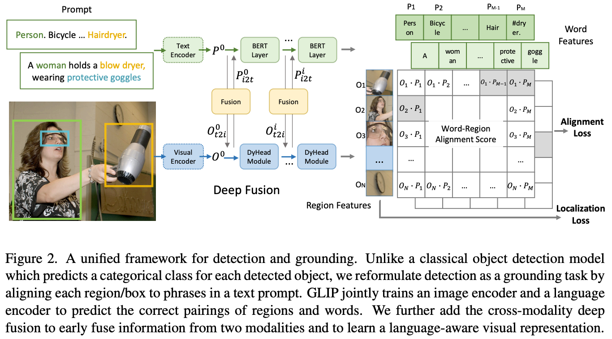

其中，图像编码器是swin transformer模型，文本编码器是bert模型，深度融合阶段的模型是dynamic head

#### 2.损失函数

预训练的损失函数包括：

1. 文字-区域对齐损失，评价文本和图像区域是否对齐

   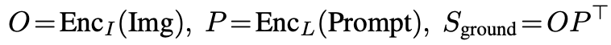

   其中，O是图像中的对象/区域/边界框特征，P是文本中的token特征，S是区域-文本对齐损失

2. 图像定位损失，包含了分类准确性和位置准确性两部分，评价图像的实例框定位是否准确

   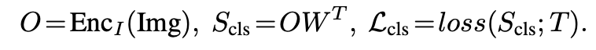

   其中，O是图像中的对象/区域/边界框特征，W是边界框分类器的权重矩阵，S是输出类别，T是图像区域和实例类别的目标匹配（taget matching），loss（S; T）是交叉熵损失（对于two stage detectors）或者focal损失（对于one stage detectors）

   这个损失函数将检测问题的分类头部分替换成一个和类别词向量的匹配问题，从而能够实现开放式目标检测以及其他的相关下游任务

#### 3.深度融合

深度融合可以理解为多模态交叉注意力机制，q，v就是注意力机制qkv向量中的q和v，将图像特征和文本特征融合在一起进行学习，公式如下：

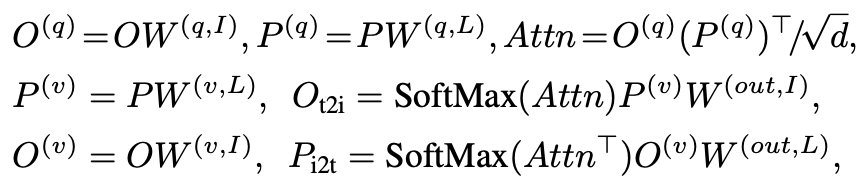

## Glip v2

glip v2是一个视觉语言理解的预训练模型，统一了多种定位任务和视觉语言理解任务，在训练过程中使两种任务相互促进。支持目标检测、实例分割、视觉语言定位、视觉问答（VQA）和图像说明生成

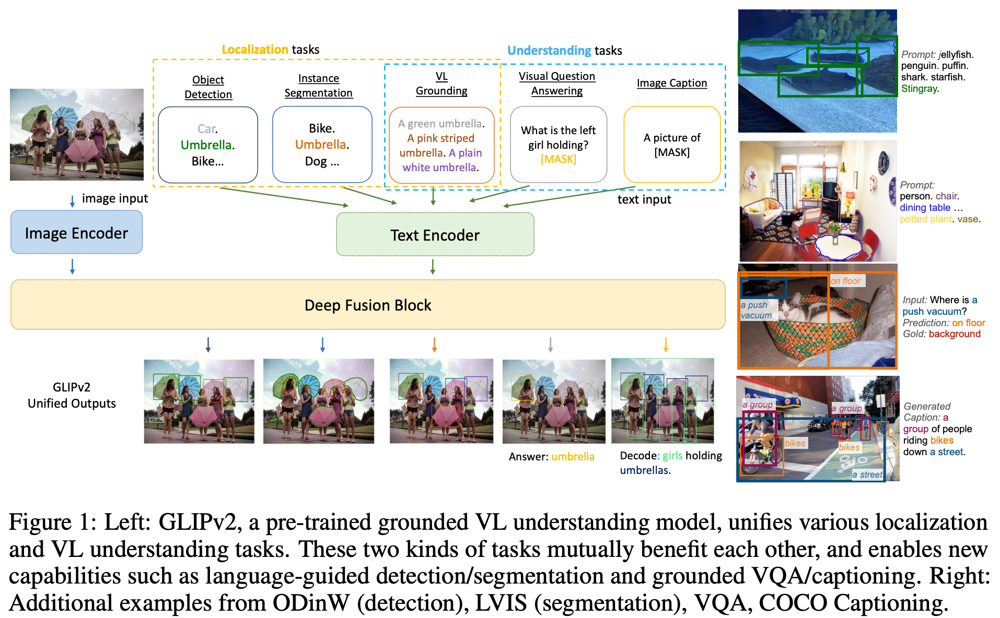

#### 1.预训练

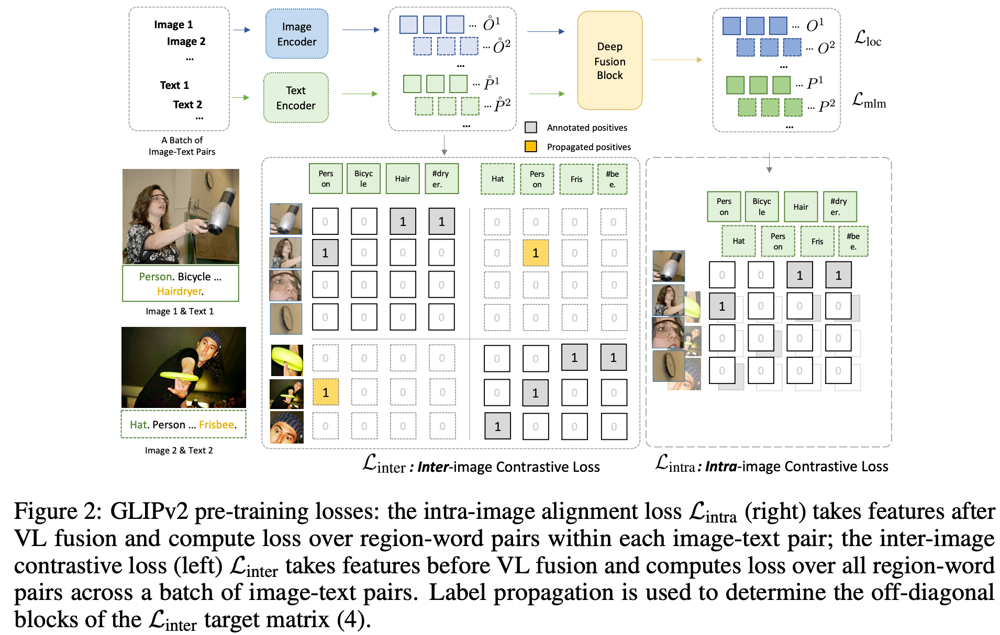

其中，图像编码器是swin transformer模型，文本编码器是bert模型，深度融合阶段的模型是dynamic head，实例分割头是hourglass

Glip v2的预训练包含三种损失函数：

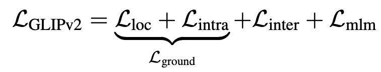

1. 短语定位损失(Lground)，包括定位损失(Lloc)和图像内区域-文本对齐损失(intra)

   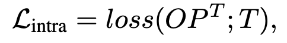

   其中，OP是图像和文本的相似度，T是的文本图像匹配的标注数据，loss（S; T）是交叉熵损失（对于two stage detectors）或者focal损失（对于one stage detectors）

2. 图像间区域-文本对比学习损失(Linter)

   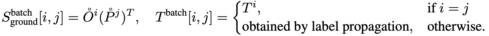

   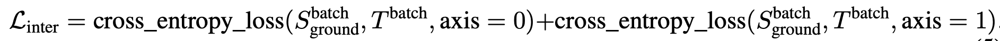

   表示一个batch内不同样本对（图像-文本对）之间的交叉熵损失，axis的不同分别表示图像对文本的交叉熵损失和文本对图像的交叉熵损失

3. 掩码语言模型损失（Lmlm，是bert中的mlm损失）

#### 下游任务迁移

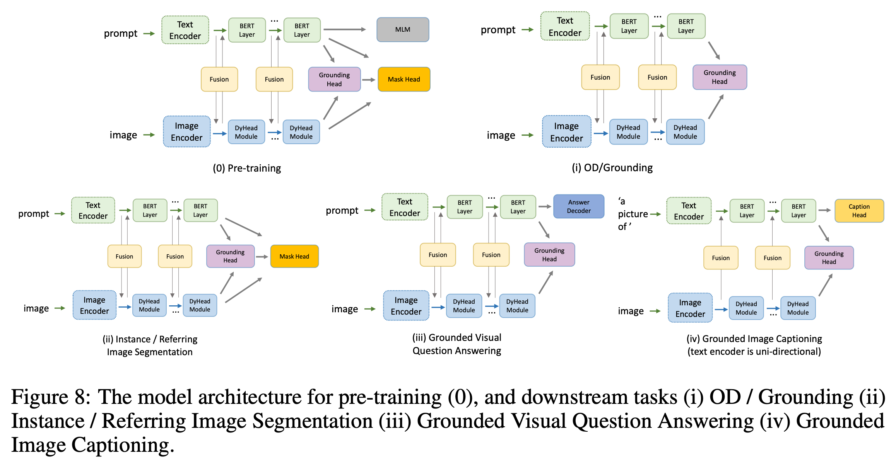

