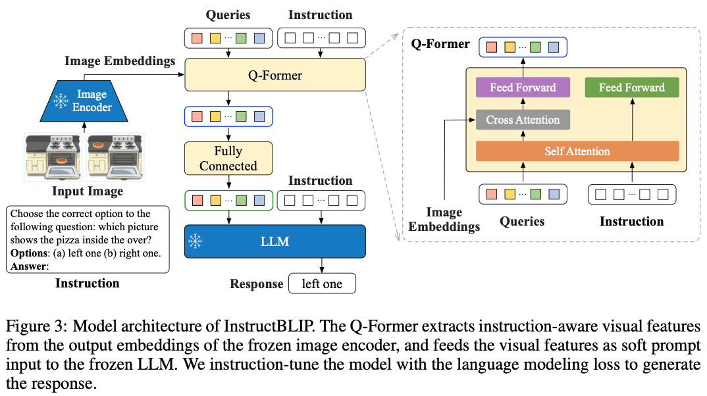

## InstructBlip

paper：https://arxiv.org/pdf/2305.06500.pdf

github：https://github.com/salesforce/LAVIS/tree/main/projects/instructblip

InstructBlip是一种视觉语言指令调优（ vision-language instruction tuning）框架，复用了BLIP2的结构，有一个imag encoder，一个LLM，一个QFormer连接前两者。在进行视觉语言指令微调期间，我们从预训练的BLIP2的checkpoint初始化模型，并且只微调Q-Former的参数，同时保持图像编码器和LLM冻结

#### 1.模型结构

instructblip结构图如下：

instructblip的image encoder是VIT模型，llm模型有FlanT5-XL（3B）、FlanT5-XXL（11B）、Vicuna-7B和Vicuna-13B一共四种

Q-Former从冻结的图像编码器的输出中提取视觉特征。具体而言，一组可学习的查询嵌入通过交叉注意力层与冻结的图像编码器进行交互。这些查询的输出特征随后被投影为输入视觉提示，提供给冻结的LLM。Q-Former经过两个阶段的预训练，遵循BLIP-2论文的方法，学习提取文本对齐的视觉特征，这些特征对LLM易于理解。在推理过程中，将指令附加在视觉提示后，引导LLM执行特定的任务

在InstructBLIP中，指令文本不仅作为输入提供给LLM，也提供给Q-Former。指令通过Q-Former的自注意力层与查询进行交互，影响查询提取与指令所描述的任务更相关的图像特征。因此，LLM接收到更有用的视觉信息，以完成任务