## 评分卡建模

### 一、数据预处理

#### 1.重复值删除

```python
data = data.drop_duplicates(inplace=False)
data = data.reset_index(drop=True)
```

#### 2.缺失值处理

对模型影响不大的特征，如果缺失比例较大，可以直接删除该特征；如果缺失比例较小，可以用均值、中位数、众数等填充。对模型影响较大的特征，可以将含有缺失值的特征当作目标列，采用树模型（如随机森林，决策树等）进行填充。

```python
# 对NumberOfDependents列用中位数进行填充
data["NumberOfDependents"] = data["NumberOfDependents"].fillna(data["NumberOfDependents"].median()) 

# 对MonthlyIncome列用随机森林模型进行填充
def rf_imputer(data, fill_column, complete_column):
    '''
        param：
            data：数据集
            fill_column：需要进行缺失值填充的列
            complete_column：不含缺失值的完整的列
        return：
            data：缺失值填充后的数据集
    '''
    train_data = data.loc[data[fill_column].notna(), :]
    train_data = train_data.reset_index(drop=True)
    test_data = data.loc[data[fill_column].isna(), :]
    test_data = test_data.reset_index(drop=True)

    train_x = train_data.drop([fill_column], axis=1)
    train_y = train_data[fill_column]
    test_x = test_data.drop([fill_column], axis=1)
   
    from sklearn.ensemble import RandomForestRegressor
    rfr = RandomForestRegressor()
    rfr = rfr.fit(train_x, train_y)
    pred_y = rfr.predict(test_x)
    
    test_data[fill_column] = pred_y
    data = pd.concat([train_data, test_data], axis=0)
    data = data.reset_index(drop=True)
    
    return data

data = rf_imputer(data, 'MonthlyIncome', 'SeriousDlqin2yrs')
```


#### 3.异常值处理

一般采用采用箱线图分位数法和正态分布图参考线法对异常值进行识别，然后删除异常值

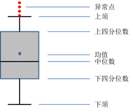

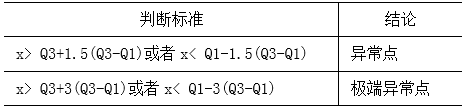

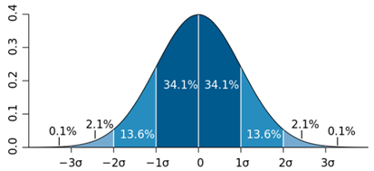

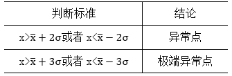


```python
# 用箱线图分位数法删除age列中的异常值
# 计算下四分位数和上四分位
Q1 = data['age'].quantile(q = 0.25)
Q3 = data['age'].quantile(q = 0.75)
# 基于1.5倍的四分位差计算上下须对应的值
low_whisker = Q1 - 1.5*(Q3 - Q1)
up_whisker = Q3 + 1.5*(Q3 - Q1)
# 寻找异常点
res = data['age'][(data['age'] > up_whisker) | (data['age'] < low_whisker)]
# 删除异常值
data = data.drop(res.index)
data = data.reset_index(drop=True)
```

```python
# 用正态分布图参考线法删除NumberOfTimes90DaysLate列中的极端异常值
# 计算判断极端异常点的临界值
extreme_outlier_ll = data["NumberOfTimes90DaysLate"].mean() - 3* data["NumberOfTimes90DaysLate"].std()
extreme_outlier_ul = data["NumberOfTimes90DaysLate"].mean() + 3* data["NumberOfTimes90DaysLate"].std()
# 寻找极端异常点
extreme_outlier_res = data.loc[(data["NumberOfTimes90DaysLate"] > extreme_outlier_ul) | (data["NumberOfTimes90DaysLate"] < extreme_outlier_ll),:]
# 删除极端异常值
data = data.drop(extreme_outlier_res.index)
data = data.reset_index(drop=True)
```

#### 4.共线性筛选

一般使用皮尔逊相关系数和方差膨胀因子（VIF）来检验数据集特征间共线性

皮尔逊相关系数：两个变量之间的协方差和标准差的商，皮尔逊相关系数越大，说明两个变量的线性相关性越大

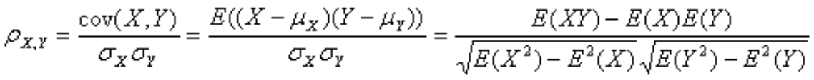

方差膨胀因子（VIF）：是衡量多元线性回归模型中复 (多重)共线性严重程度的一种度量，方差膨胀因子VIF越大，说明自变量之间存在共线性的可能性越大。公式中，Ri为自变量对其余自变量作回归分析的负相关系数。

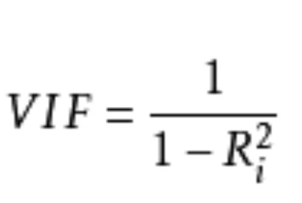

```python
# 计算皮尔逊相关系数，删除相关系数较大的
x = data.drop(['SeriousDlqin2yrs'], axis=1)
corrs = x.corr(method='pearson')

from statsmodels.stats.outliers_influence import variance_inflation_factor
# 每轮循环中计算各个变量的VIF，并删除VIF>threshold的变量
def vif(X, threshold=10.0):
    while True:
        vif = [variance_inflation_factor(X.values, ix) for ix in range(X.shape[1])]
        maxvif = max(vif)
        maxix = vif.index(maxvif)
        if maxvif >= threshold:
            print('delete=', X.columns[maxix], '  ', 'vif=', maxvif)
            X = X.drop([X.columns[maxix]], axis=1)
        else:
            break
    print('Remain Variables:', X.columns.tolist())
    print('VIF:', vif)
    return X

res = vif(x, 10)
```

### 二、分箱

#### 1.等频分箱

```python
qcut_res = pd.qcut(data['age'], q=10)
```

#### 2.等距分箱

```python
cut_res = pd.cut(data['age'], bins=20)
```

#### 3.聚类分箱

```python
from sklearn.cluster import KMeans

k_means = KMeans(n_clusters=20)
k_means.fit(data[['age']])
res = k_means.predict(data[['age']])
```

#### 4.卡方分箱

卡方分箱是依赖于卡方检验的分箱方法，在统计指标上选择卡方统计量（chi-Square）进行判别，分箱的基本思想是判断相邻的两个区间是否有分布差异，基于卡方统计量的结果进行自下而上的合并，直到满足分箱的限制条件为止。

分箱终止条件：
1.分箱个数：每次将样本中具有最小卡方值的区间与相邻的最小卡方区间进行合并，直到分箱个数达到限制条件为止。
2.卡方阈值：根据自由度和显著性水平得到对应的卡方阈值，如果分箱的各区间最小卡方值小于卡方阈值，则继续合并，直到最小卡方值超过设定阈值为止。

```python
def chi_bins(df, col, target, confidence=3.841, bins=5):  # 设定自由度为1，卡方阈值为3.841，最大分箱数20
    '''
        params:
            df：数据集
            col：要分箱的列名
            target：目标列名
        return：
            result_data：分箱结果，包括woe, bad_rate等指标
            iv：分箱后该列的IV值
    '''
    total = df[target].count()  # 计算总样本数
    bad = df[target].sum()  # 计算坏样本总数
    good = total - bad  # 计算好样本总数
    total_bin = df.groupby([col])[target].count()  # 计算每个箱体总样本数
    total_bin_table = pd.DataFrame({'total': total_bin})  # 创建一个数据框保存结果
    bad_bin = df.groupby([col])[target].sum()  # 计算每个箱体的坏样本数
    bad_bin_table = pd.DataFrame({'bad': bad_bin})  # 创建一个数据框保存结果
    regroup = pd.merge(total_bin_table, bad_bin_table, left_index=True, right_index=True, how='inner')  # 组合total_bin 和 bad_bin
    regroup.reset_index(inplace=True)
    regroup['good'] = regroup['total'] - regroup['bad']  # 计算每个箱体的好样本数
    regroup = regroup.drop(['total'], axis=1)  # 删除total
    np_regroup = np.array(regroup)  # 将regroup转为numpy

    # 处理连续没有正样本和负样本的区间，进行合并，以免卡方报错
    i = 0
    while (i <= np_regroup.shape[0] - 2):
        if ((np_regroup[i, 1] == 0 and np_regroup[i + 1, 1] == 0) or (np_regroup[i, 2] == 0 and np_regroup[i + 1, 2] == 0)):
            np_regroup[i, 1] = np_regroup[i, 1] + np_regroup[i + 1, 1]  # 正样本
            np_regroup[i, 2] = np_regroup[i, 2] + np_regroup[i + 1, 2]  # 负样本
            np_regroup[i, 0] = np_regroup[i + 1, 0]
            np_regroup = np.delete(np_regroup, i + 1, 0)
            i = i - 1
        i = i + 1

    # 对相邻两个区间的值进行卡方计算
    chi_table = np.array([])  # 创建一个数组保存相邻两个区间的卡方值
    for i in np.arange(np_regroup.shape[0] - 1):
        chi = ((np_regroup[i, 1] * np_regroup[i + 1, 2] - np_regroup[i, 2] * np_regroup[i + 1, 1]) ** 2 *
               (np_regroup[i, 1] + np_regroup[i, 2] + np_regroup[i + 1, 1] + np_regroup[i + 1, 2])) / \
              ((np_regroup[i, 1] + np_regroup[i, 2]) * (np_regroup[i + 1, 1] + np_regroup[i + 1, 2]) *
               (np_regroup[i, 1] + np_regroup[i + 1, 1]) * (np_regroup[i, 2] + np_regroup[i + 1, 2]))
        # chi = chi2_contingency(np_regroup[i:i+2,1:], correction=False)[0]
        chi_table = np.append(chi_table, chi)

    # 将卡方值最小的两个区间进行合并
    while True:  # 除非设置break，否则会一直循环下去
        if (len(chi_table) <= (bins - 1) or min(chi_table) >= confidence):
            break  # 当chi_table的值个数小于等于（箱体数-1) 或 最小的卡方值大于等于卡方阈值时，循环停止
        chi_min_index = np.where(chi_table==min(chi_table))[0][0]  # 找出卡方最小值的索引
        np_regroup[chi_min_index, 1] = np_regroup[chi_min_index, 1] + np_regroup[chi_min_index + 1, 1]
        np_regroup[chi_min_index, 2] = np_regroup[chi_min_index, 2] + np_regroup[chi_min_index + 1, 2]
        np_regroup[chi_min_index, 0] = np_regroup[chi_min_index + 1, 0]
        np_regroup = np.delete(np_regroup, chi_min_index + 1, axis=0)

        if (chi_min_index == np_regroup.shape[0] - 1):  # 当卡方最小值是最后两个区间时，计算当前区间和前一个区间的卡方值并替换
            chi_table[chi_min_index - 1] = ((np_regroup[chi_min_index - 1, 1] * np_regroup[chi_min_index, 2] -
                                             np_regroup[chi_min_index - 1, 2] * np_regroup[chi_min_index, 1]) ** 2 *
                                            (np_regroup[chi_min_index - 1, 1] + np_regroup[chi_min_index - 1, 2] +
                                             np_regroup[chi_min_index, 1] + np_regroup[chi_min_index, 2])) / \
                                           ((np_regroup[chi_min_index - 1, 1] + np_regroup[chi_min_index - 1, 2]) *
                                            (np_regroup[chi_min_index, 1] + np_regroup[chi_min_index, 2]) *
                                            (np_regroup[chi_min_index - 1, 1] + np_regroup[chi_min_index, 1]) *
                                            (np_regroup[chi_min_index - 1, 2] + np_regroup[chi_min_index, 2]))
            chi_table = np.delete(chi_table, chi_min_index, axis=0)  # 删除替换前的卡方值
        else:
            # 计算合并后当前区间和前一个区间的卡方值并替换
            chi_table[chi_min_index - 1] = ((np_regroup[chi_min_index - 1, 1] * np_regroup[chi_min_index, 2] -
                                             np_regroup[chi_min_index - 1, 2] * np_regroup[chi_min_index, 1]) ** 2 *
                                            (np_regroup[chi_min_index - 1, 1] + np_regroup[chi_min_index - 1, 2] +
                                             np_regroup[chi_min_index, 1] + np_regroup[chi_min_index, 2])) / \
                                           ((np_regroup[chi_min_index - 1, 1] + np_regroup[chi_min_index - 1, 2]) *
                                            (np_regroup[chi_min_index, 1] + np_regroup[chi_min_index, 2]) *
                                            (np_regroup[chi_min_index - 1, 1] + np_regroup[chi_min_index, 1]) *
                                            (np_regroup[chi_min_index - 1, 2] + np_regroup[chi_min_index, 2]))
            # 计算合并后当前区间和后一个区间的卡方值并替换
            chi_table[chi_min_index] = ((np_regroup[chi_min_index, 1] * np_regroup[chi_min_index + 1, 2] -
                                         np_regroup[chi_min_index, 2] * np_regroup[chi_min_index + 1, 1]) ** 2 *
                                        (np_regroup[chi_min_index, 1] + np_regroup[chi_min_index, 2] +
                                         np_regroup[chi_min_index + 1, 1] + np_regroup[chi_min_index + 1, 2])) / \
                                       ((np_regroup[chi_min_index, 1] + np_regroup[chi_min_index, 2]) *
                                        (np_regroup[chi_min_index + 1, 1] + np_regroup[chi_min_index + 1, 2]) *
                                        (np_regroup[chi_min_index, 1] + np_regroup[chi_min_index + 1, 1]) *
                                        (np_regroup[chi_min_index, 2] + np_regroup[chi_min_index + 1, 2]))
            chi_table = np.delete(chi_table, chi_min_index + 1, axis=0)  # 删除替换前的卡方值

    # 将结果保存为一个数据框
    result_data = pd.DataFrame()
    result_data['col'] = [col] * np_regroup.shape[0]  # 结果第一列为变量名
    list_temp = []  # 创建一个空白的分组列
    for i in np.arange(np_regroup.shape[0]):
        if i == 0:  # 当为第一个箱体时
            x = '0' + ',' + str(np_regroup[i, 0])
        elif i == np_regroup.shape[0] - 1:  # 当为最后一个箱体时
            x = str(np_regroup[i - 1, 0]) + '+'
        else:
            x = str(np_regroup[i - 1, 0]) + ',' + str(np_regroup[i, 0])
        list_temp.append(x)
    result_data['bin'] = list_temp
    result_data['bad'] = np_regroup[:, 1]
    result_data['good'] = np_regroup[:, 2]
    result_data['bad_rate'] = result_data['bad'] / total  # 计算每个箱体坏样本所占总样本比例
    result_data['badattr'] = result_data['bad'] / bad  # 计算每个箱体坏样本所占坏样本总数的比例
    result_data['goodattr'] = result_data['good'] / good  # 计算每个箱体好样本所占好样本总数的比例
    result_data['woe'] = np.log(result_data['goodattr'] / result_data['badattr'])  # 计算每个箱体的woe值
    iv = ((result_data['goodattr'] - result_data['badattr']) * result_data['woe']).sum()  # 计算每个变量的iv值
    return result_data, iv

df = pd.read_csv('rankingcard.csv')
res, iv = chi_bins(df, 'age', 'SeriousDlqin2yrs', bins=13)
print('分箱结果:\n', res)
print('IV值为:\n', iv)
```

#### 5.Best-KS分箱

KS（Kolmogorov Smirnov）用于模型风险区分能力进行评估，指标衡量的是好坏样本累计部分之间的差距 。KS值越大，表示该变量越能将正，负客户的区分程度越大。通常来说，KS>0.2即表示特征有较好的准确率。

KS的计算方式：计算分箱后每组的好账户占比和坏帐户占比的差值的绝对值：|good占比 − bad占比∣，然后取所有组中最大的KS值作为变量的KS值。

best-ks分箱的原理：
将变量的所有取值从小到大排序
计算每一点的KS值
选取最大的KS值对应的特征值Xks，将特征x分为xi ≤ Xks和xi > Xks两部分。然后对于每部分重复2-3步

分箱终止条件：
最小的箱占比低于设定的阈值（常用0.05）

```python
def best_ks_box(data, var_name, target, box_num, limit_):
    '''
        params:
            data：数据集
            var_name：要分箱的列名
            target：目标列名
            box_num：最大分箱数
            limit_：每箱的样本数占总体的比例阈值
        return：
            df_：分箱结果
    '''
    data = data[[var_name, target]]

    """
    KS值函数
    """
    def ks_bin(data_, limit):
        g = data_.iloc[:, 1].value_counts()[0]
        b = data_.iloc[:, 1].value_counts()[1]
        data_cro = pd.crosstab(data_.iloc[:, 0], data_.iloc[:, 1])
        data_cro[0] = data_cro[0] / g
        data_cro[1] = data_cro[1] / b
        data_cro_cum = data_cro.cumsum()
        ks_list = abs(data_cro_cum[1] - data_cro_cum[0])
        ks_list_index = ks_list.nlargest(len(ks_list)).index.tolist()
        i = 0
        for i in ks_list_index:
            data_1 = data_[data_.iloc[:, 0] <= i]
            data_2 = data_[data_.iloc[:, 0] > i]
            if len(data_1) >= limit and len(data_2) >= limit:
                break
        return i

    """
    区间选取函数
    """
    def ks_zone(data_, list_):
        list_zone = list()
        list_.sort()
        n = 0
        for i in list_:
            m = sum(data_.iloc[:, 0] <= i) - n
            n = sum(data_.iloc[:, 0] <= i)
            list_zone.append(m)
        list_zone.append(50000 - sum(list_zone))
        max_index = list_zone.index(max(list_zone))
        if max_index == 0:
            rst = [data_.iloc[:, 0].unique().min(), list_[0]]
        elif max_index == len(list_):
            rst = [list_[-1], data_.iloc[:, 0].unique().max()]
        else:
            rst = [list_[max_index - 1], list_[max_index]]
        return rst

    data_ = data.copy()

    """"
    循环体
    """
    zone = list()
    for i in range(box_num - 1):
        ks_ = ks_bin(data_, limit_)
        zone.append(ks_)
        new_zone = ks_zone(data, zone)
        data_ = data[(data.iloc[:, 0] > new_zone[0]) & (data.iloc[:, 0] <= new_zone[1])]

    """
    构造分箱明细表
    """
    zone = list(set(zone))
    zone.append(data.iloc[:, 0].unique().max())
    zone.append(data.iloc[:, 0].unique().min())
    zone.sort()
    df_ = pd.DataFrame(columns=[0, 1])
    for i in range(len(zone) - 1):
        if i == 0:
            data_ = data[(data.iloc[:, 0] >= zone[i]) & (data.iloc[:, 0] <= zone[i + 1])]
        else:
            data_ = data[(data.iloc[:, 0] > zone[i]) & (data.iloc[:, 0] <= zone[i + 1])]
        data_cro = pd.crosstab(data_.iloc[:, 0], data_.iloc[:, 1])
        df_.loc['{0}-{1}'.format(data_cro.index.min(), data_cro.index.max())] = data_cro.apply(sum)
    return df_

data = pd.read_csv('rankingcard.csv')
res = best_ks_box(data, 'age', 'SeriousDlqin2yrs', box_num=10, limit_=0.05)
```

#### 6.决策树分箱

利用决策树生成的内部划分节点的阈值，作为分箱的边界

```python
from sklearn.tree import DecisionTreeClassifier

def optimal_binning_boundary(data, x, y, num_bins):
    '''
        利用决策树获得最优分箱的边界值列表,利用决策树生成的内部划分节点的阈值，作为分箱的边界
        params：
            data：数据集
            x：要分箱的列名
            y：目标列名
            num_bins：最大分箱数
        return：
            boundary：分箱的边界
    '''
    boundary = []  # 待return的分箱边界值列表

    x = data[[x]].fillna(-1).values  # 填充缺失值
    y = data[y].values

    clf = DecisionTreeClassifier(criterion='entropy',  # “信息熵”最小化准则划分
                                 max_leaf_nodes=num_bins,  # 最大叶子节点数
                                 min_samples_leaf=0.05)  # 叶子节点样本数量最小占比

    clf.fit(x, y)  # 训练决策树

    # tree.plot_tree(clf) #打印决策树的结构图
    # plt.show()

    n_nodes = clf.tree_.node_count  # 决策树的节点数
    children_left = clf.tree_.children_left  # node_count大小的数组，children_left[i]表示第i个节点的左子节点
    children_right = clf.tree_.children_right  # node_count大小的数组，children_right[i]表示第i个节点的右子节点
    threshold = clf.tree_.threshold  # node_count大小的数组，threshold[i]表示第i个节点划分数据集的阈值

    for i in range(n_nodes):
        if children_left[i] != children_right[i]:  # 非叶节点
            boundary.append(threshold[i])

    boundary.sort()

    min_x = x.min()
    max_x = x.max() + 0.1  # +0.1是为了考虑后续groupby操作时，能包含特征最大值的样本
    boundary = [min_x] + boundary + [max_x]

    return boundary

data = pd.read_csv('rankingcard.csv')
res = optimal_binning_boundary(data, 'age', 'SeriousDlqin2yrs', num_bins=20)
```

### 三、评价分箱结果

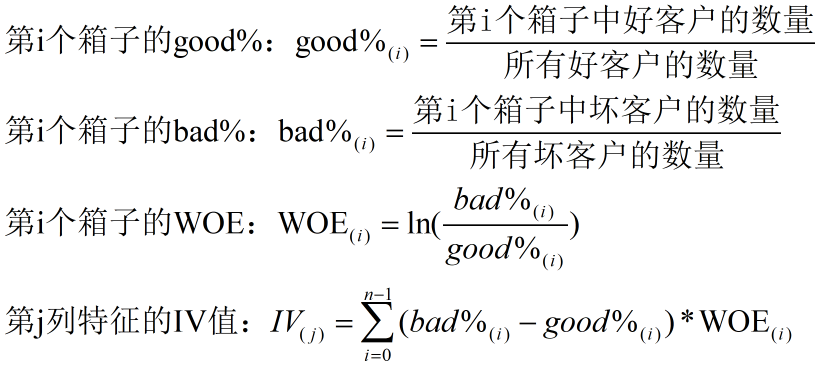

### 四、特征筛选

AIC（赤池信息量准则）：它建立在熵的概念基础上，可以权衡所估计模型的复杂度和此模型拟合数据的优良性，公式：


其中，p是进入模型当中的自变量个数，n为样本量，SSE是残差平方和，在n固定的情况下，p越小，AIC越小，SSE越小，AIC越小，而p越小代表着模型越简洁，SSE越小代表着模型越精准，即拟合度越好，综上所诉，AIC越小，即模型就越简洁和精准。

逐步回归算法：逐步回归一般根据AIC值进行特征筛选，逐步回归分为三种，分别是向前逐步回归，向后逐步回归，双向逐步回归。向前逐步回归的特点是将自变量一个一个当如模型中，每当放入一个变量时，都利用相应的检验准则检验，当加入的变量不能使得模型变得更优良时，变量将会被剔除，如此不断迭代，直到没有适合的新变量加入为止。向后逐步回归的特点是，将所有变量都放入模型之后，一个一个的剔除变量，将某一变量拿出模型而使得模型更优良时，将会剔除此变量。如此反复迭代，直到没有合适的变量剔除为止。双向逐步回归则是结合了以上的向前和向后逐步回归的特点。

### 五、模型训练和评估

将数据集转换成WOE值并经过特征筛选后，即可传入模型进行训练。可以用Accuracy、AUC、KS值等指标对模型进行评价。

```python
from sklearn.linear_model import LogisticRegression as LR
lr = LR().fit(X,y)
score = lr.score(vali_X, vali_y)
```

### 六、制作评分卡

评分卡分数公式如下：

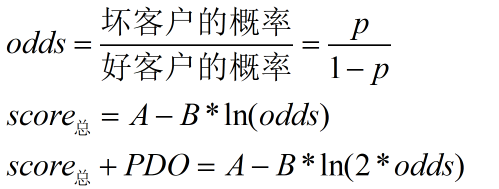


其中，A与B是常数，A叫做“补偿”，B叫做“刻度”，odds 代表了一个人违约的可能性。在给定odds，PDO和score总的情况下，可以求出A和B。

在逻辑回归模型中，p的值为：

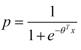

经如下转换，可以得到score总的值为：

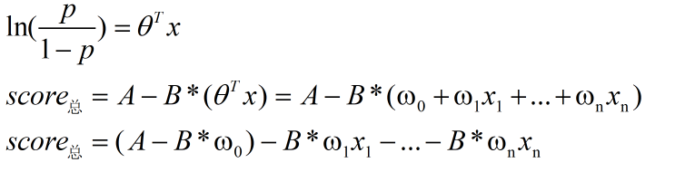

其中，ω为逻辑回归模型中的系数。所以，评分卡的基础分数base_score和第j个特征的第i个分箱的分数为：

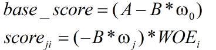

代码如下：

```python
# 给定的odds为1/60，score总为600，PDO为20
B = 20/np.log(2)
A = 600 + B*np.log(1/60)

base_score = A - B*lr.intercept_
score_age = woeall["age"] * (-B*lr.coef_[0][0])
```

