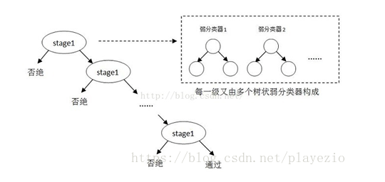

#### 1.人脸检测

人脸检测是在图像中检测出人脸区域，opencv中的人脸检测主要有2中，一种是基于Haar或LBP（LBP既可以人脸检测，也可以人脸识别），另一种是基于深度学习

##### 1.Haar人脸检测器

###### 1.模型原理

Haar人脸分类器的训练步骤如下：

1）准备人脸、非人脸样本集分别作为正样本和负样本

2）计算特征值和积分图

Haar-like特征分为四类：边缘特征、线性特征、中心特征和对角线特征，组成特征模板检测窗口。该模板的特征值就是白色矩形像素和减去黑色矩形像素和。Haar特征值反映了图像的灰度变化情况，如：眼睛要比脸颊颜色要深，鼻梁两侧比鼻梁颜色要深。通过改变特征模板的大小和位置，可在图像中穷举出大量的特征，实际训练时会将特征值进行归一化处理。如下图所示：


3）筛选出T个优秀的特征值（即最优弱分类器）

一个弱分类器就类似下图的决策树，最基本的弱分类器只包含一个Haar-like特征，筛选出T个优秀的特征值（即最优弱分类器），筛选标准是对正负样本区分度越大的特征分类效果越好。然后把这T个最优弱分类器传给AdaBoost进行训练


4）把这T个最优弱分类器传给强分类器进行训练，多个强分类器级联成Adaboost级联分类器

将多个弱分类器组合成一个强分类器，强分类器在训练过程中会更加看重弱分类器分类错误的样本。多个强分类器级联起来组成最终的Adaboost级联分类器，由于图像内的人脸位置和大小不尽相同，检测过程中，图像会输出大量的子窗口图像，这些子窗口图像经过筛选式级联分类器会不断的被每一个节点筛选、抛弃或通过。级联分类器如下图所示，其中每一个stage都代表一级强分类器。当检测窗口通过所有的强分类器时才被认为是正样本，否则拒绝：



###### 2.检测代码

```python
import cv2

# 读图片
img = cv2.imread("img_teste.jpg", cv2.IMREAD_COLOR)
gray = cv2.cvtColor(img, cv2.COLOR_BGR2GRAY)
# 加载Haar级联人脸检测器
face = cv2.CascadeClassifier("haarcascade_frontalface_default.xml")
# 执行人脸检测
faces = face.detectMultiScale(gray)

for x, y, w, h in faces:
    cv2.rectangle(img, (x, y), (x + w, y + h), (255, 0, 0), 2)  # 绘制矩形标注人脸
    roi_eye = gray[y:y + h, x:x + w]  # 根据人脸获得眼睛的检测范围
cv2.imshow('faces', img) # 展示检测结果
cv2.waitKey(0)
```

##### 2.基于深度学习的人脸检测器

opencv的深度神经网络（DNN）模块提供了基于深度学习的人脸检测器。DNN使用的深度学习框架包括Caffe、TensorFlow、Torch等。下面的代码以tensorflow为例：

```python
import cv2
import numpy as np

img = cv2.imread("D:/Dataset/cv/person_horse_instance_voc/image/1_2007_003191.jpg") # 读图片
gray = cv2.cvtColor(img, cv2.COLOR_BGR2GRAY) # 将图片转成灰度图
h, w = img.shape[:2] # 获取图片尺寸

dnnet = cv2.dnn.readNetFromTensorflow("opencv_face_detector_uint8.pb", "opencv_face_detector.pbtxt") # 加载tensorflow模型
blobs = cv2.dnn.blobFromImage(img, 1., (300, 300), [104., 117., 123.], False, False)  # 创建图像块数据，形状为NCHW

dnnet.setInput(blobs)  # 将块数据设置为输入
detections = dnnet.forward()  # 执行计算，获得检测结果

faces = 0
for i in range(0, detections.shape[2]):  # 迭代，输出可信度高的人脸检测结果
    confidence = detections[0, 0, i, 2] # 获得置信度
    if confidence > 0.6:  # 输出置信度大于0.6的结果
        faces += 1
        box = detections[0, 0, i, 3:7] * np.array([w, h, w, h]) # 获得人脸在图像中的坐标
        x1, y1, x2, y2 = box.astype("int")
        y = y1 - 10 if y1 - 10 > 10 else y1 + 10  # 计算可信度输出位置
        text = "%.3f" % (confidence * 100) + '%'
        cv2.rectangle(img, (x1, y1), (x2, y2), (255, 0, 0), 2)  # 绘制矩形标注人脸范围
        cv2.putText(img, text, (x1, y), cv2.FONT_HERSHEY_SIMPLEX, 0.9, (0, 0, 255), 2)  # 输出置信度的值
cv2.imshow("faces", img) # 展示图片
cv2.waitKey(0)

```

#### 2.人脸识别

##### 1.算法类型和原理

opencv中的人脸识别方法有EigenFace、FisherFace和LBPHFace三种。

EigenFace和FisherFace的主要思想是求得训练集中各个人脸的特征向量，在预测时，与预测人脸的特征向量求相似度，跟距相似度阈值来判断人脸的类别

LBPH将人脸图像中的每个子区域用统计直方图表示，直方图内统计的时像素点的LBP值，预测时，根据预测图片的直方图矩阵和训练中的各图像的直方图之间的距离，来判断所属类别

LBP编码的过程如下，将圆的边所经过的网格中的像素值和中心点的像素值比较，如果大于或等于中心点像素值，则记为1，否则记为0，记录所有网格的值可以得到一个二进制向量，再将二进制向量转为十进制的数值，即为中心像素点的LBP编码值，如：Binary：00010011 Decimal：19，LBP编码具有旋转不变性


##### 2.训练和预测代码

```python
import cv2
import numpy as np

# 读入图片，图片的尺寸要保持一致
liu1 = cv2.resize(cv2.imread("D:/tmp/face_recognize/liu1.png", cv2.IMREAD_GRAYSCALE), (300, 300))
liu2 = cv2.resize(cv2.imread("D:/tmp/face_recognize/liu2.png", cv2.IMREAD_GRAYSCALE), (300, 300))
liu3 = cv2.resize(cv2.imread("D:/tmp/face_recognize/liu3.png", cv2.IMREAD_GRAYSCALE), (300, 300))
liu4 = cv2.resize(cv2.imread("D:/tmp/face_recognize/liu4.png", cv2.IMREAD_GRAYSCALE), (300, 300))
liu5 = cv2.resize(cv2.imread("D:/tmp/face_recognize/liu5.png", cv2.IMREAD_GRAYSCALE), (300, 300))
wang1 = cv2.resize(cv2.imread("D:/tmp/face_recognize/wang1.png", cv2.IMREAD_GRAYSCALE), (300, 300))
wang2 = cv2.resize(cv2.imread("D:/tmp/face_recognize/wang2.png", cv2.IMREAD_GRAYSCALE), (300, 300))
wang3 = cv2.resize(cv2.imread("D:/tmp/face_recognize/wang3.png", cv2.IMREAD_GRAYSCALE), (300, 300))
wang4 = cv2.resize(cv2.imread("D:/tmp/face_recognize/wang4.png", cv2.IMREAD_GRAYSCALE), (300, 300))
wang5 = cv2.resize(cv2.imread("D:/tmp/face_recognize/wang5.png", cv2.IMREAD_GRAYSCALE), (300, 300))
wang6 = cv2.resize(cv2.imread("D:/tmp/face_recognize/wang6.png", cv2.IMREAD_GRAYSCALE), (300, 300))  # 作为测试图片

train_images = [liu1, liu2, liu3, liu4, liu5, wang1, wang2, wang3, wang4, wang5]
labels = np.array([0, 0, 0, 0, 0, 1, 1, 1, 1, 1])  # 创建标签数组
# recognizer = cv2.face.EigenFaceRecognizer_create()  # 创建EigenFace识别器
# recognizer = cv2.face.FisherFaceRecognizer_create()  # 创建FisherFace识别器
recognizer = cv2.face.LBPHFaceRecognizer_create()  # 创建LBPHFace识别器
recognizer.train(train_images, labels)
label, confidence = recognizer.predict(wang6)
print('匹配标签： ', label)
print('可信度： ', confidence)
```

