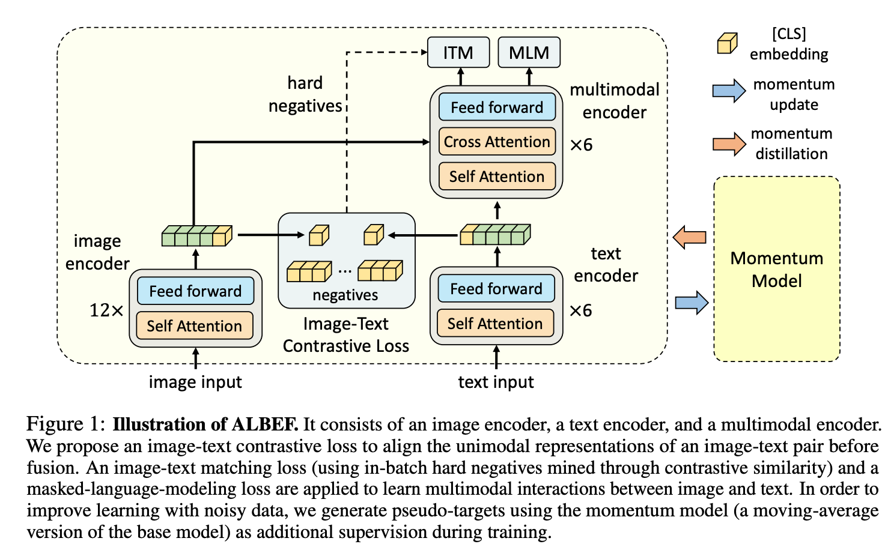
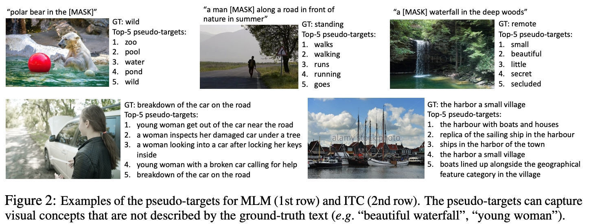
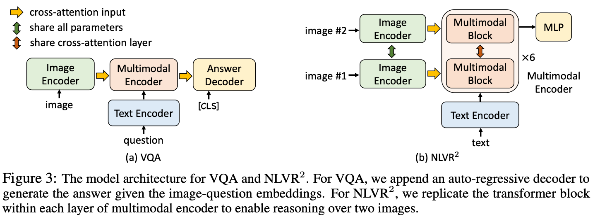

#### ALBEF

（Align before Fuse: Vision and Language Representation Learning with Momentum Distillation））

github：https://github.com/salesforce/ALBEF

paper：https://arxiv.org/pdf/2107.07651.pdf

#### 1.模型结构

训练模型的结构包含了图片编码器、文本编码器和多模态编码器三个部分。训练损失包含图像-文本对比损失，用于在特征融合之前对齐图片和文本对；图片-文本匹配损失；掩码语言模型损失。为了提高模型在噪声数据中的学习提出了假设目标，使用原base模型的移动平均模型作为额外的监督学习

#### 2.目标函数

ALBEF预训练包含3各目标：

1.图像-文本对比学习image-text contrastive learning (ITC) ，学习输入图像文本对的相似关系

2.掩码语言模型masked language modeling (MLM) ，学习模型根据图片和文本输入，对文本掩码的预测能力

3.图像-文本匹配image-text matching (ITM)，学习图像和文本是否匹配，属于二分类问题

由于预训练base模型的输入数据都是数据对，文本可能包含与图像无关的词，或者图像可能包含文本中未描述的实体。 对于 ITC 学习，图像的负文本也可能与图像的内容相匹配。 对于 MLM，可能存在与描述图像同样好（或更好）的注释不同的其他词。为了解决这个问题，提出了从动量模型生成的伪目标中学习。 动量模型是一个不断发展的教师模型，包含单模态和多模态编码器的指数移动平均版本。 在训练基础模型的同时，使其预测与动量模型的预测相匹配。下图展示了伪目标中排名前 5 位的候选示例，这些示例有效地捕获了图像的相关单词/文本

#### 3.下游任务

1.图片-文本检索（Image-Text Retrieval），包含文本检索图片（IR）和图片检索文本（TR）

2.视觉潜能（Visual Entailment，SNLI-VE）是一个细粒度的视觉推理任务，用于预测图像和文本之间的关系是蕴含的、中性的还是矛盾的

3.视觉问答（Visual Question Answering ，VQA），要求模型预测给定图像和问题的答案

4.自然语言视觉推理（Natural Language for Visual Reasoning，NLVR），要求模型预测文本是否描述了一对图像。 扩展了多模态编码器以支持对两张图像进行推理

5.视觉接地（Visual Grounding）旨在定位图像中与特定文本描述相对应的区域

其中，VQA和NLVR任务的模型结构如下图所示：

