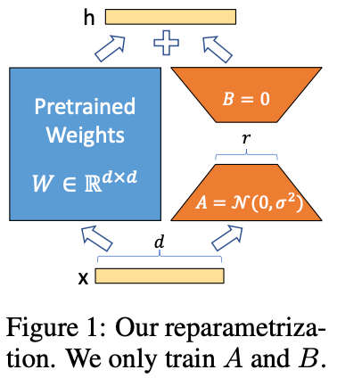

# LoRA论文学习总结

## 前言

NLP模型训练的一般范式就是在领域数据集上进行预训练来适应特定的任务，但当模型越来越大时，重新训练所有模型参数的微调就变得不太可行。LoRA（Low-Rank Adaptation）微调的思想是冻结与训练的模型权重，并将可训练的秩分解矩阵注入到Transformer架构的每一层，大大减少了下有任务的可训练参数的数量。

论文地址：https://arxiv.org/pdf/2106.09685.pdf

代码仓库：https://github.com/microsoft/LoRA

## 1.矩阵的秩

### 1.1 K阶子式

在$m*n$的矩阵$A$中，任取$k$行与$k$列($k<=m, k<=n$)，位于这些行列交叉处的$k^2$个元素，不改变他们在$A$中所处的位置次序而得的$k$阶行列式，称为矩阵$A$的$k$阶子式。如下式中，右边矩阵就是左边矩阵的2阶子式
$$
\begin{bmatrix}
1  &{\color{Red} 2}   &{\color{Red} 3}  \\
4  &{\color{Red} 5}   &{\color{Red} 6}  \\
7  &8  &9
\end{bmatrix}
\longrightarrow 
\begin{bmatrix}
{\color{Red} 2}   &{\color{Red} 3}  \\
{\color{Red} 5}   &{\color{Red} 6}  

\end{bmatrix}
$$

### 1.2 矩阵的秩

设在矩阵$A$中有一个不等于0的$r$阶子式$D$，且所有$r+1$阶子式（如果存在的话）全等于0，那么$D$称为矩阵$A$的最高阶非零子式，数称$r$为矩阵$A$的秩，记作$R(A)$. 并规定零矩阵的秩等于0

这句话的意思就是，非零子式的最高阶数就秩

例如下式中的左边的矩阵经过初等变换后得到右边的矩阵，右边矩阵的最高阶非零子式的阶数为3，那就说明原矩阵的秩为3
$$
\begin{bmatrix}
2  &-1  &-1  &1  &2 \\
1  &1  &-2  &1  &4 \\
4  &-6  &2  &-2  &4 \\
3  &6  &9  &7  &9
\end{bmatrix}
\longrightarrow 
\begin{bmatrix}
1  &0  &-1  &0  &4 \\
0  &1  &-1  &0  &3 \\
0  &0  &0  &1  &-3 \\
0  &0  &0  &0  &0
\end{bmatrix}
$$

## 2.低秩参数化更新矩阵

神经网络包含许多执行矩阵乘法的密集层，这些层中的权矩阵通常是全秩的。在适应特定任务时，预训练的语言模型具有较低的“内在维度”，尽管随机投射到较小的子空间，但仍然可以有效地学习。受此启发，论文假设权重的更新在适应过程中也具有较低的“内在秩”。对于预训练的权重矩阵$W_0\in R^{d*k}$，用低阶分解成$W_0 +\Delta W = W_0 + BA$来表示它的更新，其中$B\in R^{d*r}, A\in R^{r*k}$，并且秩$r\ll min(d,k)$. 在训练过程中，$W_0$被冻结，不进行梯度更新，而$A$和$B$包含可训练参数。$W_0$和$\Delta W = BA$都有相同的输入，它们各自的输出向量按坐标求和。$x$的正向传递过程可以表示为：
$$
y=W_ox+\Delta Wx=W_0x+BAx
$$
LoRA的训练过程如下图所示，刚开始训练时，B为全0矩阵，A通过随机高斯初始化：

从图中可以看出，$r$是训练时的超参数，且远远小于$d$，所以LoRA的模型权重占用的内存非常小

同时也能看出，模型在推理时LoRA的权重和预训练权重是并行计算的，所以加上LoRA后的模型没有推理延迟。

## 总结

 LoRA是一种有效的适应策略，既不会引入推理延迟，也不会减少输入序列长度，同时保持高模型质量。 重要的是，当它部署为服务时，通过共享绝大多数模型参数，可以实现快速任务切换

后来有在LoRA的基础上衍生出新的方法，例如[QLoRA](https://arxiv.org/pdf/2305.14314.pdf)，它对模型权重进行先量化再微调，模型是按照NF4（4-bit NormalFloat）保存的，训练时需要把参数反量化到bf16后进行训练

[AdaLORA](https://arxiv.org/pdf/2303.10512.pdf)改进了LORA可微调参数的分配方式，提出了一种基于下游任务动态分配秩$r$的方法。AdaLORA包含两个组成部分：1.基于 SVD 的自适应，以奇异值分解的形式制定增量矩阵；2.重要性感知排名分配，根据重要性度量来修剪冗余奇异值