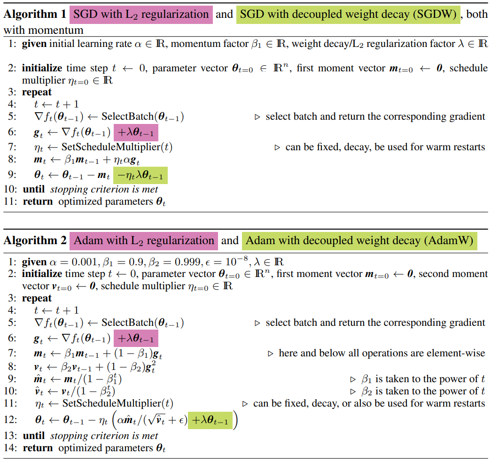
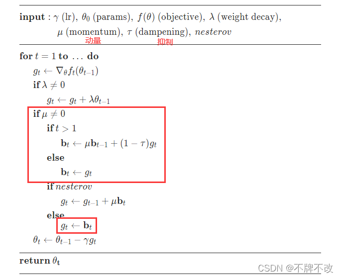
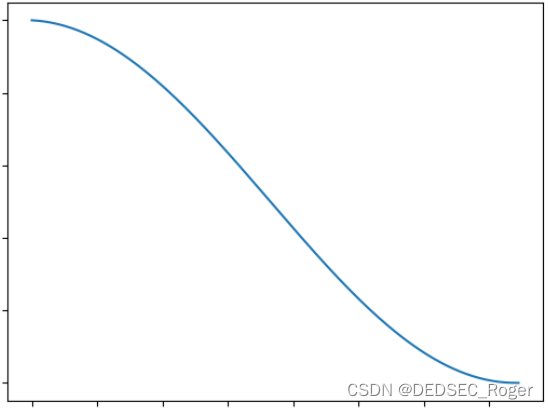

#### 1.优化器（optimizer）

##### 1.优化器的种类

SGD，Adam([Adam: A Method for Stochastic Optimization](paper/adam.pdf), 2014)，AdamW([Decoupled Weight Decay Regularization](paper/adamw.pdf), 2017)



torch.optim中实现了上述三种优化器，SGD，Adam和AdamW

SGD优化器更新权重参数的过程如下：

1）给定学习率α，动量因子β，权重衰退因子（或者L2正则化因子）

2）初始化时间步time step，权重参数θ，一阶矩估计m，损失函数f(θ) <- f(θ) + λL2(θ)

3）求损失函数对权重参数的梯度▽f(θ)，加上L2正则化项的导数λθ，这个时间步上的梯度gt <- ▽f(θ) + λθ

4）求加入动量后的梯度mt <- βm + ηgt

5）更新权重参数θ <- θ - mt

Adam优化器的更新权重参数的过程如下：

1）给定学习率α，一阶矩估计系数β1，二阶矩估计系数β2，权重衰退因子（或者L2正则化因子）

2）初始化时间步time step，权重参数θ，一阶矩估计m，二阶矩估计v，损失函数f(θ) <- f(θ) + λL2(θ)

3）求损失函数对权重参数的梯度▽f(θ)，加上L2正则化项的导数λθ，这个时间步上的梯度gt <- ▽f(θ) + λθ

4）求加入动量后一阶矩估计的梯度mt <- β1m + (1-β1)gt

5）求加入动量后二阶矩估计的梯度vt <- β2m + (1-β2)gt^2

6）求纠正动量偏差后的一阶矩估计mt <- mt / (1 - β1^t)

7）求纠正动量偏差后的二阶矩估计vt <- vt / (1 - β2^t)

8）更新权重参数θ <- θ - mt / (vt^0.5)

Adam和AdamW的不同在于，Adam在损失函数中加入了对于权重参数θ的L2正则化项，在损失函数对权重参数求导时，会考虑λθ这一项；而AdamW是将L2正则化项的导数λθ添加在了最后一步更新权重参数的步骤上，如上图所示。

##### 2.pytorch中优化器的参数

###### 1.SGD

```python
optim.SGD(params,lr,momentum,dampening,weight_decay,nesterov)
```

params：要训练的参数，一般传入的是model.parameters()

lr：学习率learning rate，也叫步长

momentum：动量因子，在计算梯度时考虑上一个时间步的动量，使权重参数更新时更稳定，可有效避免局部最优解，加快收敛

dampening：抑制因子，在计算加入动量后的梯度时会用到

weight_deca：权重衰退因子，相当于给损失函数添加了一个对于权重参数的L2正则化项，更倾向于获得更小的参数，是模型简单，有利于减少过拟合

nesterov：是否使用牛顿动量，默认为False，如果为True，在计算梯度时会考虑上一个时间步的梯度

如下图：



###### 2.Adam

```python
optim.Adam(params,lr,betas=(beta1,beta2),eps,weight_decay,amsgrad)
```

params：要训练的参数，一般传入的是model.parameters()

lr：学习率learning rate，也叫步长

betas：beta1：一阶矩估计系数（如 0.9），beta2：二阶矩估计系数（如 0.999），一阶矩相当于求均值，二阶矩相当于求平方

eps：epsilon，该参数是非常小的数，为了防止在最后权重参数更新时除以零

weight_deca：权重衰退因子，相当于给损失函数添加了一个对于权重参数的L2正则化项，更倾向于获得更小的参数，使模型简单，有利于减少过拟合

amsgrad：是否使用AMSGrad变量，默认为False，asmgrad优化方法是针对Adam的改进，通过添加额外的约束，使学习率始终为非负数

##### 3.反向传播的过程

反向传播的过程就是根据链式求导法则，从后往前求损失函数L关于参数θ的梯度gt，过程如下：

L = L(y hat, y true)

y hat = θ x + b

样本的目标值影响着L，样本的特征值影响着y hat，他们共同影响着损失函数L关于参数θ的梯度gt

#### 2.学习率调整器（lr_scheduler）

##### 1.StepLR

```python
lr_scheduler.StepLR(optimizer, step_size, gamma, last_epoch)
```

公式：


公式的代码表示：new_lr = initial_lr * gamma ** (epoch // step_size)

optimizer：优化器

step_size：学习率更新步长，每step_size个epoch更新一次学习率

gamma：γ，衰减率（默认0.1，即减小10倍），即每step_size个epoch后lr变为lr*gamma

last_epoch：表示上次训练的epoch数，last_epoch为-1时表示从头开始训练

##### 2.MultiStepLR

```python
lr_scheduler.MultiStepLR(optimizer, milestones, gamma, last_epoch)
```

公式：


表示当epoch数存在于milestones列表中时才会更新学习率，按照bisect_right二等分的方式，即第一次是r的1次方，第二次是r的2次方

optimizer：优化器

milestones：里程碑，是一个数组（例如[10, 24, 32]），当epoch数存在于该数组时，就会更新学习率

gamma：γ，衰减率（默认0.1，即减小10倍），即每step_size个epoch后lr变为lr*gamma

last_epoch：表示上次训练的epoch数，last_epoch为-1时表示从头开始训练

##### 3.ExponentialLR

```python
lr_scheduler.ExponentialLR(optimizer, gamma, last_epoch)
```

公式：


每个epoch都会更新学习率

optimizer：优化器

gamma：γ，衰减率（默认0.1，即减小10倍），即每step_size个epoch后lr变为lr*gamma

last_epoch：表示上次训练的epoch数，last_epoch为-1时表示从头开始训练

##### 4.CosineAnnealingLR

````python
lr_scheduler.CosineAnnealingLR(optimizer, T_max, eta_min, last_epoch)
````

公式：


optimizer：优化器，其中设定了当前学习率，也是最大学习率

T_max：最大epoch

eta_min：最小学习率

last_epoch：表示上次训练的epoch数，last_epoch为-1时表示从头开始训练

T_max的作用：

若T_max大于或等于总epoch，则学习率从nmax到nmin单调变化



若T_max小于总epoch，则学习率在每两个T_max间隔内完成一次从nmax到nmin，再从nmin到nmax的变化，直至总epoch结束


