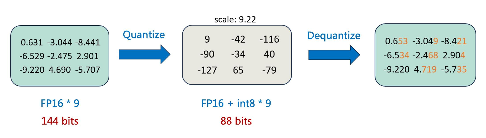
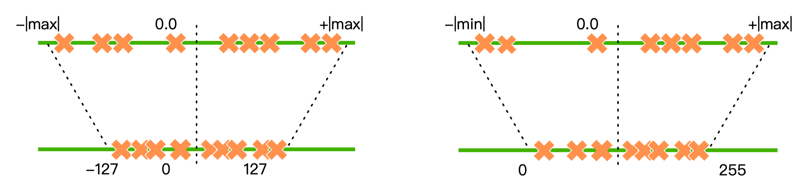
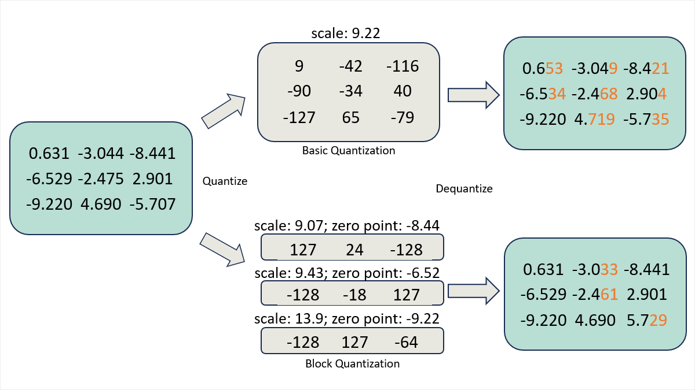

# 模型压缩：剪枝、量化、蒸馏

在模型应用程序中，推理时间是至关重要的，模型压缩是缩短推理时间的有效办法，常见的模型压缩方法有剪枝、量化和知识蒸馏

## 1.剪枝（pruning）

剪枝是一种通过减少模型中的参数量来进行模型压缩的技术，可以在保证一定精度的情况下减少模型的内存占用和硬件消耗

pytorch教程：https://pytorch.org/tutorials/intermediate/pruning_tutorial.html

目前pytorch支持的剪枝规则有：

- RandomUnstructured
- L1Unstructured
- RandomStructured
- LnStructured
- CustomFromMask

```python
# 实例化神经网络
model = LeNet()

# 配置可剪枝的网络层和参数名
parameters_to_prune = (
    (model.conv1, 'weight'),
    (model.conv2, 'weight'),
    (model.fc1, 'weight'),
    (model.fc2, 'weight'),
    (model.fc3, 'weight'),
)

# 全局剪枝，采用L1Unstructured的方法，剪去0.2的参数量
prune.global_unstructured(
    parameters_to_prune,
    pruning_method=prune.L1Unstructured,
    amount=0.2,
)
# 查看剪枝后的模型参数
print(model.state_dict())
```


## 2.量化（quantization）

pytorch提供了量化感知训练、 训练后动态量化和训练后校正量化：https://pytorch.org/blog/introduction-to-quantization-on-pytorch/

```python
"""训练后动态量化"""
import torch.quantization
quantized_model = torch.quantization.quantize_dynamic(model, {torch.nn.Linear}, dtype=torch.qint8)

"""训练后校正量化"""
# 设置服务器(x86)的量化配置
deploymentmyModel.qconfig = torch.quantization.get_default_config('fbgemm')
torch.quantization.prepare(myModel, inplace=True)
torch.quantization.convert(myModel, inplace=True)

"""量化感知训练"""
# 设置量化感知训练服务器(x86)的量化配置
qat_model.qconfig=torch.quantization.get_default_qat_qconfig('fbgemm')
torch.quantization.prepare_qat(qat_model, inplace=True)
# 转换为量化版本，删除dropout
epochquantized_model=torch.quantization.convert(qat_model.eval(), inplace=False)
```

### 简介：

模型量化是一种压缩网络参数的方式，它将神经网络的参数（weight）、特征图（activation）等原本用浮点表示的量值换用定点（整型）表示，同时尽可能减少计算精度损失，在计算过程中，再将定点数据反量化回浮点数据，得到结果。如下图（绝对值最大的数-9.22，量化至-127，其余的数除以9.22乘以127的到量化后的结果；反量化至浮点数的过程是就量化过程的逆向计算，精度会有一些损失）



模型量化的实现建立在深度网络对噪声具有一定的容忍性上，模型量化相当于对深度网络增加了一定的噪声（量化误差），如果量化位数合适，模型量化基本不会造成较大的精度损失

模型量化的主要作用：

 	1. 可以减少内存和显存占用
 	1. 能够提高运行速度：在适配低精度的硬件下，量化模型的运算能直接用 int8 GEMM kernel 计算；量化减少了单位数据的 bit 数，因而可以减少计算过程中的 IO 通信量。

### 量化方法：

#### 根据量化方案分类：

量化感知训练QAT（Quant-Aware Training）：也可以称为**在线量化**，它需要利用额外的训练数据，在量化的同时结合反向传播对模型权重进行调整，意在确保量化模型的精度不掉点

后训练量化PTQ （Post Training Quantization）：也可以称为**离线量化**（Off Quantization），它是在已训练的模型上，使用少量或不使用额外数据，对模型量化过程进行校准，可能伴有模型权重的缩放，

	- **训练后动态量化**（Post Dynamic Quantization）不使用校准数据集，直接对每一层 layer 通过量化公式进行转换。QLoRA 就是采用这种方法。
	- **训练后校正量化**（Post Calibration Quantization）需要输入有代表性的数据集，根据模型每一层 layer 的输入输出调整量化权重。GPTQ 就是采用这种方法。

#### 根据量化公式分类：

根据量化公式的不同，可以分为线性量化和非线性量化，也可以分为对称量化和非对称量化。

根据量化公式是否为线性，量化可以分为**线性量化**和非线性量化。在线性量化下，浮点数与定点数之间的转换公式如下：$Q=R/S+Z$，其中，$R$ 表示量化前的浮点数，$Q$ 表示量化后的定点数，$S$（Scale）表示缩放因子的数值，$Z$（Zero）表示零点的数值

**对称量化**（如下图左图所示）中，量化前后的 0 点是对齐的，因此不需要记录零点。它适合对分布良好且均值为 0 的参数进行量化。因此对称量化常用于对 weight 量化

**非对称量化**（如下图右图所示）中，量化前后 0 点不对齐，需要额外记录一个 offset，也就是零点。非对称量化常用于对 activation 做量化



### Block-wise quantization

为了避免异常值（outlier）的影响，我们会将输入 tensor 分割成一个个 block，每个 block 单独做量化，有单独的 scale 和 zero，因此能使量化的精度损失减少（见下图橙色的误差部分）。



## 3.知识蒸馏（knowledge distillation）

pytorch教程：https://pytorch.org/tutorials/beginner/knowledge_distillation_tutorial.html

知识蒸馏是一种技术，可以将知识从计算成本较高的大型模型转移到较小的模型，而不会失去有效性。具体的方法是在训练小模型时，在损失函数中添加额外的损失函数，损失函数的添加方式有以下几种：

### 1.输出层的差异损失

这种方法是对比学生网络和教师网络在输出层上的概率分布之间的差异

```python
optimizer.zero_grad()
ce_loss = nn.CrossEntropyLoss()

# 冻结教师网络的权重，计算教师网络的输出层结果
with torch.no_grad(): 
    teacher_logits = teacher(inputs) 

# 学生网络的输出层结果 
student_logits = student(inputs) 

# 计算软目标损失（soft targets loss），考虑温度系数T的影响，计算学生网络推理结果和教师网络在推理结果上的差异
soft_targets = nn.functional.softmax(teacher_logits / T, dim=-1)
soft_prob = nn.functional.log_softmax(student_logits / T, dim=-1)
soft_targets_loss = torch.sum(soft_targets * (soft_targets.log() - soft_prob)) / soft_prob.size()[0] * (T**2) 

# 学生网络的交叉熵损失
label_loss = ce_loss(student_logits, labels) 

# 将软目标损失添加到交叉熵损失中
loss = soft_target_loss_weight * soft_targets_loss + ce_loss_weight * label_loss 

loss.backward()
optimizer.step()
```

### 2.隐藏层的相似度损失（余弦相似度损失）

这种方法是对比学生网络和教师网络在输出层上的概率分布之间的差异

```python
optimizer.zero_grad()
ce_loss = nn.CrossEntropyLoss()
cosine_loss = nn.CosineEmbeddingLoss()

# 冻结教师网络的权重，只记录隐藏层的结果（一般是在分类器之前，flatten之后的输出结果）
with torch.no_grad(): 
    _, teacher_hidden_representation = teacher(inputs)

# 学生网络的推理结果，包含输出层和隐藏层的结果
student_logits, student_hidden_representation = student(inputs) 

# 计算学生网络和教师网络在隐藏层的余弦损失
hidden_rep_loss = cosine_loss(student_hidden_representation, teacher_hidden_representation, target=torch.ones(inputs.size(0)).to(device))

# 学生网络的交叉熵损失
label_loss = ce_loss(student_logits, labels)

# 将余弦相似度损失添加到交叉熵损失中
loss = hidden_rep_loss_weight * hidden_rep_loss + ce_loss_weight * label_loss

loss.backward()
optimizer.step()
```

### 3.中间层的回归损失（均方误差，mse）

```python
optimizer.zero_grad()
ce_loss = nn.CrossEntropyLoss()
mse_loss = nn.MSELoss()

# 冻结教师网络的权重，只记录中间层的特征（一般是卷积层的输出结果）
with torch.no_grad(): 
    _, teacher_feature_map = teacher(inputs)

# 学生网络的推理结果，包含输出层的结果和中间层的特征
student_logits, regressor_feature_map = student(inputs) 

# 计算学生网络和教师网络在中间层的均方误差
hidden_rep_loss = mse_loss(regressor_feature_map, teacher_feature_map)

# 学生网络的交叉熵损失
label_loss = ce_loss(student_logits, labels)

# 将中间层的均方误差添加到交叉熵损失中
loss = feature_map_weight * hidden_rep_loss + ce_loss_weight * label_loss

loss.backward()
optimizer.step()
```

