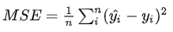
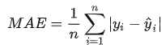
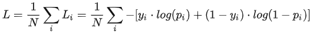
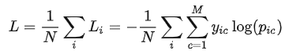
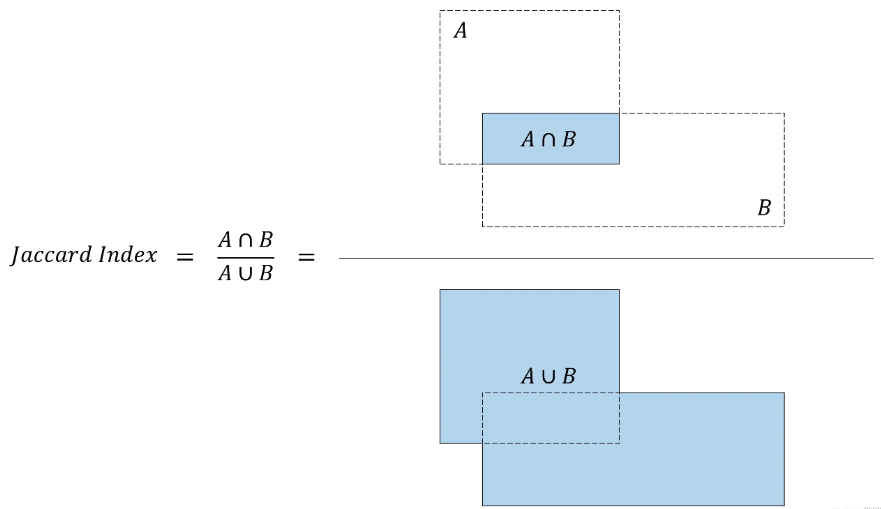
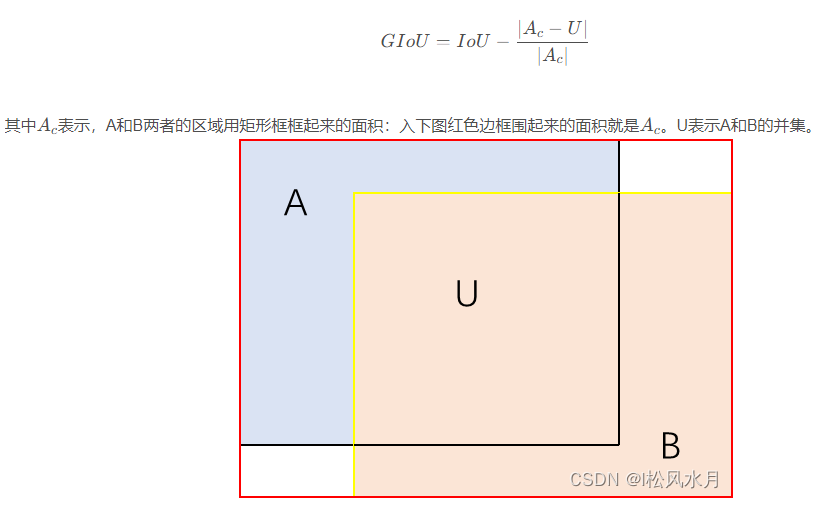
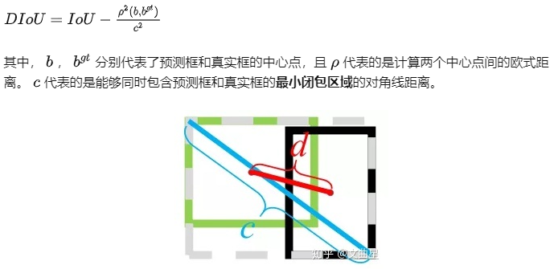
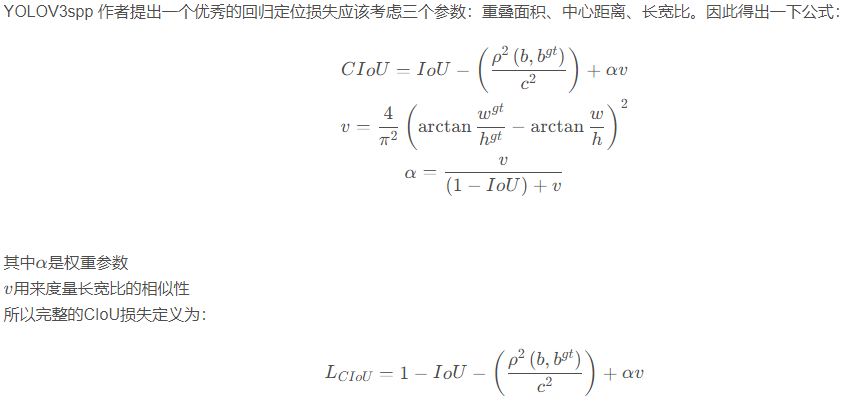

##### 1.回归

###### 1.平均平方误差（mse）

n代表样本数，yi hat是预测值，yi是真实值

###### 2.平均绝对误差（mae）

n代表样本数，yi hat是预测值，yi是真实值

##### 2.分类

###### 1.交叉熵

二分类：

N是样本数，yi是样本i真实值的label，正类为1，负类为0，pi是样本i预测为正类的概率

多分类：

N是样本数，M是标签label的数量，yic是符号函数（0或1），如果样本i真实值为c类别，yic就为1，否则为0，pic是样本i预测为c类别的概率

##### 3.目标检测

###### 1.IoU损失函数

IoU表示预测框和真实框的交集面积比上并集的面积，如下图所示：

IoU损失函数为：L(IoU) = -ln(IoU)

###### 2.GIoU

GIoU在IoU的基础上做了一些改进，如下图：

GIoU损失函数为：L(GIoU) = 1-GIoU

###### 3.DIoU

DIoU要比GIou更加符合目标框回归的机制，将目标与anchor之间的距离，重叠率以及尺度都考虑进去，使得目标框回归变得更加稳定，不会像IoU和GIoU一样出现训练过程中发散等问题。

DIoU损失函数为：L(DIoU) = 1-DIoU

###### 4.CIou

###### 5.Iou,GIoU,DIoU,CIoU的对比

边界框回归的三大集合因素：重叠面积、中心点距离、纵横比
IoU: 考虑了重叠面积，归一化坐标尺度
GIoU： 考虑了重叠面积，基于IoU解决边界框不相交时loss等于0的问题。
DIoU： 考虑了重叠面积、中心点距离，基于IoU解决GIoU收敛慢的问题。
CIoU： 考虑了重叠面积、中心点距离、纵横比，基于DIoU提升回归精确度。

##### 4.DPO Loss

