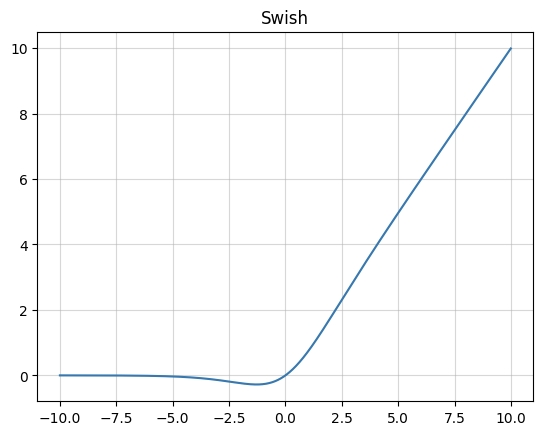
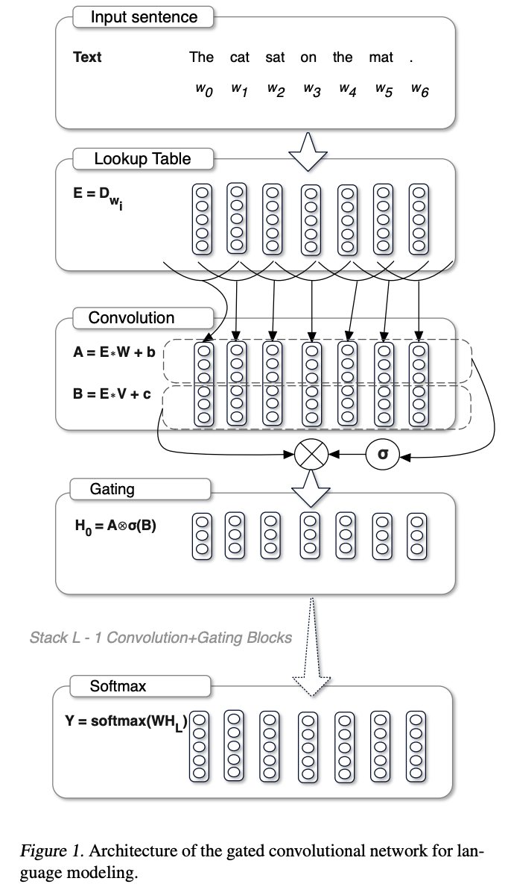

# 激活函数

## 1.SiLU（Swish）

SiLU(Sigmoid Linear Unit)激活函数,也被称为Swish激活函数,是一种自适应的非线性激活函
数,由Google Brain在2017年引入。SiLU函数结合了Sigmoid函数和线性函数的特点,其数学定义
如下:
$$
f(x) = х·σ(x)
$$
其中，σ(w)是标准的Sigmoid函数,定义为:
$$
σ(x)=1/(1+e^(-x))
$$

SiLU函数的特性包括:

1. 非线性：SiLU是一个非线性函数,这意味着它可以引入非线性特性,使得神经网络能够学习和
   模拟更复杂的数据模式。
2. 连续可导：SiLU在整个定义域内都是连续且可微的,这有助于优化算法(如梯度下降)在训练
   过程中更有效地更新网络权重。
3. 自适应性：SiLU函数的输出依赖于输入值,它在正数区域的输出接近于输入值,在负数区域的
   输出接近于0。这种自适应性质使得SiLU在某些情况下比ReLU(Rectified Linear Unit)更有
   优势,尤其是在处理负值时。
4. 平滑性：SiLU在接近0的区域比ReLU更平滑,这有助于缓解样梯度消失问题,并且可以提供更稳
   定的梯度流。

SiLU函数在深度神经网络中已经显示出其有效性,尤其是在处理序列数据和图像数据的任务中。它
在某些情况下能够提供比ReLU更好的性能,同时保持了ReLU的一些优点,如缓解梯度消失问题。
此外,SiLU的平滑性使其在训练过程中更加稳定,有助于提高模型的收敛速度和最终性能。

## 2.SwiGLU

SwiGLU是一种激活函数，它结合了SWISH和GLU两者的特点：

### Swish

Swish函数公式为：
$$
Swish(x)=x*\sigma (x)
$$
其中，$\sigma$为sigmoid函数：
$$
\sigma (x)=\frac{1}{1+e^{-x}}
$$
SWISH的函数图像如下：

### GLU

GLU（gated linear unit）是门控线性单元，sigmoid函数就是其中的门，GLU的结构图如下：

从公式可以看到，输入$x$分两路，其中一路的运算结果不做处理，另一路则经过sigmoid激活函数，GLU的公式如下：
$$
GLU(x,W,V,b,c)=\sigma(xW+b)\otimes(xV+c)
$$
其中，$x$代表输入；$W，V，b，c$都是要学习的参数，$\sigma$是激活函数，$\otimes$是对应元素相乘

### SwiGLU

SwiGLU就是将原GLU中的$\sigma$换成了Swish函数，公式如下
$$
SwiGLU(x,W,V,b,c)=Swish(xW+b)\otimes(xV+c)
$$

## 3.GELU

GELU (Gaussian Error Linear Unit)激活函数是一种基于高期分布的非线性激活函数,它在深度
学习和特别是自然语言处理(NLP)任务中越来越受欢迎。GELU的数学表达式如下
GELU(х) = хФ(x)
其中,重(x)是标准正态分布的累积分布函数(CDF),可以表示为:
1
2
这里,erf是误差函数(errorfunction),它是高斯分布的不完全积分形式。
GELU函数的特性包括:
1.非线性:GELU提供了非线性变换,这对于神经网络学习复杂的数据模式是必要的。
平滑性:GELU在整个实数范围内都是平滑的,这有助于梯度的不稳定传播,从而可能提高训练过
程的效率。
3.概率性:GELU的输出可以被解释为输入值落在某个范围内的概率,这与神经网络中的随机正则
化(如dropout)相呼应。
4.连续可导:GELU是连续且在整个定义域内可微的,这使得它在反向传播过程中的梯度计算更加
稳定。
GELU在BERT (Bidirectional Encoder Representations fromTransformers)等预训练语言模
型中得到了广泛应用,因为它能够提供比ReLU更好的性能。在BERT中,GELU被用于Transformer
模型的前馈网络部分,以增强模型对语言数据的表示能力。
