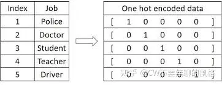
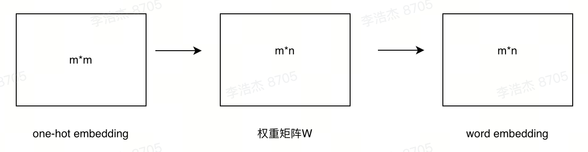
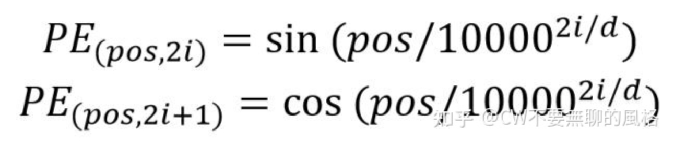

### 1.词编码

1.one-hot向量，根据单词在词汇表中的位置为每个词生成one-hot向量

2.word embedding，由于one-hot向量非常稀疏，且有可能很长，占用计算资源并且无法体现词与词之间的关系，所以需要设计一个可学习的权重矩阵W，权重矩阵W的形状是m * n，m表示词汇表的长度，n是词向量的维度，也叫embedding dim。将one-hot向量和w进行点乘，即得到word embedding后的词向量，向量长度为n。一个句子经过词编码之后得到的是一个max_length * n的矩阵

### 2.位置编码

经过word embedding，虽然获得了词与词之间关系的表达形式，但是词在句子中的位置关系还无法体现，由于 Transformer 是并行地处理句子中的所有词，因此需要加入词在句子中的位置信息，这就需要 Position Embedding了。句子中每个词的位置编码和词编码的维度要保持一致，这样才能将两个编码相加，公式如下：

Pos表示词在句子中的位置，介于[1, max_length]之间；d是词向量的维度，i表示编码向量的第i个维度，介于[1,d]之间，2i表示偶数维度，2i+1表示奇数维度。

使用这样的三角函数可以保证句子的不同位置在所有维度上不会被编码到完全一样的值，从而使每个位置都获得独一无二的编码。位置编码得到的是一个max_length * n的矩阵

词编码和位置编码相加之后，即作为模型的输入。