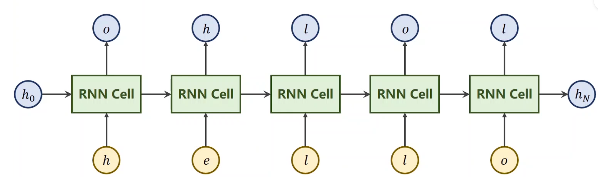
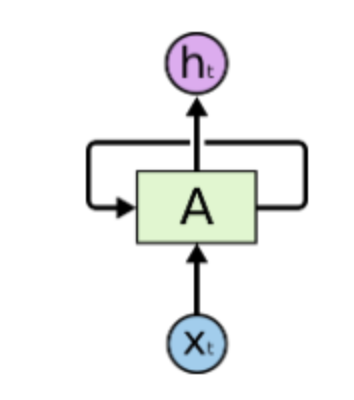
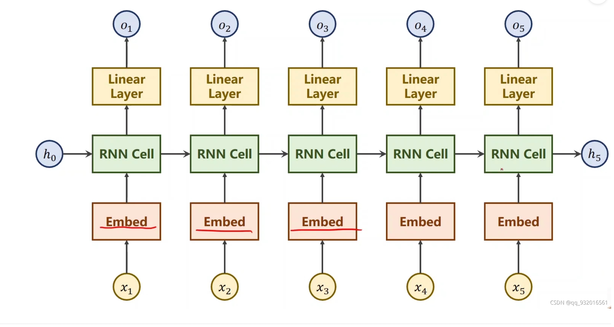
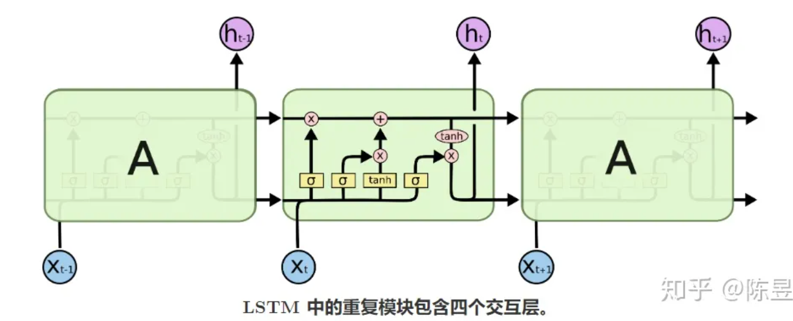
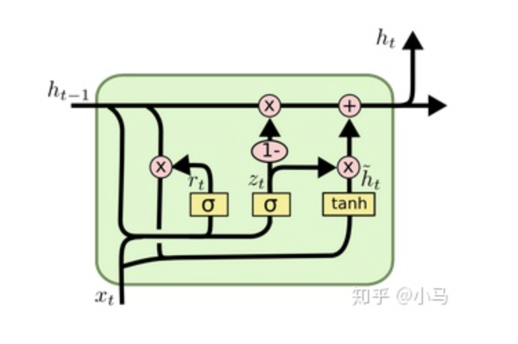

1.RNN的基本结构：

黄色框是不同时间步的输入，每个绿色框都是同一个的网络，RNN Cell是有线性层和激活函数组成

2.添加了embedding和linear layer后的RNN

3.lstm的结构

lstm对rnn对rnn进行了改进，增加了一条长链，可以记忆长序列

黄色框从左至右依次是：遗忘门，记忆门，记忆门，输出门

4.gru

在LSTM中，引入了三个门函数：输入门、遗忘门和输出门。而在GRU中，只有两个门：更新门和重置门

重置门rt：用于控制前一时刻的隐含层状态有多大程度更新到当前候选隐含层状态
更新门zt：用于控制前一时刻的隐含层状态有多大程度更新到当前隐含层状态