### 图像分类

轻量级网络主要想应用在移动端，主要有：MobileNet，SqueezeNet，ShuffleNet

其他网络则主要应用在服务器上

##### 1.LeNet([Gradient-based learning applied to document recognition](paper/lenet.pdf), 1998)

LeNet-5是LeNet系列的最终稳定版，该网络包含3个卷积层和2个全连接层。

该网络常被用作手写数字识别，它的特点是：所有卷积核大小均为5x5，步长为1，所有池化方法为平均池化，所有激活函数采用Sigmoid。其结构如下图所示：

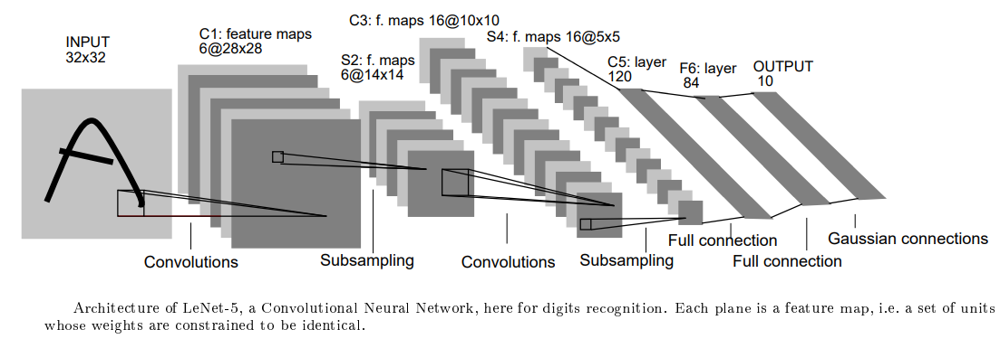

##### 2.AlexNet([ImageNet Classification with Deep Convolutional Neural Networks](paper/alexnet.pdf), 2012)

AlexNet网络包含5个卷积层，3个全连接层。

它的特点是首次利用GPU进行网络加速训练，使用了ReLU激活函数，使用了dropout方法，使用了局部响应归一化（Local Responsible Normalization，LRN）。最初的AlexNet网络分为上下两个部分，分别为两个GPU的运行过程，在第3卷积层和第6、7、8全连接层有交互。其结构如下图所示：

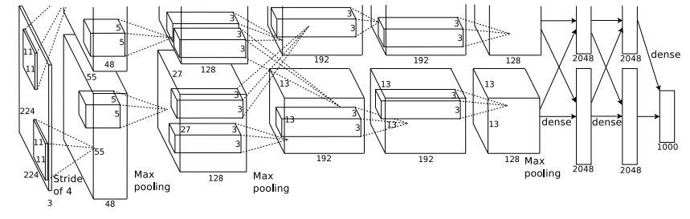

为了简化网络结构，现在实现的AlexNet将两部分合并，见论文[One weird trick for parallelizing convolutional neural networks](paper/alexnet2.pdf)，其结构如下图所示：

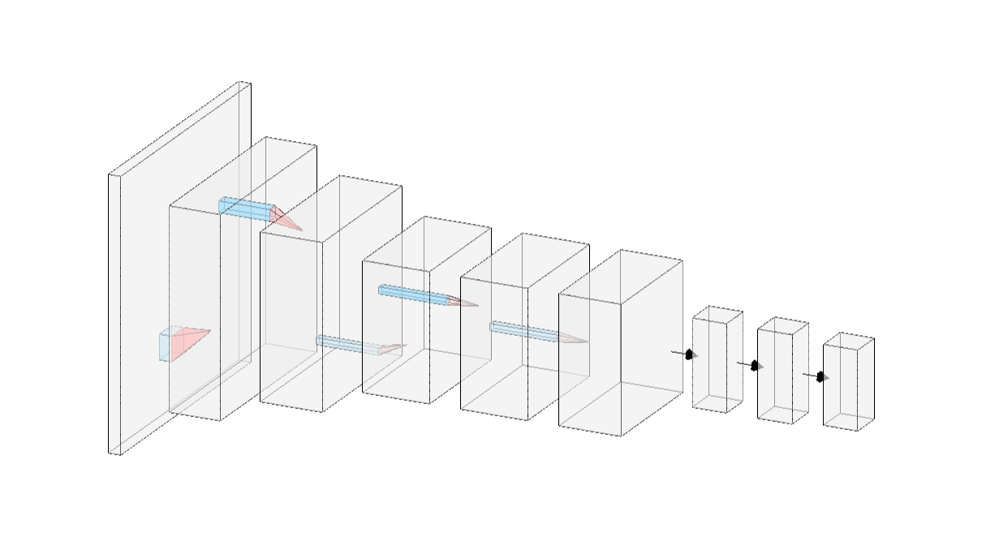

##### 3.VGG([Very Deep Convolutional Networks for Large-Scale Image Recognition](paper/vgg.pdf), 2014)

VGGNet是一系列的网络，有VGG11，VGG11_BN，VGG13，VGG13_BN，VGG16，VGG16_BN，VGG19和VGG19_BN，VGG网络的配置如下：

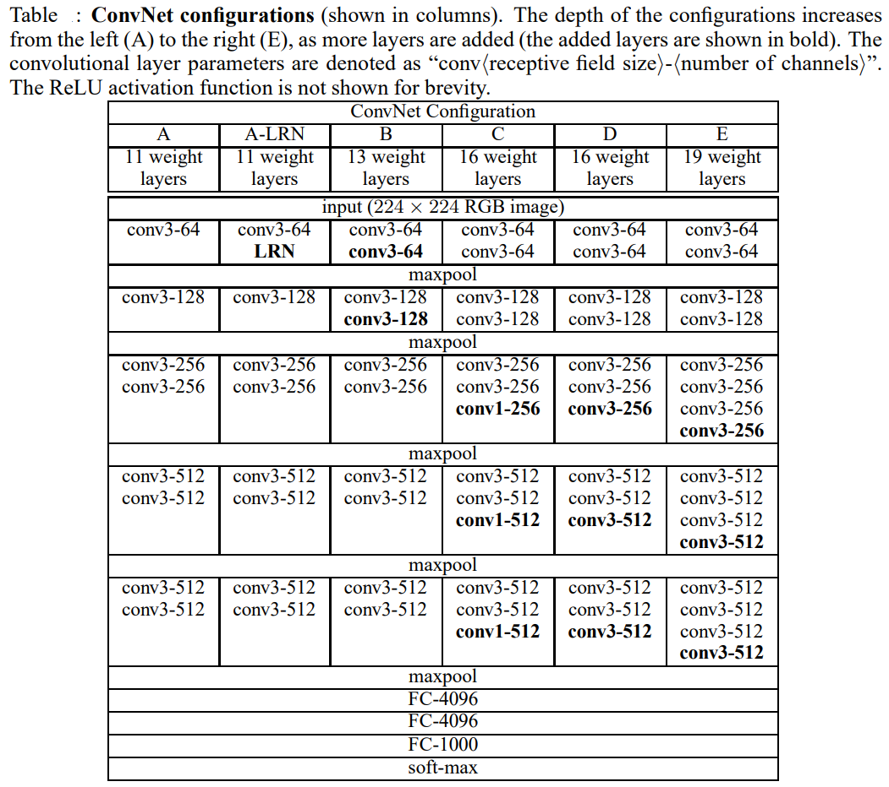

VGG16应用较广泛，它包含了13个卷积层和3个全连接层。它的特点是参数达到了1.38亿个，同一个block内的卷积层都是同结构，每个池化层都采用最大池化，并将特征缩减一半，VGG16的结构如下图所示：

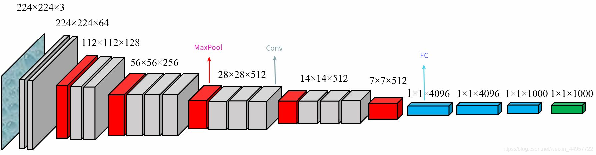

##### 4.GoogLeNet([Going Deeper with Convolutions](paper/googlenet.pdf), 2014)

GoogLeNet采用了Inception网络结构，该结构采用了四个分支，每个分支分别由1x1卷积、3x3卷积、5x5卷积和3x3max pooling组成。在3x3和5x5卷积之前，使用1x1卷积对特征图厚度进行降维来减小计算量。该结构既增加了网络的宽度，也增加了网络对不同尺度的适用性。四个分支输出后在通道维度上进行叠加，作为下一层的输入，四个分支输出的feature map的尺寸可由padding的大小进行控制，以保证它们的特征维度相同，但通道数可以不同，Inception网络结构如下图所示：

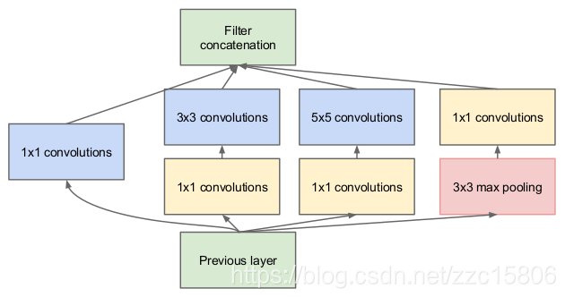

除此之外，GoogLeNet还添加了2个辅助分类器，在增加反向传播的梯度大小的同时，也起到正则化的作用。在训练过程中的计算网络损失时，中间的辅助分类器损失会乘以一个权重（默认为0.3）加入到最后层的loss值中。在预测时，则忽略中间softmax层的输出。GoogLeNet的网络结构如下图所示：

##### 5.Inception([Rethinking the Inception Architecture for Computer Vision](paper/inceptionv3.pdf), Inception-v3，2015)

Inception网络结构发展成为一些列的模型，目前有GoogLeNet（Inception-v1），Inception-v2，Inception-v3，Inception-v4，Inception-ResNet-v1和Inception-ResNet-v2。

Inception-v2到Inception-v4不断对Inception网络结构进行改进，主要改进的方面包括：

（1）是使用了批量标准化（Batch Normalization）的方法；

（2）使用标签平滑正则化（Label Smoothing Regularization）方法在预测结果中加噪声来对模型进行约束，降低模型过拟合

（3）采用了卷积分解，即用两个3x3的卷积替代一个5x5，用一个1x3和一个3x1的卷积替代一个3x3的卷积，减少了参数量。卷积分解的示意图和分解后的Inception结构图如下所示：

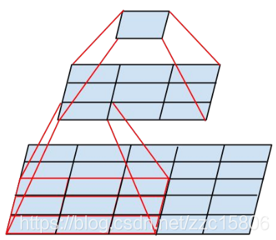

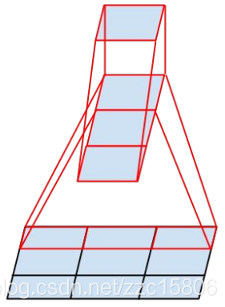

Inception-Resnet在Inception的基础上增加了残差连接，Inception-Resnet-v1和Inception-Resnet-v2的结构大致相同，主要不同的地方在于特征层的通道数，Inception-Resnet-v2的特征层通道数更多。每个Inception module最后都使用了一个1x1的卷积，作用是保证残差连接部分和Inception部分输出特征矩阵的通道数相同，这样才能保证两部分特征能够相加。Inception-Resnet-v2的基本模块如下所示（35x35grid modules指的是特征矩阵的尺寸）：

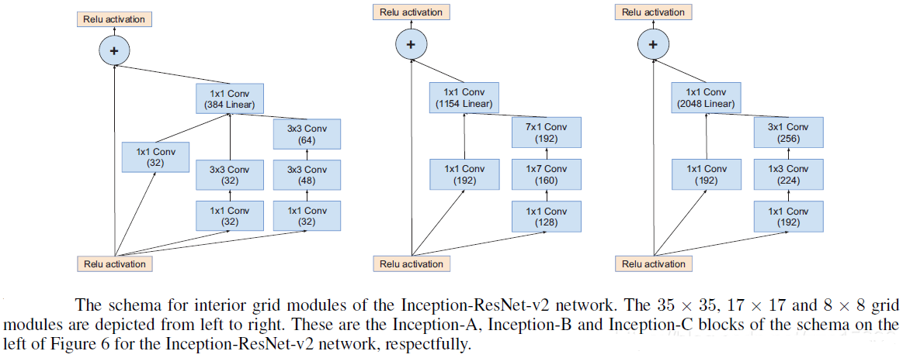

##### 6.ResNet([ Deep Residual Learning for Image Recognition](paper/resnet.pdf), 2015)

ResNet是一系列的网络，有ResNet18，ResNet34，ResNet50，ResNet101，ResNet152，ResNet网络的配置如下：

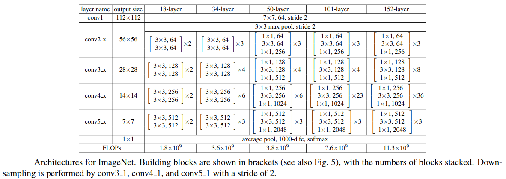

ResNet网络最大的特点是提出了残差网络结构（Residual），来减轻模型退化问题，residual的计算方式如下：

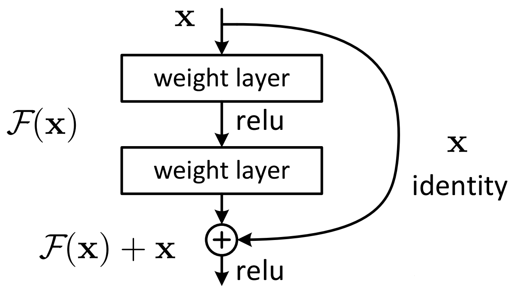

residual结构使用了一种捷径（shortcut）的连接方式，让特征矩阵隔层相加。注意在上图中，F(X)和X形状要相同，所谓特征相加是特征矩阵相同位置上的数字进行相加，网络层的形状并未改变。

ResNet中的两种不同的residual结构：

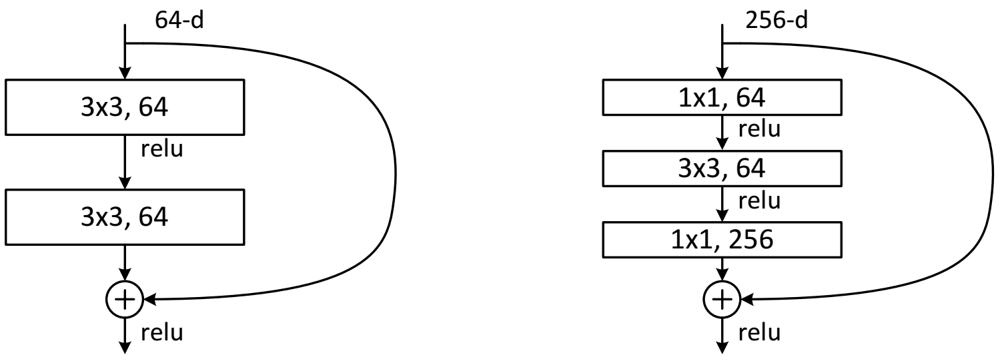

左边的是残差结构称为BasicBlock，右边的残差结构称为Bottleneck，先降维，再升维。Bottleneck的参数较少，搭建深层次网络时，采用三层的Bottleneck残差结构。ResNet18和ResNet34采用BasicBlock结构，ResNet50、ResNet101和ResNet152采用Bottleneck结构。

BasicBlock的参数个数是：256×256×3×3×2=1179648

Bottleneck的参数个数是：1×1×256×64+3×3×64×64+1×1×256×64=69632

##### 7.Wide ResNet([Wide Residual Networks](paper/wideresnet.pdf), 2016)

Wide ResNet在ResNet基础上增大了网络的厚度，就是指增加了特征矩阵的通道数。在配置网络的过程中，只增加了一个参数k，当k=1时，与常规的ResNet无异，当k>1时，增加了网络的厚度。Wide ResNet网络的配置如下：

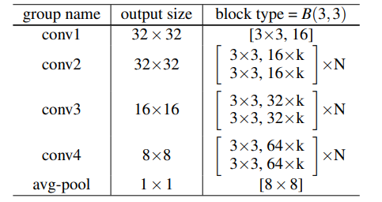

##### 8.ResNeXt([Aggregated Residual Transformations for Deep Neural Networks](paper/resnext.pdf), 2016)

ResNeXt是ResNet和Inception的结合体，ResNeXt将单路卷积编程了多个支路的分组卷积。下图中左边是ResNet，右边是ResNeXt，下表是ResNet-50和ResNeXt-50（32x4d）的结构对比，ResNeXt-50（32x4d）中的32表示分组数，4d表示没组的通道数为4，

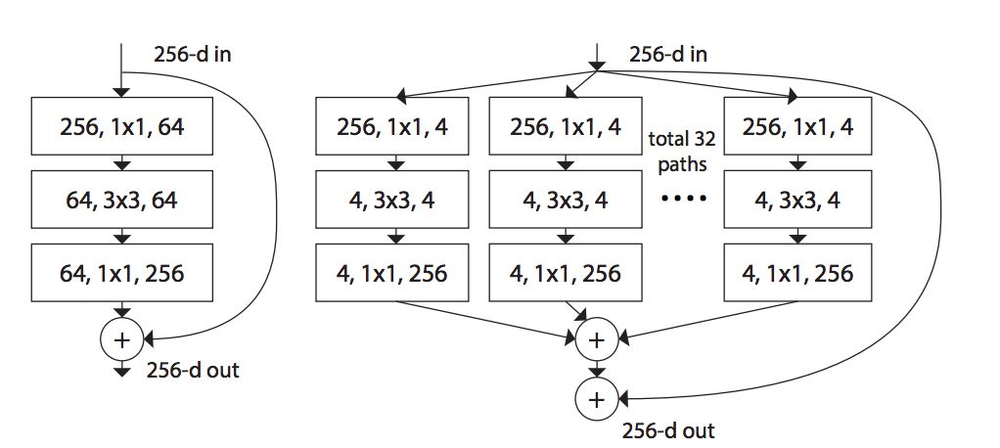

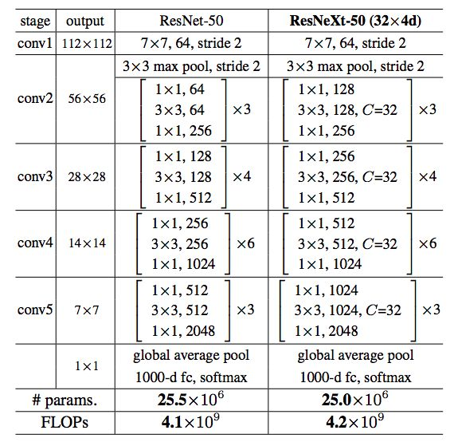

##### 9.DenseNet([Densely Connected Convolutional Networks](paper/densenet.pdf), 2016)

DenseNet脱离了加深网络层数(ResNet)和加宽网络结构(Inception)来提升网络性能的定式思维，从特征(feature)的角度考虑,通过特征重用和旁路(Bypass)设置，既大幅度减少了网络的参数量，又在一定程度上缓解了梯度弥散（gradient vanishing）问题的产生，DenseNet在提出时做出的假设是：与其多次学习冗余的特征，特征复用是一种更好的特征提取方式。

DenseNet的主要特点是旁路的设计加强了特征的重用，使得每一层网络的输入都受其之前的所有层的输出的影响

根据网络层数的不同，DenseNet分为densenet121、densenet169、densenet201和densenet264，其结构如下：

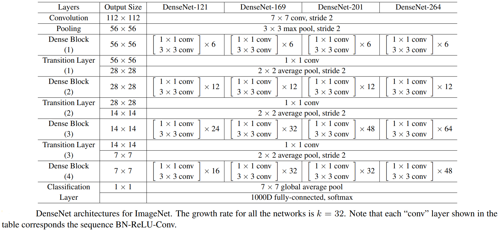

DenseNet网络由多个denseblock组成，不同denseblock间用transition层连接，transition层由BN+Conv(1x1)+average-pooling(2x2)组成，主要用于缩小特征尺寸。下图是一个包含3个denseblock的densenet网络：

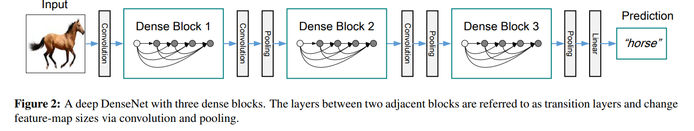

denseblock中的各个网络层输出的特征尺寸是相同的，为了保证不同层的输出可以叠加在一起，denseblock的结构如下：

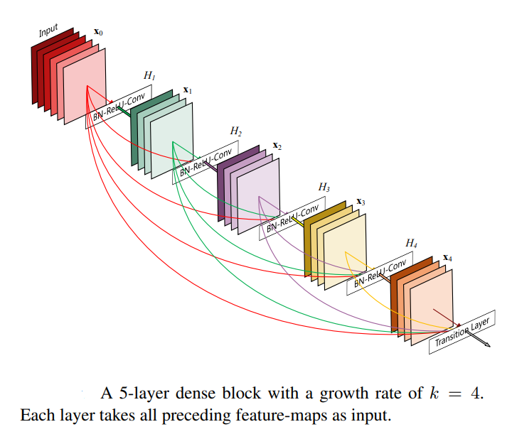

##### 10.MobileNet([Searching for MobileNetV3](paper/mobilenet-v3.pdf), 2018)

MobileNet-v1提出了深度可分离卷积（Depthwise Separable Convolution），分为Depthwise Convolution与Pointwise Convolution两步，depthwise层只改变feature map的大小，不改变通道数，feature map中的每个通道只被一个卷积核卷积。而Pointwise 层则相反，只改变通道数，不改变大小，它的卷积核尺寸为1x1，卷积核的个数决定输出的feature map的通道数。主要作用是减少了参数量。

MobileNet-v1使用ReLU6激活函数，f(x)=0, if x<=0; x if 0<x<6; 6 if x>=6，深度可分离卷积结构如下图所示：

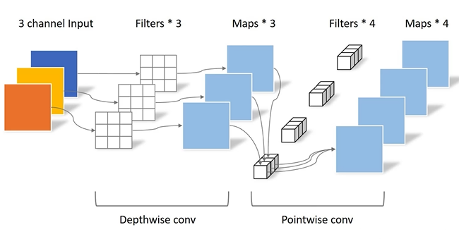

MobileNet-v2提出了反向残差块（Inverted residual block），和普通的残差结构相比，反向残差块先进行1x1逐点卷积进行升维，然后进行3x3的depthwise卷积，最后再进行1x1卷积降维。反向设计的内存使用效率更高。普通的残差结构两边厚，中间薄，所以中间的部分叫做bottleneck，是沙漏型；Inverted residual先升维再降维，所以两边薄的部分叫做bottleneck，是纺锤型；在降维过程中去掉了ReLU激活函数，所以叫线性瓶颈层(Linear Bottlenecks)。线性瓶颈反向残差结构如下图所示：

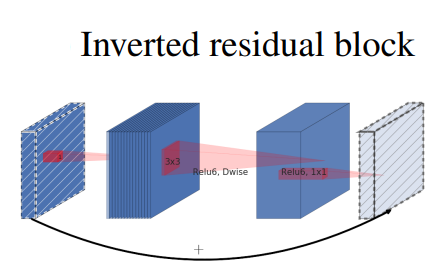

MobileNet-v3在MobileNet-v2反向残差块的基础上加入了SE（Squeeze&Excitation）模块，Squeeze是通过全局池化得到一个1x1xc的特征图；Excitation有两个全连接层组成，输出结果还是一个1x1xc的特征图；最后在和Squeeze前的特征图进行scale操作，就是通道权重相乘，得到wxhxc的特征图。这种结构相当于添加了注意力机制，在实验中提高了模型的精度。SE模块被添加在反向残差块的depthwise convolution后面。SE模块结构图如下所示：

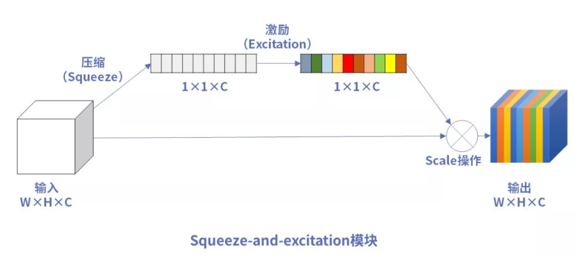

MobileNet-v3一个bottle neck的基本网络结构如下所示：

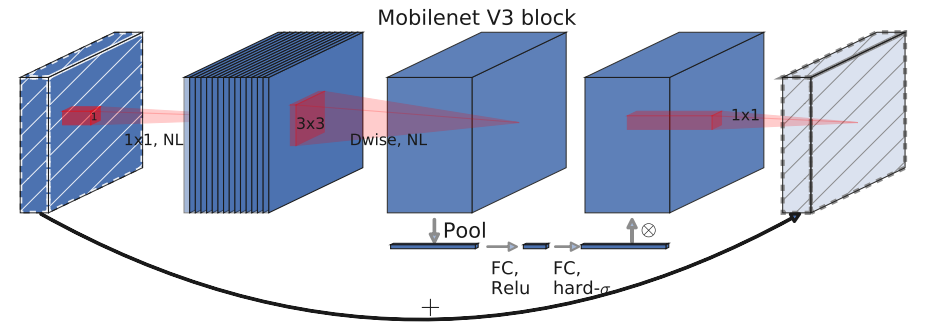

MobileNet-v3的配置如下图所示，分为MobileNet-v3-large和MobileNet-v3-small，整体结构相似，主要是bottle neck的个数不同：

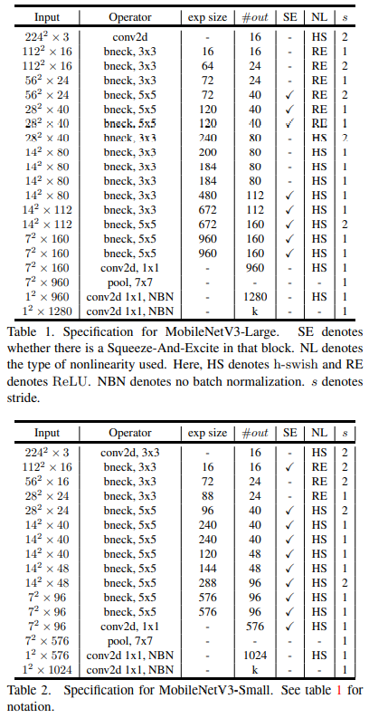

MobileNet-v3使用hardwish激活函数，提高了模型的准确率，其公式和图像如下所示：

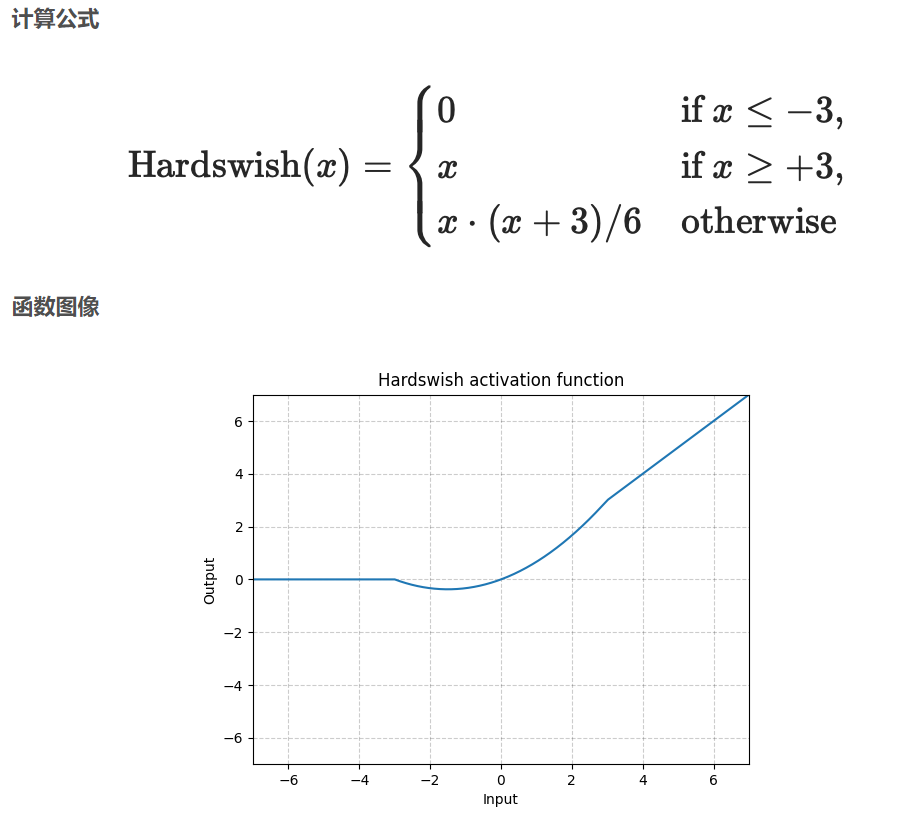

##### 11.EfficientNet([EfficientNet: Rethinking Model Scaling for Convolutional Neural Networks](paper/efficientnet.pdf), 2019)

EfficientNet_v1的主要结构是MBConv，这种结构是在MobileNet_v3的反向残差块（Inverted residual block）的基础上进行了改进，在反向残差块降维之后又加入了一个dropout操作，将SE模块线性层的激活函数分别换成了swish和sigmoid函数。同时在网络的宽度，深度，分辨率方面做了优化，其结构如下图所示：

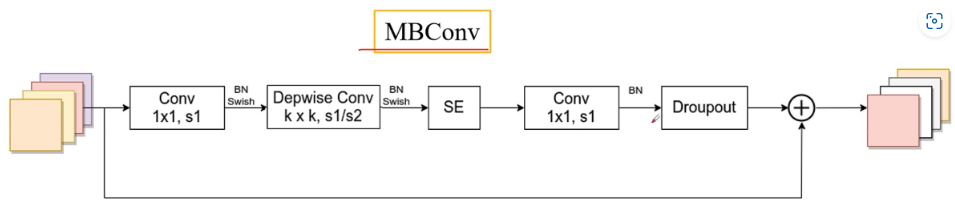

EfficientNet_v2主要的改进是用Fused-MBConv替换了部分的MBConv，替换的比例用神经网络结构搜索（NAS）来确定，替换的原因是depthwise convolution在模型的早起是执行缓慢的。Fused-MBConv将MBConv的1x1升维卷积和3x3depthwise卷积替换为普通的3x3升维卷积，其结构图如下：

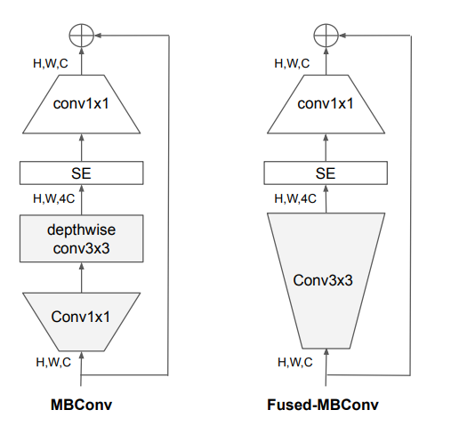

##### 12.ShuffleNet([ShuffleNet V2: Practical Guidelines for Efficient CNN Architecture Design](paper/shufflenet.pdf), 2018)

一般的卷积都是在所有的输入特征图上做卷积，可以说是全通道卷积。分组卷积(Group Convolution)将输入特征图的各个通道进行分组，采用不同的卷积核分别进行卷积操作，这样可以降低计算量。他缺点是同一输入特征图的不同分组的通道间没有了信息交流。为了解决分组卷积中不同组的通道间缺少信息交流的问题，ShuffleNet网络提出了channel shuffle的方法，就是将分组卷积后，各组的通道进行shuffle（均匀的打乱），这样就融合了不同分组间的特征信息。如下图所示：

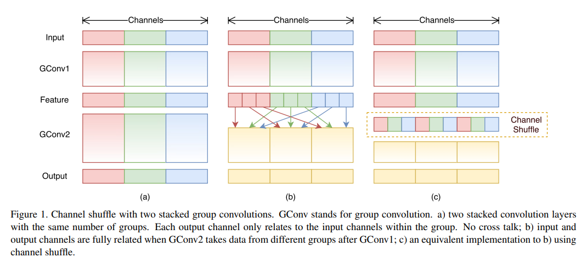

shuffleNet-v1的基本单元是在残差结构上建立起来的。a）为基本单元，b）下采样版本。在b）单元里，左侧采用步长为2的平均池化操作；右侧先采用一个1x1的分组卷积，然后进行channel shuffle，再采用步长为2的depthwise convolution操作，不改变特征图的通道数，并使特征图的形状和左侧一致，再进行一次分组卷积后，最后与左侧的输出进行拼接，而不是相加，大大的减少了计算量。

shuffleNet-v2对shuffleNet_v1进行了改进，c）为基本单元，d）下采样版本，在c）中，首先将输入特征图分为两组，右侧进行1x1卷积，3x3 depthwise convolution卷积，1x1卷积，然后和左侧进行拼接，最后再进行channel shuffle。这完全去除了shuffleNet_v1中的add操作，控制了分组卷积的组数，在训练速度和精度了都有不少的提升。shuffleNet-v1和shuffleNet-v2的基本单元结构如下所示：

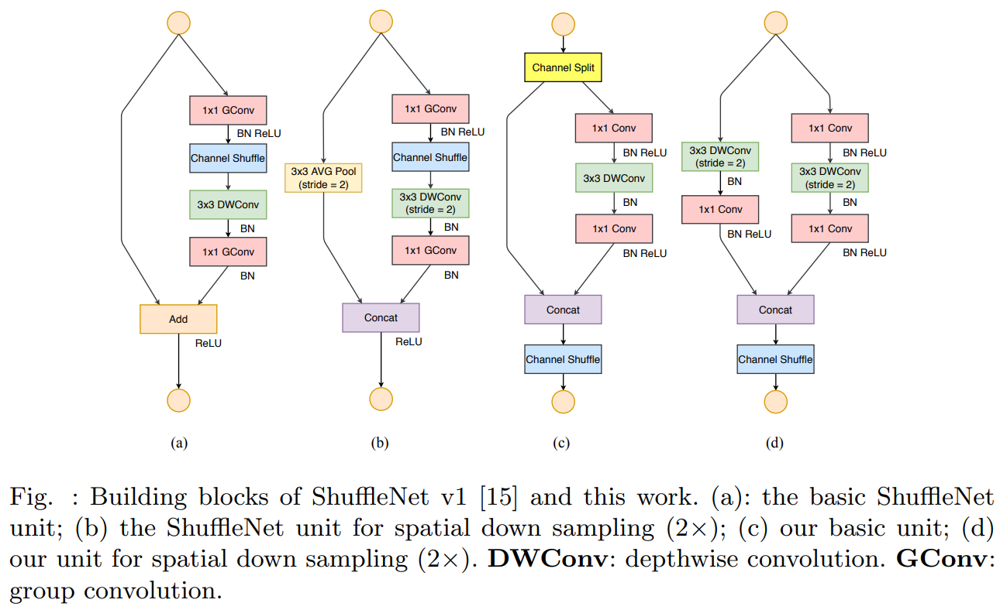

##### 13.DPN(Dual Path Networks)

ResNet和DenseNet是short-cut(捷径)系列网络中最为经典的两个基础网络，其中ResNet是通过特征相加的方式得到网络层的输出，DenseNet是通过特征叠加(拼接)的方式得到网络层的输出。DPN综合考虑了这两种网络的优点和限制，发现ResNet隐式地通过残差路径重复使用了特征，而DenseNet通过这个密集连接可以更好地探索新的特征。

(1) 双路径结构

DPN的双路径结构如图所示，+表示单位相加，~表示拆分。左侧是一个DenseNet（将DenseNet的拼接写成相加），右侧是一个ResNet，将两个网络通过单位相加的方式进行了合并，相当于采用了Inception网络的思想，扩展了网络的宽度。然后经过中间网络层后再拆分，分别传入DenseNet和ResNet

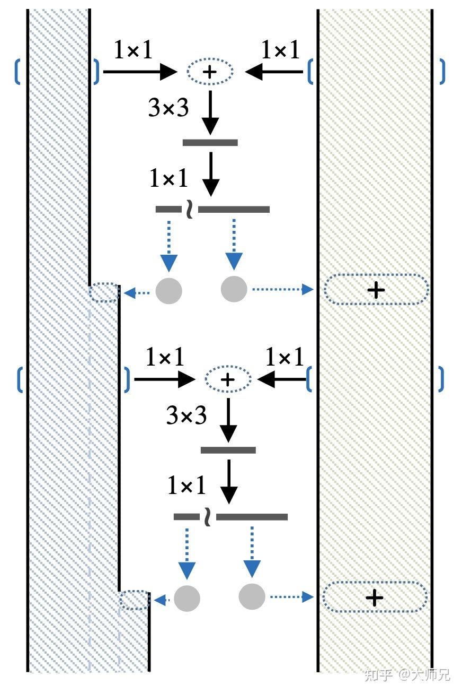

(2) DPN网络结构

下图是真正的DPN网络结构，和上图不同的是，ResNet和DenseNet共享了第一个1x1卷积，进一步减少了网络参数

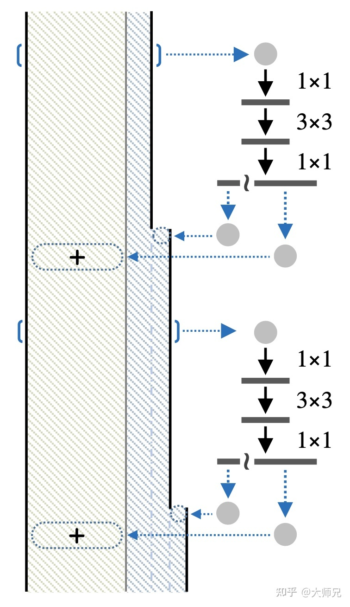

##### 14.SqueezeNet([ SqueezeNet: AlexNet-level accuracy with 50x fewer parameters and <0.5MB model size](paper/squeezenet.pdf), 2016)

SqueezeNet在保证模型精度不降低的前提下，最大程度的提高运算速度。创新点在于提出了fire module，包括两个部分，squeeze和expand，如下图所示：

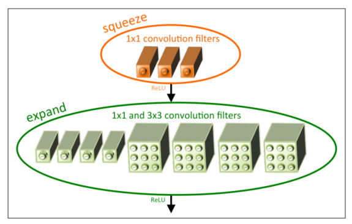

其中的squeeze层采用 1x1卷积核对上一层 feature map进行卷积，其主要目的是降低特征矩阵的维度；expand使用的Inception结构，将1x1和3x3卷积的输出结果拼接在一起，作者建议拼接后的维度大于squeeze层输出的维度，相当于加入了瓶颈层。

##### 15.MNASNet([MnasNet: Platform-Aware Neural Architecture Search for Mobile](paper/mnasnet.pdf), 2018)

MNASNet使用神经网络架构搜索算法搜索出最佳的网络结构，搜索空间包括卷积方式，卷积核尺寸，SE模块注意力机制，跨层连接方式，输出层卷积核大小，每个block种的layer个数等，分层次搜索空间的结构如图所示：

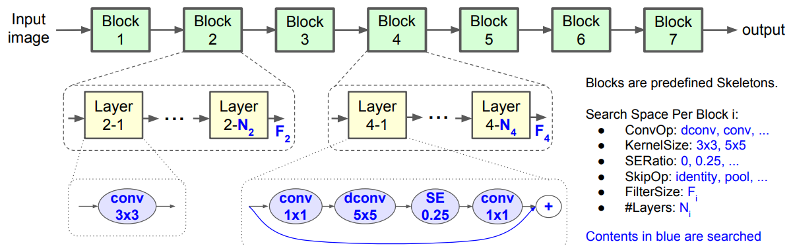

搜到的网络结构如下图所示：

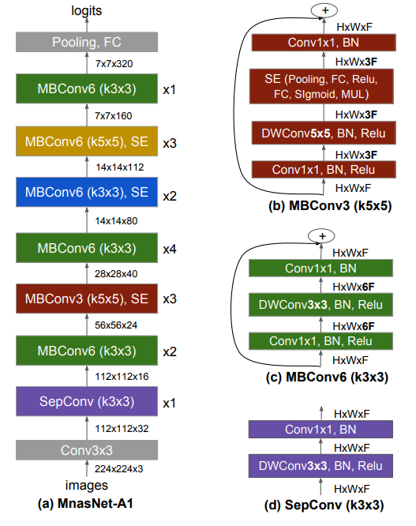

##### 16.RegNet([Designing Network Design Spaces](paper/regnet.pdf), 2020)

RegNet利用了神经网络架构搜索（NAS）技术，其设计空间如下图所示：

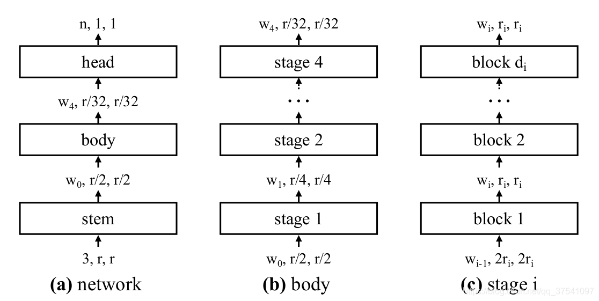

(a)是网络的基本结构，stem是普通的卷积层，head是线性层，body由四个stage组成，每个stage由若干个block组成，数量由NAS搜索决定。每个block的结构类似一个残差结构，如下图所示，block和ResNeXt网络中的block结构基本一致，用到了分组卷积。

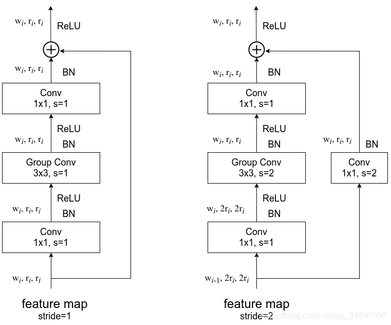

##### 17.Vision Transformer([An Image is Worth 16x16 Words: Transformers for Image Recognition at Scale](paper/vision_transformer.pdf), 2020)

Vision Transformer模型将自然语言处理的中的Transformer模型编码器(Encoder)部分应用在了图像分类中，利用其中的多头注意力机制可以更有效的提取图像中关键区域的特征。将输入图片分割成多个小区域，然后将每个小区域线性编码成向量，再加上位置编码，就和文本任务中输入向量的结构保持一致，剩下和的部分就是常规Encoder的结构。模型结构如下图所示：

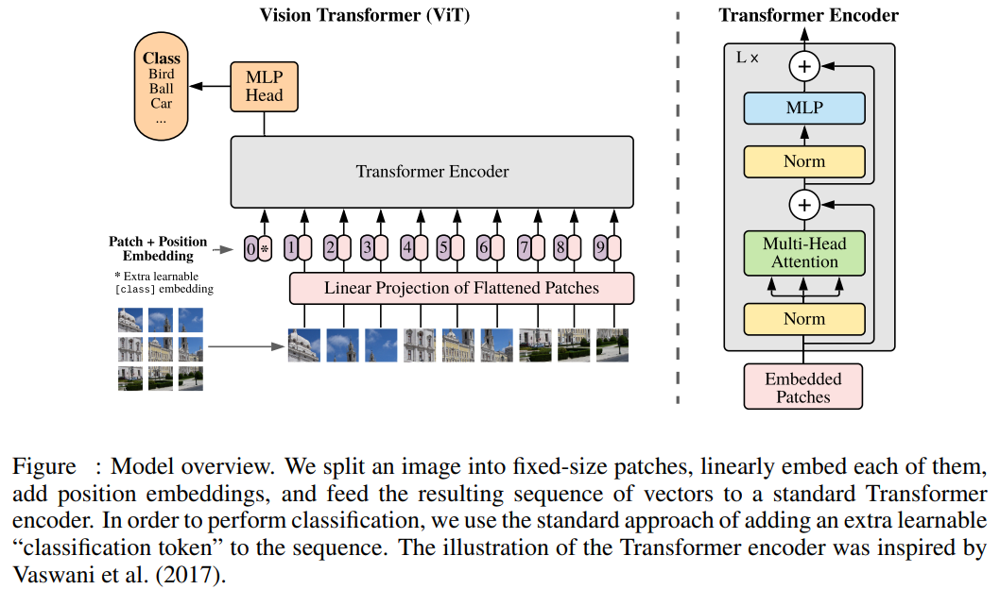

跟原始的transformer相比，Vision Transformer中的标准化(Norm)放在了多头注意力(Multi-Head Attention)前面。值得注意的是，Vision Transformer的注意力机制是全局的，即是一整张图片上的自注意力，缺点是计算量较大

##### 18.Swin Transformer([Swin Transformer: Hierarchical Vision Transformer using Shifted Windows](paper/swin_transformer.pdf), 2021)

Swin Transformer在Vision Transformer的基础上加入了层级设计特征提取和滑动窗口，传统的Transformer是基于全局来计算注意力的，复杂度较高，Swin Transformer是将注意力限制在每个窗口内，减少了计算量，使用滑动窗口的是为了增加不同窗口之间的信息交互。Vision Transformer的特征图都是固定的，Swin Transformer的特征图具有层次性的特征图。二者的对比如下：

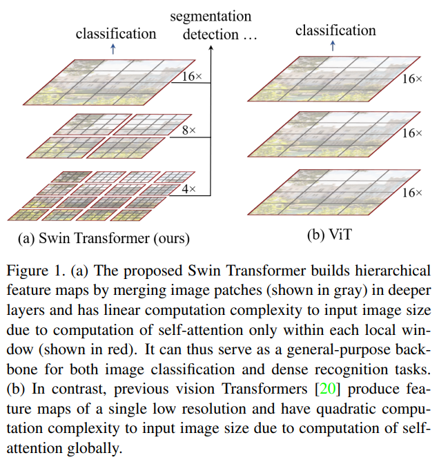

整体架构如下：

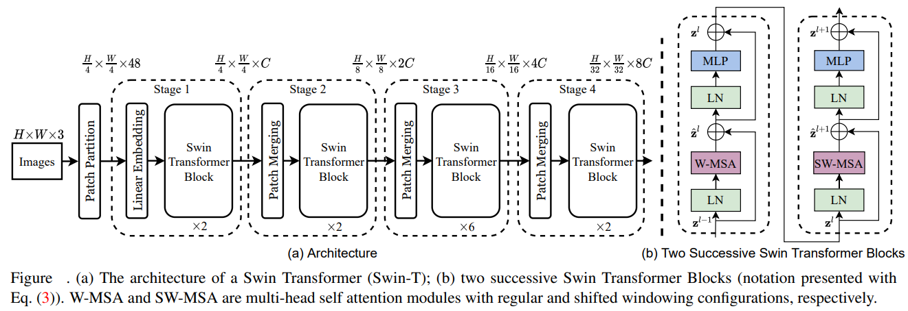

上图中，patch partition是将图片分成多个小图块，生成嵌入矩阵，每个stage中Linear Embedding和Patch Merging的作用是不断的缩小分辨率，让模型学习到不同分辨率下的图像特征。stage中的Linear embedding用来图片矩阵转换成1xhxw形状，Block用于计算注意力，在计算多头自注意力时考虑了相对位置编码，公式如下：

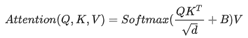

滑动窗口计算注意力的步骤如下图：

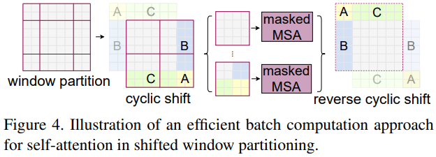

其中，为了便于计算，ABC区域是窗口滑动后截取拼接到右下角部分，只有连续的区域才计算注意力。具体做法是给窗口滑动后的每个区域一个index，并进行窗口移动，是总窗口数量与滑动前保持一致，在计算注意力时只计算index相同的区域的注意力，其他地方被mask掉。图示如下：

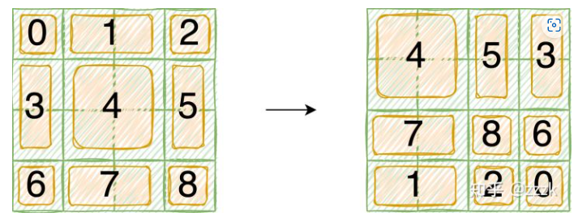

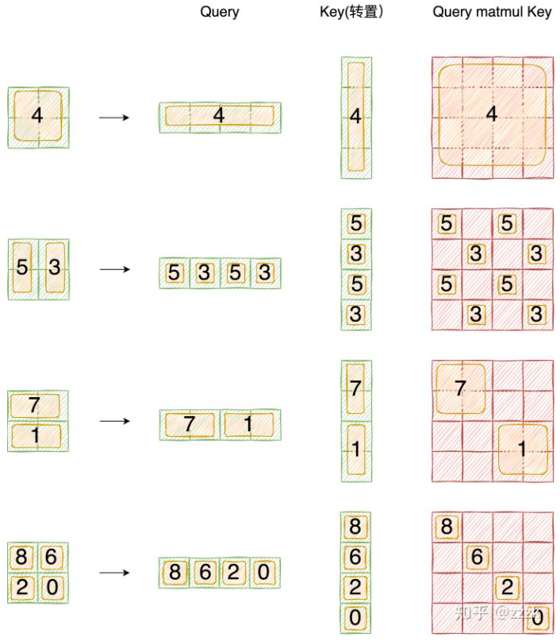

##### 19.ConvNeXt([A ConvNet for the 2020s](paper/convnext.pdf), 2020)

ConvNeXt将swin transformer的设计思路应用在ResNet50网络中，改造出一个性能更佳的网络，主要改造了以下几点，见下图：

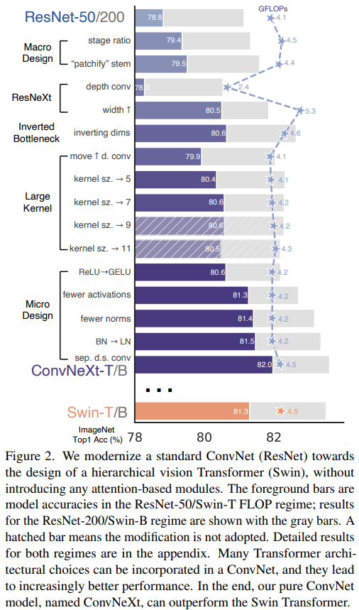

1）Macro design：将ResNet网络中4个stage里的堆叠的block块的比例调整为1：1：3：1，更换大小为4的卷积核，步距为4，和swin transformer对应

2）ResNeXt：将ResNeXt中的groupwise convolution换成了depthwise convolution，大幅度地减少了参数量

3）Inverted bottleneck：将ResNeXt中的残差结构换成了MobileNet-v2中的反向残差结构

4）Large kernel size：将Multi-head Self-Attention类比成depthwise convolution，将反向残差结构中的depthwise convolution上移到第一个位置，同时增大了卷积核大小，尺寸设置为7

5）Various layer-wise Micro designs：将激活函数有RELU替换成了GELU，BN换成了LN，设置了更少的激活函数和正则化函数

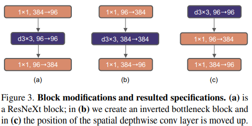
