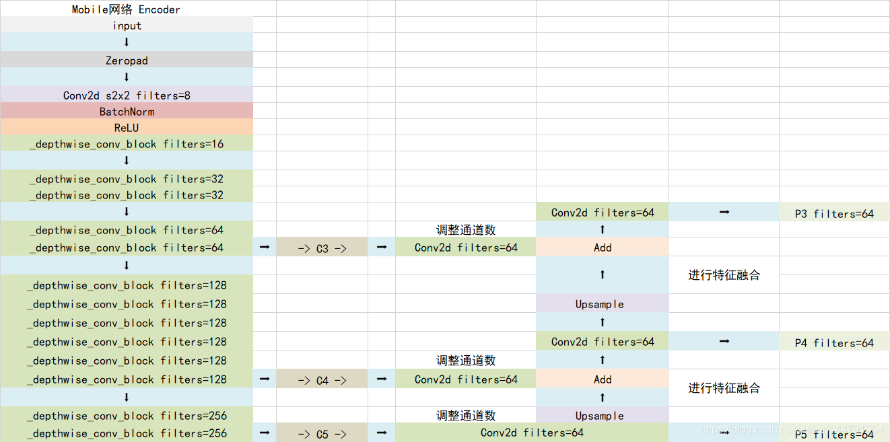
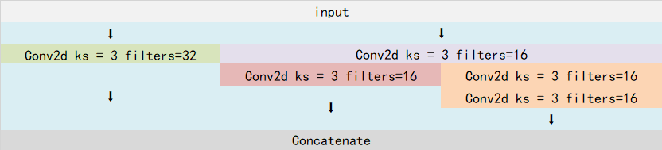
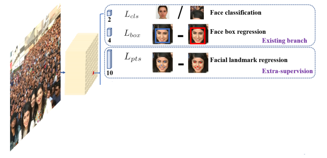
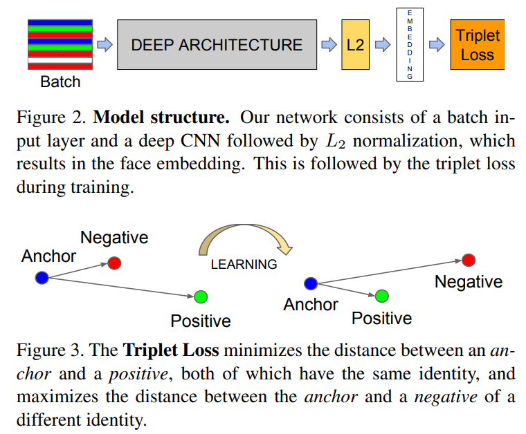
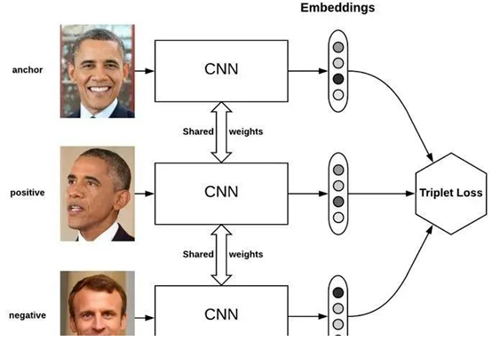

#### 人脸检测和识别

人脸检测是在图像中检测出人脸区域

人脸识别是将人脸区域识别为对应的人是谁

##### 1.RetinaFace人脸检测([RetinaFace: Single-stage Dense Face Localisation in the Wild](paper/retinaface.pdf), 2019)

RetinaFace是一个one-stage的人脸检测模型，主干网络一般采用MobileNetv1-0.25或者ResNet，取主干网络的最后三个stage的输出层C3，C4，C5组成特征金字塔结构，并将特征金字塔结构中的三个有效特征层经过SSH网络加强特征提取，最后在SSH网络输出的三个有效特征层上获得预测结果。

###### 1.backbone+fpn

以MobileNetv1-0.25为主干网络的FPN结构如下：

###### 2.ssh

SSH网络很像Inception，是三个并行结构，利用3x3卷积的堆叠替代5x5和7x7卷积。SSH网络的结构如下：

###### 3.head

经过ssh网络输出的特征图，在每个网格内生成2个不同比例的先验框，每个先验框代表原图片上的一定区域。检测头的任务一共有三个，分别是判断先验框内是否包含人脸的二分类任务，对先验框的四条边的位置调整的回归任务，对先验框内人脸的五个关键点坐标调整的回归任务。

检测头的任务类型如下图所示：

###### 4.loss

检测头的三个任务对应的loss分别为：

1）Face classification Loss：预测框中是否包含人脸的交叉熵loss

2）Box Smooth Loss：预测框的回归loss

2）Lamdmark Smooth Loss：预测框内人脸关键点坐标的回归loss

##### 2.FaceNet人脸识别([FaceNet: A Unified Embedding for Face Recognition and Clustering](paper/facenet.pdf), 2015)

FaceNet是一个人脸识别的模型，整体结构如下：

###### 1.Deep Architecture

主干网络部分，主干网络可以选择Inception-ResNetV1或者MobileNetV1，主要用于提取人脸图片特征，主干网络的输出层形状为：（b, c, h, w），经过全局平均池化后的形状为：（b, c, 1, 1），再经过全连接层输出一个128维的向量，该向量就表示输入人脸图片的特征向量

###### 2.L2

获得图片的特征向量后，还要经过L2标准化处理，就是所有元素平方和的平方根，主要是为了统一向量中的元素值的数量级。Embedding指的就是L2标准化后的特征向量

###### 3.Triplet Loss

主要思想是让负样本对之间的距离大于正样本对之间的距离，在训练过的过程中同时选取一对正样本对和负样本对，且正负样本对中有一个正样本是相同的，就是有三张图片输入来计算Loss。如上图中的Figure3所示，anchor是基准图片，positive是与基准图片类别相同的正样本，negative是与基准图片类别不同的负样本。公式如下：

L=max(d(a,p)−d(a,n)+margin,0)

d(a,p)就是anchor和positive的欧几里得距离，d(a,n)就是negative和positive的欧几里得距离，margin是一个常数。在训练过程中，我们希望d(a,p)越来越小，d(a,n)越来越大，表示相同身份之间的特征距离要尽可能的小，而不同身份之间的特征距离要尽可能的大

Triplet Loss的示意图如下，可见训练过程中每个batch中的样本类别需要满足要求，即两个样本类别必须相同，另一个样本类别必须不同：

